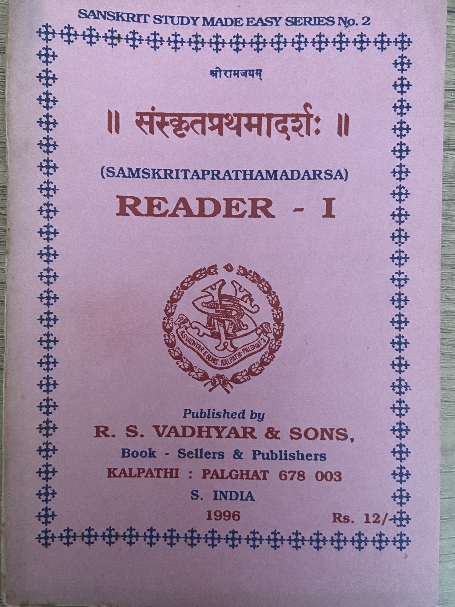
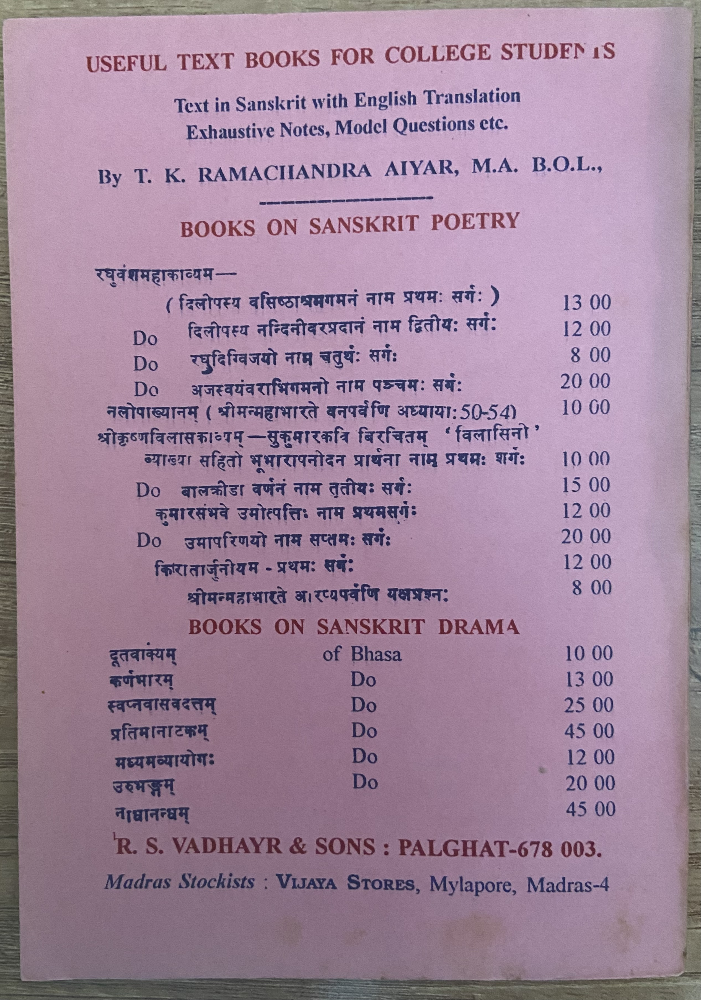

# संस्कृतप्रथमादर्शः Reader - I

R. S. Vadhyar & Sons published a set of introductory Sanskrit books for young students. Unfortunately, the company no longer exists. I am not sure if new copies of these books are being published. The last few sets may be available book shops dealing with Sanskrit books including - R S Vadhyar & Sona (Kalpathi, Palakkad), Giri Traders (Chennai) or Vedanta Book House (Near Uma Talkies, Bangalore).

These are my notes from reading the book. It includes some of the short stories in the book along with translation done by me. I have tried my best to check for errors but I can't guarantee there are none.

