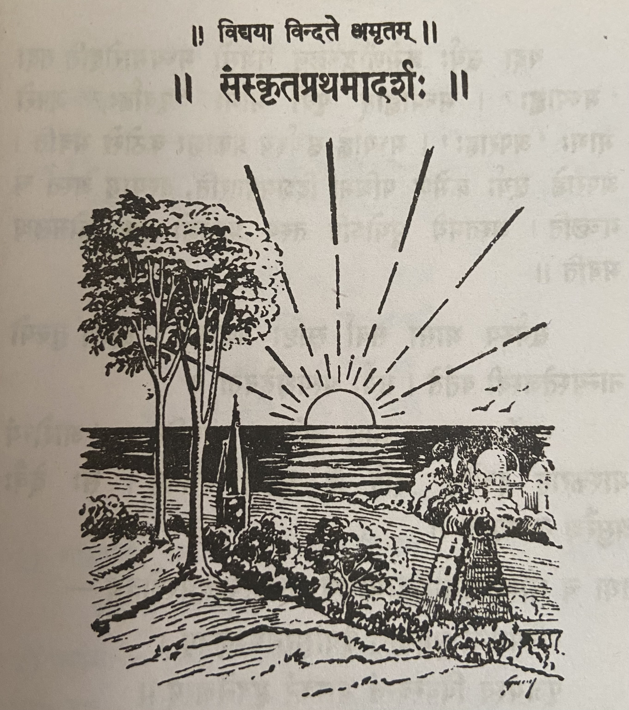

# Lesson 1: सूर्यः प्रत्यक्षदेवता

<!---

--->

पश्य, पूर्वस्यां दिशि सूर्य उदयते । तस्य प्राकाशः संप्रति रक्तः कोमलश्च वर्तते। सूर्यः उदयमानोऽन्धकारं नाशयति, प्राणिनः प्रबोधयति, कुसुमानि च विकासयति।
सन्तो बालाः सूर्रोदयात् पूर्वम् उषसि प्रबुध्य स्वीयान् पाठान् पठन्ति।।

यदा सूर्यः क्रमेणोद्गच्छन् नभसो मध्यमारोहति तदा "मध्यान्हः" । मध्याह्नात् पूर्वो भागः "पूर्वाह्णः", अपरो भागः "अपराह्णः"। मध्याह्ने सूर्यस्य प्राकाशः कठोरो भवति। अपराह्णे सूर्यः क्रमेण पश्चिमां दिशमवतरति, तस्याम् अस्तं च गच्छति। अस्तमये भूयोऽपि तस्य प्रकाशो रक्तः कोमलश्व भवति।

सूर्यस्य भासा सर्वा सृष्टिः प्रकाशते। सूर्येण तुल्यो नान्यस्तेजस्वी वर्तते। सूर्यः प्रत्यक्षदेवता।।

सूर्योपासनया जनाः अरोगाः भवन्ति। "आरोग्यं भास्करात् इच्छेत्" इति हि महतां वचनम्। सः देवैः असुरैश्च नमस्कृतः।।

तथा च श्रीमद्वाल्मीकिरामायणे आदित्यहृदयस्तोत्रम् -

रश्मिमन्तं समुद्यन्तं देवासुरनमस्कृतम्।
पूजयस्व विवस्वन्तं भास्करं भुवनेश्वरम्।।

 

तस्मात् त्वमपि तं नमस्कुरु।।

---

**Translation**

**Title:** Sun the deity that is visible

Look, in the East the Sun rises. At this time (संप्रति) his light is red and pretty. The sun that has risen (or The risen sun) (सूर्यः उदयमानः अन्धकारं) destroys darkness, awakens animals (in this context: all animals including man, insect etc.), makes flower to flower. Good children wake up at dawn before the Sun rises and read their lessons.

When the rising Sun gradually climbs to the middle of the sky then it is Noon (मध्यानः). The part (of the day) before afternoon is forenoon (पूर्वाह्णः), the part after (अपरः) is afternoon (अपराह्णः). In the afternoon (मध्याह्ने) the light of the Sun is harsh (कठोरः). In the afternoon the Sun gradually climbs down in the western direction and goes there to set (अस्तं) also. When it sets (अस्तमये), in the ground (भूयोऽपि), his light is red and pretty.

भूयोऽपि (again also) - भूयः (again) अपि

भासा (३ vibhakti)

By the glow of the Sun, all the creation is lighted. Compared to the Sun nobody else is brighter. Sun is the visible deity.

उपासना (f) serving
सूर्योपासनया - samasam

By serving/worshipping the Sun (सूर्योपासनया) people are without disease (i.e. healthy). "May the Sun give health" - This is the saying of great men. He is worshipped by _Devas_ and _Asuras_.

Thus in the Valmiki Ramayana the Aditya Hrudaya Stotram:

The one who has the rays (रश्मिमन्तं)

The one who raises well (समुद्यन्तं = सम् उद्यनतम् )

Worshipped by the _Devas_ and _Asuras_ (देवासुरनमस्कृतम्).

You should worship (पूजयस्व) the Sun (विवस्वन्तं) the cause of light (भास्करं) and the ruler of the world (भुवनेश्वरम्).

Therefore (तस्मात्), you also (त्वमपि) worship (नमस्कुरु) him (तं).

**Vocabulary**

| Word | Meaning |
| --- | --- |
| संप्रति (ind.) | at this time, at present, now |
| रक्तः  (adj) | red |
| प्राणिनः | animals (plural) |
| प्रबोधयति (verb) | awaken |
| प्रबुध्यते | wake up |
| क्रमेण (adverb) | gradually, in the order |
| क्रमेण (ind.) | in regular course, by degrees |
| नभस् | sky |
| उद्गच्छन् | rising, climbing up. Comes from उद्गच्छति|
| अवतरति | come down, sink, arrive |
| अस्त | set |

 

| Word | Meaning | Word | Meaning |
| --- | --- | --- | --- |
| कोमल | pretty | | |

प्राणिन् - animal (singular)

रक्त also has a neuter form where it means blood.

प्रबुध्य -

नभसः - In the sky

देवासुरनमस्कृतम - samastha padam

पूजयस्व - लोट् लकारः मध्यम् पुरुषः आत्मनेपदी (पूज्यते)

 

**Clarifications from Sanskrit teacher**

Actually सन्तः is the first case plural of सत् शब्दः। सत् - existence / good. Here used in the sense of good. सत् is good and असत् bad. The formation is like "सन्  सन्तौ सन्तः। So सन्तो बालाः - सन्तः बालाः - good boys

उषसि is सप्तमी एकवचनम्। उषस् शब्दः। Here used in the sense of "dawn / before sun rise". Generally it is used in the sense of both "dawn and dusk. Here the literal meaning is "in/at dawn".

स्वीयान् पाठान् means "their own lessons". स्व / स्वीय always used in the sense of "self". Se these are adjectives they get form in all the 3 genders. स्वीयान् is masculine second case plural because it is used as an adjective for पाठान्
