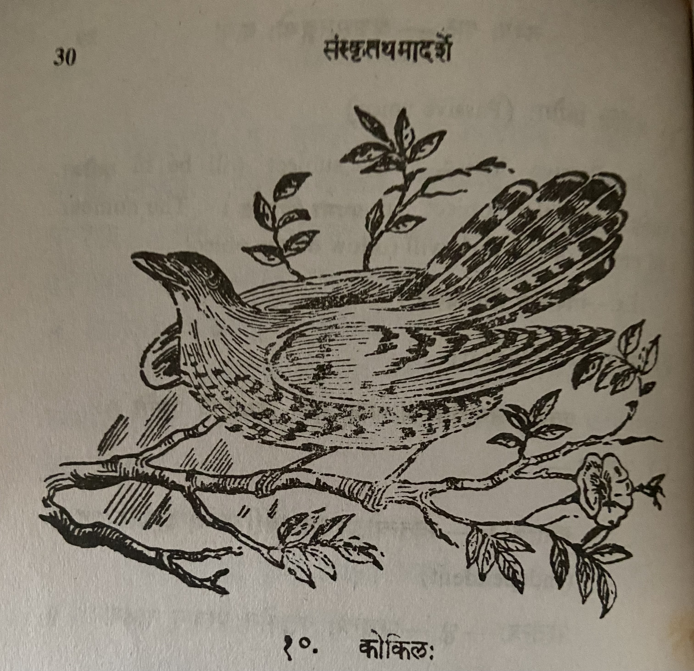

# Lesson 10: कोकिलः

नायं सुरुपो विहगो नापि कायोऽस्य भासुरः । 

न चास्य पक्षयोः सन्ति चित्रवर्णा विशेषकाः ॥  &nbsp; १

केवलं काकसदृशो रुपे वर्णेऽप्ययं खगः ।

अथापि मधुरं गायन् अयं जगति पूज्यते ॥ &nbsp; २

रसालशिखरासीनो वसन्ते मधुरं स्वनन् ।

कस्य नो हृदयानन्दं जनयत्येष कोकिलः ॥ &nbsp; ३

काकः कृष्णः पिकः कृष्णः को भेदः पिककाकयोः ।

वसन्तकाले संप्राप्ते काकः काकः पिकः पिकः ॥ &nbsp; ४

किं कुलेन विशालेन किं रूपेण सुशोभिना ।

महत्त्वे कारणं तावत् वाग्रसो जनरञ्जकः॥ &nbsp; ५

---

**Translation**

This lesson is a poem about the Cuckoo bird. The couplets without सन्धि

**न अयं सुरुपः विहगः न अपि कायः अस्य भासुरः ।**

This (अयं) is not (न) a beautiful bird and (अपि) nor (न) its body shining (भासुरः).

**न च अस्य पक्षयोः सन्ति चित्रवर्णा विशेषकाः ॥** 

And (च) attractive/special (विशेषकाः) colors (चित्रवर्णा) are not (न) present (सन्ति) on those (अस्य) two wings (पक्षयोः) 

**केवलं काकसदृशः रुपे वर्णे अपि अयं खगः ।**

This (अयं) bird (खगः) also (अपि) only (केवलं) looks like a crow (काकसदृशः) in form (रुपे) and color (वर्णे).

**अथापि मधुरं गायन् अयं जगति पूज्यते ॥** 

Moreover (अथापि) this sweet (मधुरं) singing (गायन्) is praised (पूज्यते) by all (जगति). 

**रसाल शिखरासीनः वसन्ते मधुरं स्वनन् ।**

Sitting on top of (शिखरासीनः) the mango tree (रसाल) in Spring (वसन्ते) sweet (मधुरं) sounding (स्वनन्).

**कस्य नो1 हृदयानन्दं जनयत्येष कोकिलः ॥**

This (एष) cuckoo  (कोकिलः), (in) for whose (कस्य) heart's joy (हृदयानन्दं) does it not (नो) cause/produce (जनयति)  

Above is close to literal translation. Here is a what it means:

This cuckoo, in whom does it not produce joy.

1Both न & नो are negative words. Meaning "no / not". नो is also an अव्यय like न

**काकः कृष्णः पिकः कृष्णः को भेदः पिककाकयोः ।**

Crow (काकः) is black (कृष्णः), cuckoo (पिकः) is black (कृष्णः) what (is the) (कः) difference (भेदः) between the cuckoo and crow (पिककाकयोः)

**वसन्तकाले संप्राप्ते काकः काकः पिकः पिकः ॥   ४**

When spring (वसन्तकाले) happens/is attained (संप्राप्ते) crow (काकः) is crow (काकः) cuckoo (पिकः) is cuckoo (पिकः)

**किं कुलेन विशालेन किं रूपेण सुशोभिना ।**

**महत्त्वे कारणं तावत् वाग्रसो जनरञ्जकः॥ &nbsp; ५**

From teacher:

किम् (what) कुलेन विशालेन (by big / renowned family) रूपेण सुशोभिना (by looking handsome) महत्त्वे (for greatness) कारणम् (reason) तावत् (that is) वाग्रसो (वाक् + रसः - attractive speech) जनरञ्जकः (that always pleases / attracts the people).

To summarize it: whatever the royal family you were born in however good looking you are but the reason for greatness is that soft and nice words which always attracts the people

---

**Vocabulary**

| Word | Meaning | Word | Meaning |
| --- | --- | --- | --- |
| कोकिल m. पिक m. | cuckoo | विशाल a. n. | great, noble |
| भासुर a. m. | shining | महत्व n | greatness |
| विशेषक m. | line, dot | वाग्रस m | sweetness of speech |
| रसाक m | mango tree | जनरञ्जक a. m. |  that which attracts people |
| शिखर n | top |