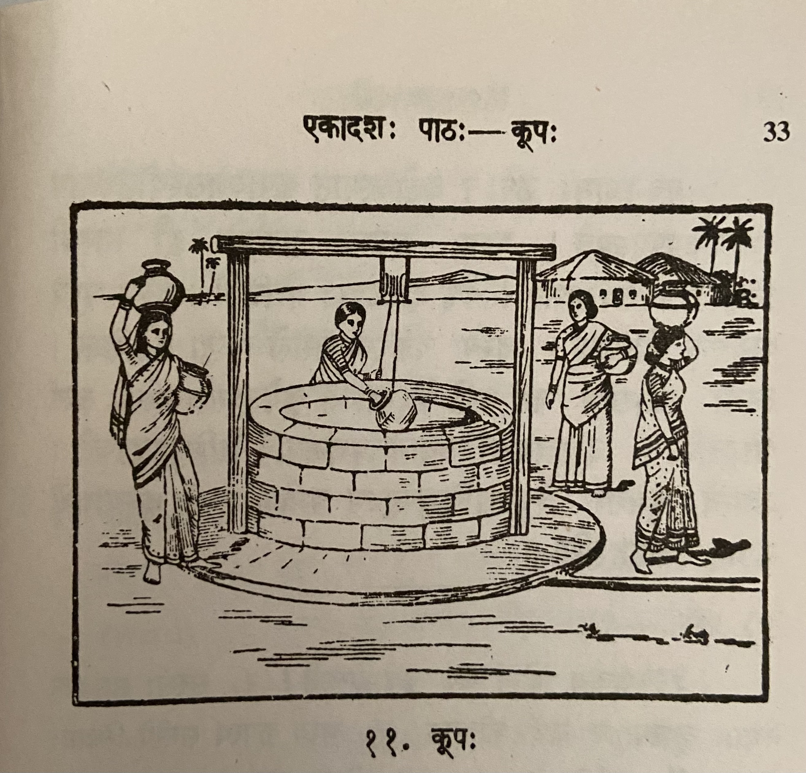

# Lesson 11: कूपः

अयं रमणीयः कूपः। पानाय योग्यं जलं कूपे लभ्यते। सरसो जलं स्नानेेन मलिनं भवति। नद्याः सलिलं प्रकृत्यैव कलुषम्। समुद्रस्य वारि लवणम्। कूपस्य उदकम् अनाविलं पानयोग्यं च भवति॥

चित्रं पश्य। कूपस्य समन्तात् बहूनि सन्ति क्षेत्राणि। ततो1 नातिदूरे दृश्यन्ते कतिचन गृहाणि। तेषु गृहेषु वसन्त्यः स्त्रियः अस्मात्2 कूपाज्जलं3 नयन्ति॥

अस्य कूपस्य समीपे चतस्रः स्त्रियः सन्ति4। द्वे स्त्रियौ जलघटं शिरसि निधाय गच्छतः। अपरा कूपाज्जलमुद्धरति5। अन्या जलमुद्धर्तुं घटहस्ता तिष्ठति॥

अयमगाधः कूपः। अतोऽस्मात् कूपाज्जलस्योद्धरणाय दारुचक्रमुपयुज्यते6। पश्य, कूपस्य पार्श्वयोः द्वौ स्तम्भौ निखातौ। तयोरुपरि8 तिर्यक् दारुदण्डो योजितः। तस्य मध्ये दारुचक्रं पिनद्धम्। तस्य चक्रस्यान्तराले रज्जुः प्रवेशिता। तस्या रज्जोरग्रेण घटं कण्ठे बद्ध्वा तं कूपेऽवतारयन्ति, जलं चोद्धरन्ति9। दारुचक्रस्य स्थानेऽयश्चक्रमपि कैश्चिदुपयुज्यते10। अद्यत्वे भूयसा वैद्युतशक्तिमुपयुज्य यन्त्रेण जनाः कृष्याद्यर्थे11 कूपात् जलमुद्धरन्ति॥

**Notes**

| Sandhi removed / Explanation | 
| --- | 
| 1ततः - there / from there. | 
| 2अस्मात् - इदं शब्द पुंल्लिङ्ग एकवचनम् - meaning "from this" |
| 3कूपात् जलं -> कूपाज्जलं | 
| 4The literal translation of this sentence is - "This well's near there are four women". The possessive case is used like this in Sanskrit. |
| 5कूपात् जलम् उद्धरति = कूपाज्जलमुद्धरति | 
| 6अतः अस्मात् कूपात् जलस्य उद्धरणाय दारु चक्रम् उपयुज्यते। The literal translation - Therefore (अतः) from that (अस्मात्) well (कूपात्) water's (जलस्य) raising (उद्धरणाय) wooden wheel (दारुचक्रम्) is being used (उपयुज्यते). जलस्य उद्धाय (water's raising) is awkward when translated to English. But it is a valid expression in Sanskrit. कूपात् is in the 4th case which is used for "from well". |
| 7In English we say "Near the well". In Sanskrit the same is written as कूपस्य पार्श्वे which literally translates to "well's near" which means "by the side of the well" |
| 8तस्योः उपरि -> तस्योरुपरि |
| 9तस्याः रज्जोः अग्रेण घटं कण्ठे बद्ध्वा तं कूपे अवतारयन्ति, जलं च उद्धरन्ति|
|10दारुचक्रस्य स्थाने अयश्चक्रम् अपि कैश्चिद् उपयुज्यते। कैश्चिद् - कैः (किम् शब्द पुंल्लिङ्ग तृतीया बहुवचनम्) + चिद् affix. Once the चिद् affix is added it will become अव्यय। कैश्चिद् - by some people|
| 11 कृषि + आदि + अर्थे  -> कृष्याद्यर्थे  for farming and other things |

**Translation**

This one (अयं) is a beautiful (रमणीयः) well (कूपः). Water (जलं) suitable (योग्यं) for drinking (पानाय) is available (लभ्यते) in the well (कूपे). Pond (सरसः) water (जलं) is (भवति) dirty/impure (मलिनं) because of bathing (स्नानेेन). River's (नद्याः) water (सलिलं) by nature (प्रकृत्या) itself (एव) is impure (कलुषम्). Ocean's (समुद्रस्य) water (वारि) is salt(y) (लवणम्). Well's (कूपस्य) water (उदकम्) is (भवति) pure (अनाविलं) and suitable for drinking (पानयोग्यं).

See (पश्य) the picture (चित्रं). Well's (कूपस्य) all around (समन्तात्) (i.e. all around the well) lots of (बहूनि) lands (क्षेत्राणि) are there (सन्ति). Not (न) too far (अतिदूरे) from there (ततः) some (कतिचन) houses (गृहाणि।) are visible (दृश्यन्ते). The women (स्त्रियः) living (वसन्त्यः) in those houses (गृहेषु) take (नयन्ति) water (जलं) from that well (कूपात्)3.

Near (समीपे ) this (अस्य) well (कूपस्य) there are (सन्ति) four (चतस्रः ) women (स्त्रियः)5. Two (द्वे) women (स्त्रियौ), having placed (निधाय) water pots (जलघटं) on their head (शिरसि), are going (गच्छतः). Another (अपरा) raises (उद्धरति) water (जलम्) from the well (कूपात्). Another (अन्या) stands (तिष्ठति) pot in hand (घटहस्ता) wanting to raise (उद्धर्तुम्) water (जलम्).

That (अयम्) is a deep (अगाधः) well (कूपः). Therefore (अतः) a wooden wheel (दारुचक्रम्) is being used (उपयुज्यते) for raising (उद्धरणाय) water (जलस्य) from that (अस्मात्) well (कूपात्). See (पश्य), by the side of (पार्श्वयोः) the well (कूपस्य) two (द्वौ) poles (स्तम्भौ) are planted (निखातौ). Over (उपरि) two of them (तयोः) a wooden stick/beam (दारुदण्डः) is attached/connected (योजितः) across (तिर्यक्). In the middle (मध्ये) of that (तस्य) a wooden wheel (दारुचक्रं) is fastened (पिनद्धम्). In the middle (अन्तराले) of that wheel (चक्रस्य) rope (रज्जुः) is sent in (प्रवेशिता). Tying (बद्ध्वा) that (तस्याः) rope's (रज्जोः) front (अग्रेण) to the neck (कण्ठे) of that pot (घटं) (people/women) send it (तं) down (अवतारयन्ति) in the well (कूपे) and (च) raise (उद्धरति) water (जलम्). In wooden wheel's (दारुचक्रस्य) place (स्थाने) iron wheel (अयश्चक्रम्) is also (अपि) used by (उपयुज्यते) some (कैश्चिद्). These days (अद्यत्वे) generally (भूयसा) using (उपयुज्य) electric power (वैद्युतशक्तिम्), by a machine (यन्त्रेण), people (जनाः) raise (उद्धरन्ति) water (जलम्) from the well (कूपात्) for farming and other things (कृष्याद्यर्थे).

---

**Vocabulary**

| Word | Meaning | Word | Meaning |
| --- | --- | --- | --- |
| प्रकृति *f.* | nature | दारुचक्र *n. u.* | wooden wheel |
| कलुष *a. n.* | dirty/impure | निखात *a. m.*| fixed, planted |
| लवण *a. n.* | saline; saltish | तिर्यक् *in* | across, sideways, obliquely, indirectly, horizontal |
| अनाविल *a. n.* | free from dirt; pure | पिनद्ध *a.n.* | fastened |
| अगाध *a. m.* | deep | रज्जु *f.* | rope |
| अन्तराले *in* | in midway, in the midst | अयश्चक्र *n.* | iron wheel |
| अग्रेण | before, in front | उद्धरति | raise up, pull out, withdraw, elevate |
| अवतारयति | take down, bring or fetch down, make or let one descend | अद्यत्वे | these days | 
| भूयसा *ind* | exceedingly, in a high degree, mostly, generally, as a rule | | |

