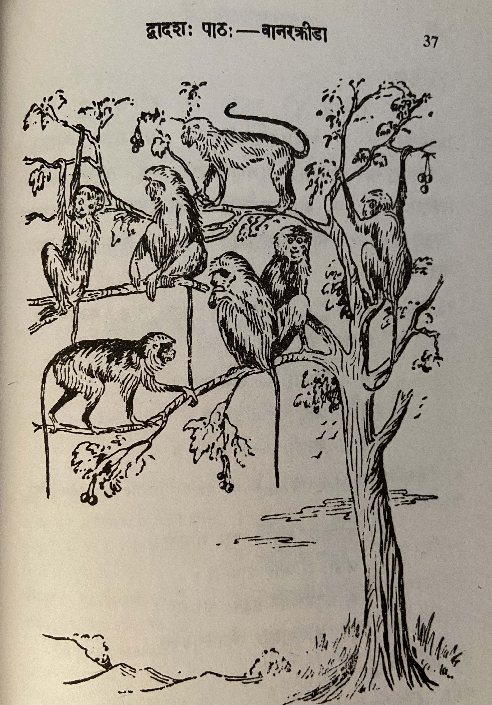

# Lesson 12: वानरक्रीडा

अस्मिन् वृक्षे केचिद्वानराः क्रीडन्ति। ते वृक्षाद्वृक्षं विटपाद्विटपं च प्लवन्ते। वानराः प्रायेण नरैस्तुल्यरूपाः। अथापि नरा इव गृहाणि खगा इ्व नीडानि वा कर्तुं न ते शक्नुवन्ति। सर्वदैव ते वृक्षेषु निवसन्ति। कन्दैः फलैश्चोदरं पूरयन्ति। वानराः स्वभावात् एव चपलाः कोपनाश्च।

काचित् कथा श्रूयते यथा - एकदा  वर्षासु कश्चिद्वानरः शैत्येन बाधितो दन्तवीणां वादयन् कस्यचन शमीतरोर्मूलमाससाद। तस्मिन् वृक्षे कुलायं कृत्वा चटकदम्पती निवसतः स्म। तयोः चटका शैत्येन कम्पमानं वानरमवलोक्य करुणया प्राह - 

&nbsp;&nbsp;&nbsp;&nbsp;&nbsp;&nbsp;
&nbsp;&nbsp;&nbsp;&nbsp;&nbsp;&nbsp;&nbsp;&nbsp;&nbsp;&nbsp;"नीडं कुर्मो वयं चापि चञ्चुमात्राहृतैस्तृणैः2। पाणिपादादिसंयुक्ता यूयं किमिति सीदथ?" इति।

तदाकर्ण्य वानरस्तामाह - "दुष्टे! अलं जल्पनेन; तूष्णीमास्स्व" इति। सा तु करूणाविष्टा पुनः पुनस्तदेव वचनमम्यधात्॥

तेन कुपितो मर्कटः - "सूचीमुखि! दुराचारे! किं प्रलपसि" इति वदन् शमीवृक्षमारुह्य तस्याः कुलायं शतधा भङ्क्त्वा क्षितावपातयत्॥

---

**Translation**

Title: Monkey Play

In that (अस्मिन्) tree (वृक्षे) some (केचिद्) monkeys (वानराः) are playing (क्रीडन्ति). They (ते) jump (प्लवन्ते) from tree (वृक्षात्) to tree (वृक्षं)  and (च) from branch (विटपात्) to branch (विटपं). Monkeys (वानराः) usually (प्रायेण) appear similar to humans (नरैस्तुल्यरूपाः - नरैः तुल्य रूपाः). Moreover (अथापि) they (ते) are not (न) able (शक्नुवन्ति) to make (कर्तुं) houses (गृहाणि) like (इव) men (नराः) or (वा) nests (नीडानि) like (इ्व) birds (खगाः). They (ते) always (सर्वदा) live (निवसन्ति) in trees (वृक्षेषु) only (एव). They fill (पूरयन्ति) their stomach (उदरं) with tubers (कन्दैः) and (च) fruits (फलैः). By nature (स्वभावात्) itself (एव) monkeys (वानराः)  are fickle (चपलाः) and (च) passionate/wrathful (कोपनाः).

Some (काचित्) story (कथा ) is heard (श्रूयते ) like this (यथा) - Once (एकदा) in rainy season (वर्षासु) some (कश्चिद्) monkey (वानरः), affected (बाधितः) due to the cold (शैत्येन), making teeth chattering (दन्तवीणां) noise (वादयन्), was seated (आससाद) at the base (मूलम्) of some (कस्यचन) *Shami* tree (शमीतरोः). In that (तस्मिन्) tree (वृक्षे), having made (कृत्वा) a nest (कुलायं), a sparrow couple (चटकदम्पती1) were living (निवसतः स्म). Among those two (तयोः) (sparrows) the female sparrow (चटका) having seen (अवलोक्य) the monkey (वानरम्) shivering (कम्पमांन) due to cold (शैत्येन) out of compassion (करूणया) said (प्राह) -

&nbsp;&nbsp;&nbsp;&nbsp;&nbsp;&nbsp;
&nbsp;&nbsp;&nbsp;&nbsp;&nbsp;&nbsp;&nbsp;&nbsp;&nbsp;&nbsp;"We (वयं  i.e. birds) also (चापि) make (कुर्मः) nest (नीडं) using beaks having collected/taken (चञ्चुमात्राहृतैः) grass (तृणैः). You all (यूयं i.e. monkeys) endowed with hands and legs (पाणिपादादिसंयुक्ताः),  why like this (किमिति) (you) are seated सीदथ?" thus (इति).

Hearing (आकर्ण्य) that (तत्) the monkey (वानरः) said (आह) to them (ताम्) - "Evil ones (दुष्टे)! enough (अलं) with the prattling (जल्पनेन); be quiet (तूष्णीमास्स्व)" thus (इति). She was but (सा तु) being filled with compassion (करूणाविष्टा) repeatedly (पुनः पुनः) said (अम्यधात्) only (एव) those (तत्) words (वचनम्).

The monkey (मर्कटः) angered (कुपितः) due to that (तेन i.e. the bird) - "Needle face (सूचीमुखि)! Wicked one (दुराचारे)! What (किम्) are you talking (प्रलपसि)" saying (वदन्) thus (इति) having climbed the *Shami* tree (शमीवृक्षमारुह्य), having broken (भङ्क्त्वा) her (तस्याः) nest (कुलायं ) into hundred pieces (शतधा), caused it to fall (अपातयत्) in the ground (क्षितौ).

1दम्पती - दम्पति शब्द स्त्रीलिङ् प्रथमा वि. द्विवचन 

2चञ्चुमात्राहृतैस्तृणैः - Here it is a compound word and correct split is "चञ्चुमात्राहृतैः + तृणैः।

---

**Vocabulary**

| Word | Meaning | Word | Meaning |
| --- | --- | --- | --- | 
| खग *m.* | bird | चटक *m.* | sparrow |
| विटप *m.* | branch, bough | जल्पनम् *n.* | prattling |
| कन्दानि *n.* | bulbous roots | तूष्णीं *in*  आस्व  *A.* | keep quiet|
| चपल *a. m.* | fickle |  |  |
| कोपना *a.m.* | wrathful, passionate | सूचीमुखी *f.*| needle faced|
| वर्षाः *f* | rainy season (always plural) | कुलाय *m.* | nest of a bird|
| शैत्यम् *n.* | cold | शतधा *in* | into a hundred pieces|
| दन्तवीणा *f.* | chattering of the teeth | क्षिति *f.* | the earth, ground |

आससाद - Past tense of the root "सद् - to sit." आससाद - seated