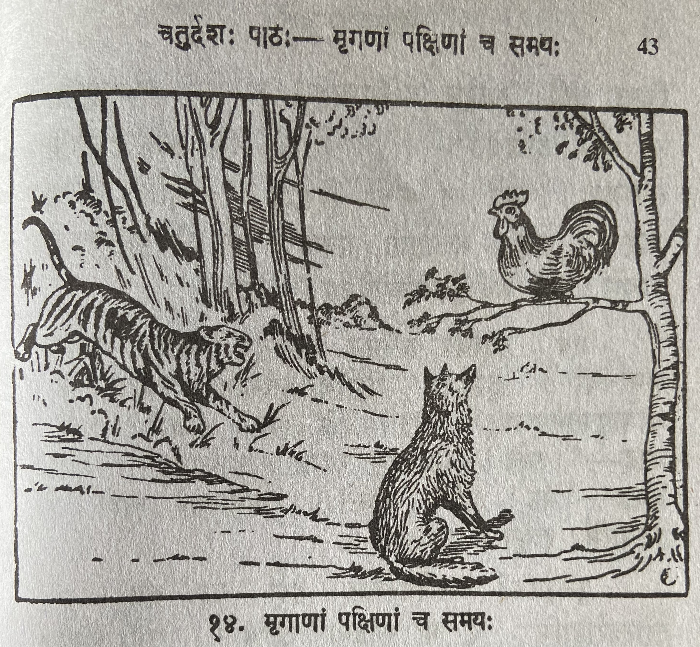

# Lesson 14: मृगाणां पक्षिणां च समयः

कृषीबलः कश्चिदरण्यपरिसरभूमौ1 वसति स्म। जातु तस्य कुक्कुटः केदारे भक्ष्यमन्विष्यन्नास्त2। जम्बुकः कश्चन बुभुक्षितः परिभ्रमस्तमुद्देशमागतः3। कुक्कुटस्तमवेक्ष्य4 समीपस्थस्य तरोः शिखरमारोहत्।

वञ्चको भग्नाशस्तरोर्मूलमासाद्य5 कुक्कुटं प्रलोभयन्नाह - "भद्र! किमिति6 मां दृष्ट्वा वृक्षमारूढवानसि? अद्य खलु मृगैः पक्षिभिश्च सर्वैः सम्भूय समयः कृतः। तत्रैव निर्णीतम्  ’ न कोऽपि कस्मा अपीतः परं द्रुह्येत्7। न कमपि पीडयेत्। किन्तु सर्वैः स्नेहेन वर्तितव्यम्। य एनं समयमुल्लङ्घिते स तीव्रं दण्डयेत’ - इति। तेनाहं त्वां स्नेहेनालिङ्गितुं समागतः। कथं त्वं मत्तो बिभेषि?" - इति। कुक्कुट आह - ’सखे! सत्यमुक्तं भवता। परं त्वं बुभुक्षित इव दृश्यसे। अतः कथं वृक्षादवरोहेयम्!’ - इति॥

एवं वदत्येव तस्मिन् नातिदूरे व्याघ्रः कश्चित समाययौ। कुक्कुटः शिरोधरामुन्नमय्य8 तमीक्षाञ्चक्रे9। गोमायुस्तमपृच्छत्10 - ’भद्र! किं सादरं वीक्षसे?’ कुक्कुट आह - ’सखे! नातिदूरे व्याघ्र आगच्छति’। क्रोष्टा भीतः - ’भद्र! यद्येवं नमस्ते। समयान्तरे त्वां भूयो द्रक्ष्यामि’ इत्युक्त्वा प्रस्थितः॥

कुक्कुटस्तं सस्मितमाह - हंहो मा गमः। अहं तरोरवरोहामि। त्वं मां स्नेहेनालिङ्गिष्यसि। ’सर्वैः स्नेहेन वर्तितव्यम’ इति समये स्थिते किमिति त्वं व्याघ्राद्भीतः!’ - इति। श्रृगालः 'न खलु घातुकाः समयमनुवर्तिष्यन्ते!' इति, वदन् द्रुतं पलायितः॥

**Notes:**

Sandhi of some complex words:

1कस्चिदरण्यपरिसरभूमौ = कश्चित् अरण्य परिसर् भूमौ

2भक्ष्यमन्विष्यन्नास्त = भक्ष्यम् अन्विष्यन् आस्त 

भक्ष्यम् अन्विष्यन् = भक्ष्यमन्विष्यन् (म् + अ = म)

अन्विष्यन् आस्त = अन्विष्य + न् + न् + आस्त = अन्विष्यन्नास्त। 

3परिभ्रमस्तमुद्देशमागतः = परिभ्रमः तम् उद्देशम् आगतः

4कुक्कुटस्तमवेक्ष्य = कुक्कुटः तम् अवेक्ष्य

5भग्नाशस्तरोर्मूलमासाद्य = भग्नासः तरोः मूलम् आसाद्य

6किमिति is the combination of किम् + इति but after joining together it becomes an अव्यय। It is commonly used in the sense of "why"

7Actually it is "न कोsपि कस्मै अपि इतः परं द्रुह्येत्। Here in कस्मै + अपि due to यन्तावान्तादेश सन्धि (सूत्र - एचोsयवायावः) rule it becomes कस्माय् (ऐ followed by vowel gets replaced by आय्). So initially it becomes कस्मायिदम्। Then due to another सूत्र (लोप शाकल्यस्य) य, व when preceeded by अ and when those two are at the end of the word (पदान्त) then optionally they become लोप and no सन्धि post लोप। So कस्मै + अपि - कस्मायपि - कस्मा अपि। is the end result

8शिरोधरामुन्नमय्य = शिरोधराम् उन्नमय्य

9तमीक्षाञ्चक्रे = तम् (he) ईक्षाम् (see) चक्रे (did)

10गोमायुस्तमपृच्छत् = गोमायुः तम् अपृच्छत्

---

**Translation**

Title: Agreement of animals and birds

A farmer (कृषीबलः) was living (वसति स्म) in some (कस्चिद्) land near a forest (अरण्यपरिसरभूमौ). Some day/once (जातु) his (तस्य) rooster/hen (कुक्कुटः) was (आस्त) seeking (अन्विष्यन्) food (भक्ष्यम्) in the paddy field (केदारे). Some (कश्चन) hungry (बुभुक्षितः) wandering (परिभ्रमः) jackal (जम्बुकः)  came (आगतः) to that (तम्) spot (उद्देशम्). The rooster (कुक्कुट:) having seen (अवेक्ष्य) him (तम्)  climbed (अरोहत्) nearby (समीपस्थस्य) tree's (तरोः) peak (शिखरम). 

The cheat (वञ्चकः), one who destroys (भग्नाशः) reached (आसाद्य) the tree's (तरोः) base (मूलम्) enticed (प्रलोभयन्) the rooster (कुक्कुटं) spoke (आह) - "Dear (भद्र)! Why is it (किमिति) after seeing (दृष्ट्वा) me (मां) (you) are (असि) climbing  the tree (वक्षम्)11. Is it not (खलु) today (अद्य) all (सर्वैः) animals (मृगैः) and (च) birds (पक्षिभिः) collectively (सम्भूय) made (कृतः) an agreement (समयः). There (तत्र) only (एव) it was decided (निर्णीतम्) 
'Here (इतः) after (परम्) no one (न कोऽपि) should bear hatred (द्रुह्येत्) for any others (कस्मै). (Should) not (न) harm/injure/trouble (पीडयेत्) anyone (कमपि). But (किन्तु) all (सर्वैः) should behave (वर्तितव्यम्) lovingly (स्नेहेन). The one who (य:) violates (उल्लङ्घिते) this (एनम्) agreement (समयम्) he (स:) will be punished (दण्डयेत) severely (तीव्रं)' - thus (इति). So (तेन) I (अहम्) have come (समागतः) to  lovingly (स्नेहेन) hug (अलिङ्गितुं) you (त्वां). How (कथं) you (त्वं) are scared (बिभेषि12) from me (मत्तः13). 

The rooster (कुक्कुटः) said (आह) thus (इति) - "Friend (सखे)! You (भवता) say (उक्तम्) the truth(सत्यम् ). But (परं) you (त्वं) look (दृश्यसे) like (इव) you are hungry (बुभुक्षित). Therefore (अतः) how (कथं) can I descend (अवरोहेयम्) from the tree (वृक्षात्)!".

As (एवम्) (they were) speaking (वदति) only (एव) not (न) too (अति) far (दूरे) some (कश्चित) tiger (व्याघ्रः) arrived (समाययौ14). The rooster (कुक्कुटः) having raised (उन्नमय्य) it's neck (शिरोधराम्) तम् (he) चक्रे (did) ईक्षाम् (see). The jackal (गोमायुः) asked (अपृच्छत्) him (तम्) - "Friend (भद्र)! What (किम्) are you seeing (वीक्षसे) with attention (सादरं)?" The rooster (कुक्कुटः) said (आह) - "Friend (सखे)! Not (न) very (अति) far (दूरे) a tiger (व्याघ्र) comes (आगच्छति).". The scared (भीतः) jackal (क्रोष्टा15) - "Dear (भद्र)! however (यदि एव) goodbye (नमस्ते). I will see (द्रक्ष्यामि) you (त्वां) again (भूयः) again some time (समयान्तरे)". After saying (उक्त्वा) thus (इति) departed (प्रस्थितः).

The rooster (कुक्कुटः) smiling (सस्मितम्16) said (आह) to him (तम्) - Ho (हंहो) don't (मा) go (गम). I (अहम्) descend from (अवरोहामि) the tree (तरोः). You (त्वं) lovingly (स्नेहेन) hug me (माम्). "All (सर्वैः) should behave (स्नेहेन ) lovingly (वर्तितव्यम)" - in such a time (इति समये स्थिते) why (किमिति) you (त्वं) are scared (भीतः) of the tiger (व्याघ्रात्).

 The jackal (श्रृगालः) - 'Cruel/killers (घातुकाः) never (न खलु) follow (अनुवर्तिष्यन्ते) rules (समयम्) !' saying (वदन्) thus (इति), quickly (द्रुतम्) escaped (पलायितः).

---

**Notes:**

11भद्र! किमिति मां दृष्ट्वा वृक्षमारूढवानसि? This sentence cannot be literally translated to English. It sounds much better in Tamizh. But here is an attempt at literal English translation - Dear (भद्र)! Why (किमिति) after seeing (दृष्ट्वा) me (मां) (you) are (असि) the one who climbed (आरूढवान्) the tree (वृक्षम्)". In Tamizh - ஏன் இப்படி என்னை பார்த்து மரம் ஏறியவன் ஆகிறாய்?

12बिभेषि - भी धातुः लट् मध्यमपुरुष एकवचनम्। The formation is:

| पुरुष | एकवचन | द्विवचन | बहुवचन |
| --- | --- | --- | --- |
| **भी धातुः** () | | | | 
| प्रथम पुरुष | बिभेति | बिभितः / बिभीतः | बिभ्यति |
| मध्यम पुरुष | बिभेषि | बिभिथः / बिभीतः | बिभिथ /  बिभीथ |
| उत्तम पुरुष | बिभेमि | बिभिवः / बिभीवः | बिभिमः / बिभीमः | 

13
मत्तः - मत् + तसिल्। मत् (fifth case of अस्मद् शब्द) मत् - it self means "from me" but the affix तसिल् - also will give fifth case meaning. Like "ग्रामतः / ग्रामात् both means "from the village"

14समाययौ is not द्विवचन। It is या धातुः लिट् प्रथमपुरुष एकवचनम्। Formation is: ययौ  ययतुः  ययुः

15क्रिष्टा - प्रथमा विभक्ति

16सस्मितम् - this is अव्यय not a विभक्ति form of word.

---

**Vocabulary**

| Word | Meaning | Word | Meaning |
| --- | --- | --- | --- |
| समय *m* | an agreement | प्रलोभयत् *a. m.* | seducing | 
| परिसर *m* | vicinity, neighbourhood | द्रुह्येत् *P.* | should bear hatred | 
| उद्देश *m* | a spot, place | शिरोधरा *f* | neck | 
| मग्नाश *am m.* | disappointed | समयान्तर *n* | another time| 
| द्रुतम् *in* | swiftly | मत्तः *in* | from me | 