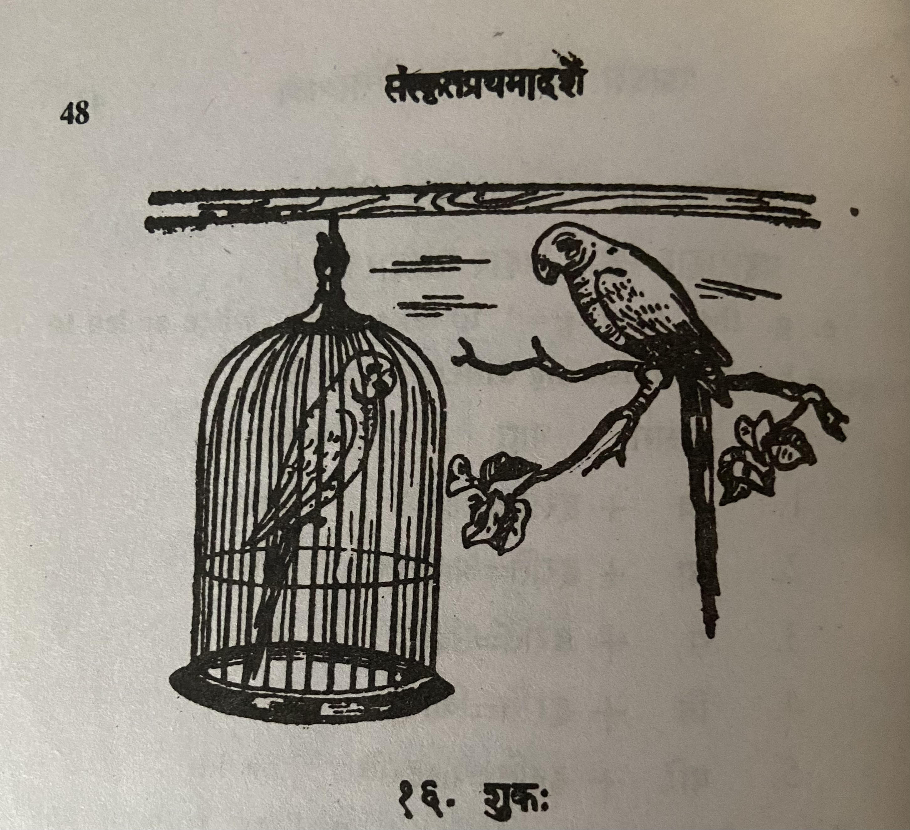

# Lesson 16: शुकः

अत्रैकः शुकः पिञ्जरे बद्धस्तिष्ठति। पिञ्जरात् बहिः शाखायां स्थिता शुकी तस्य माता। सा स्वशाबकं बद्धमवलोक्याश्रु मुच्चन्ती1 तेन सह भाषते। सा तं किं वदतीति किं जानासि? सा तं वदति -

&nbsp;&nbsp;&nbsp;&nbsp;&nbsp;&nbsp;&nbsp;&nbsp;'वत्स! उक्तं खलु मया न त्वया कोटरान्निर्गन्तव्यम् कोऽपि त्वां गृह्णीयात् - इति। मम वाक्यमानादृत्य क्रीडितुं कुसुमलतां गतस्त्वम्। यथा मया कथितं तथैव संवृत्तम्' - इति।

&nbsp;&nbsp;&nbsp;&nbsp;&nbsp;&nbsp;&nbsp;&nbsp;शुकस्तामाह - ’अम्ब! मातुर्वाक्यम् अनुल्लङ्घनीयमिति जानाम्येव। अथापि क्रीडासक्तेन मया चापल्यात् तन्नालोचितम्’। सा प्राह - ’जात! एवं गते त्वयि कथं त्वदेकपुत्रया मया आयुस्शेषो नेयः?2’ सोऽपृच्छत् - ’किमेवं वदसि? किं मम मुक्तिरेव न स्यादस्मात् पञ्जरात्?’ सा कथयति - "दृढतराः पञ्जरस्य शलाका निबिडतराश्च। यथा त्वं न पलायेथास्थता गृहस्वामी जागरूको भवष्यति। कथं ते3 मुक्तिर्भविष्यति?"

अत्रान्तरे गृहस्वामी फलहस्तः समागतः। शुकी पलायीता। गृहस्वामी शुकमिमं फलेन रुचिरेणान्नेन पोषयिष्यति। भाषणं च तं शिक्षयिष्यति। शिक्ष्यमाणाः शुका मनुष्या इव व्यक्तां वाचमुदीरयन्ति। वेदमन्त्रानपि ते पठन्ति। अयमेव शुकानां बन्धने हेतुः।

शुकानां रुपमपि रमणीयम्। तेषां पक्षौ हरितौ, चञ्चवश्चरणाश्च लोहिताः4। केचन शुकाश्चित्रवर्णाः। तेऽतीव रमणीयाः॥

---

Notes:

1मुञ्चन्ती is the कृदन्त form of the root मुच् मोचने - to release / to leave. Here it means "she was shedding tears and spoke. It is like गतवान् - गतवन्ती. क्तवत् प्रत्ययान्तः

2सति सप्तमि usage. These type of sentences are not translatable exactly to English. The closest is: In this situation, where you, my only son, have gone how will I live the remainder of life.

3ते - दकारान्तः युष्मद् शब्दः षष्ठी विभक्तिः तव/ते युवयौः/वाम् युष्माकम्/वः

4तेषां पक्षौ हरितौ। as this is द्विवचन so we must use the word two while translating. Translation must be like "their two wings are green".
चञ्चवश्चरणाः - चञ्चवः + चरणाः ।
चञ्चवः is plural. It is उकारान्त शब्द। Formation is:
चञ्चुः  चञ्चू  चञ्चवः । चञ्चुः - beak

चरणाः - feet / legs. (Like राम शब्दः)

---

**Translation**

Title: Parrot (शुकः)

Here (अत्र) one (एकः) parrot (शुकः) stands (तिष्ठति) trapped (बद्धः) in a cage (पिञ्जरे)। The female parrot (शुकी) being (स्थिता) outside (बहिः) the cage (पिञ्जरात्), in the branch (शाखायां), is his (तस्य) mother (माता). She (सा), seeing (अवलोक्य) her (स्व) young (शाबकम्) caged (बद्धम्), releasing/shedding (मुच्चन्ती) tears (अँश्रु), is talking (भाषते) with him (तेन). Do you want to know (किं जानासि) what (किं) she (सा) is speaking (वदति इति) with him (तेन)? She (सा) says (वदति) to him (तम्) - 

"Child (वत्स)! Was it not (खलु) told (उक्तं) by me (मया) thus (इति) - the hole (कोटरात्) should not be exited (निर्गन्तव्यम्) by you (त्वया), someone (कोऽपि) may catch you (गृह्णीयात्). Not listening (अनादृत्य) my (मम) words (वाक्यम्) you (त्वम्) went (गतः) for playing (क्रीडितुं) to the creeper with flowers (कुसुमलतां). Just as (यथा) as said (कथितं) by me (मया) like that (तथा) only (एव) ोचचुरेद (संवृत्तम्)" - thus (इति).

The parrot (शुकः) told (आह) her (ताम्) - "Mother (अम्ब)!  I only/certainly  (एव) know (जानामि) mother's word (मातुर्वाक्यम्) is not to be contravened (अनुल्लङ्घनीयम् इति). Moreover (अथापि) due to involvement in playing (क्रीडासक्तेन) due to my (मया) fickleness (चापल्यात्) I did not (न) think of (आलोचितम्) that (तत्)". She (सा) said (प्राह) - 'Child (जात)!  Like this (एवम्) has happened (गते) in you (त्वयि), you (त्वम्) are the only son  (एकपुत्रया) of mine (मया), how (कथं) to lead (नेयः) remainder (शेषः) of life (आयुः)2? He (सः) asked (अपृच्छत्) - '’Why (किम्) do you say (वदसि) like this (एवं) ? Why (किम्) my (मम) freedom (मुक्तिः) only (एव) from this (अस्मात्) cage (पञ्जरात्) cannot (न) happen (स्यात्)?' She (सा) said (प्राह) - "The cage's (पञ्जरस्य) bars (शलाकाः) (are) strong (दृढतराः)  and (च) dense (निबिडतराः). The house owner (गृहस्वामी) will be (भवष्यति) careful/watchful (जागरूकः) so that (यथा) you (त्वं) do not (न) **(पलायेथास्तथा)**. How (कथम्) your (ते) freedom (मुक्तिः) is possible (भविष्यति)"

In the meanwhile (अत्रान्तरे) the house owner (गृहस्वामी) fruit in hand (फलहस्तः) returned (समागतः). The female parrot (शुकी) escaped (पलायीता). The house owner (गृहस्वामी) will nourish (पोषयिष्यति) this (इमम्) parrot (शुकम्) with fruit (फलेन) and with tasty rice (रुचिरेणान्नेन). Also (च) (he) will teach (शिक्षयिष्यति) it (तम्) to speak (भाषणम्). Trained/taught (शिक्ष्यमाणाः) parrots (शुकाः) talk (उदीरयन्ति) clear (व्यक्तां) words (वाचम्) like (इव) people (मनुष्याः). They (ते) read (पठन्ति) even (अपि) *Veda Mantras* (वेदमन्त्रान्). That is (अयम्) only (एव)  the reason (हेतुः) for caging/trapping (बन्धने) parrots (शुकानां).

Parrots's (शुकानां) form (रुपम्) is also (अपि) delightful (रमणीयम्). Their (तेषां) two wings (पक्षौ) are green (हरितौ), and (च) beaks (चञ्चवः)  and (च) feet (चरणाः) reddish (लोहिताः). 

Some (केचन) parrots (शुकाः) are colorful (चित्रवर्णाः). They (ते) are extremely (अतीव) delightful (रमणीयाः).

---

**Vocabulary**

| Word | Meaning | Word | Meaning |
| --- | --- | --- | --- | 
| कोटर *n.* | hollow of a tree | जागरूक *a. m.* |  wakeful, careful |
| मुक्ति *f.* | letting off, free | पक्ष *m* | wing |
| क्षलाका *f.* | bar of a cage | निबिड *a* | dense |