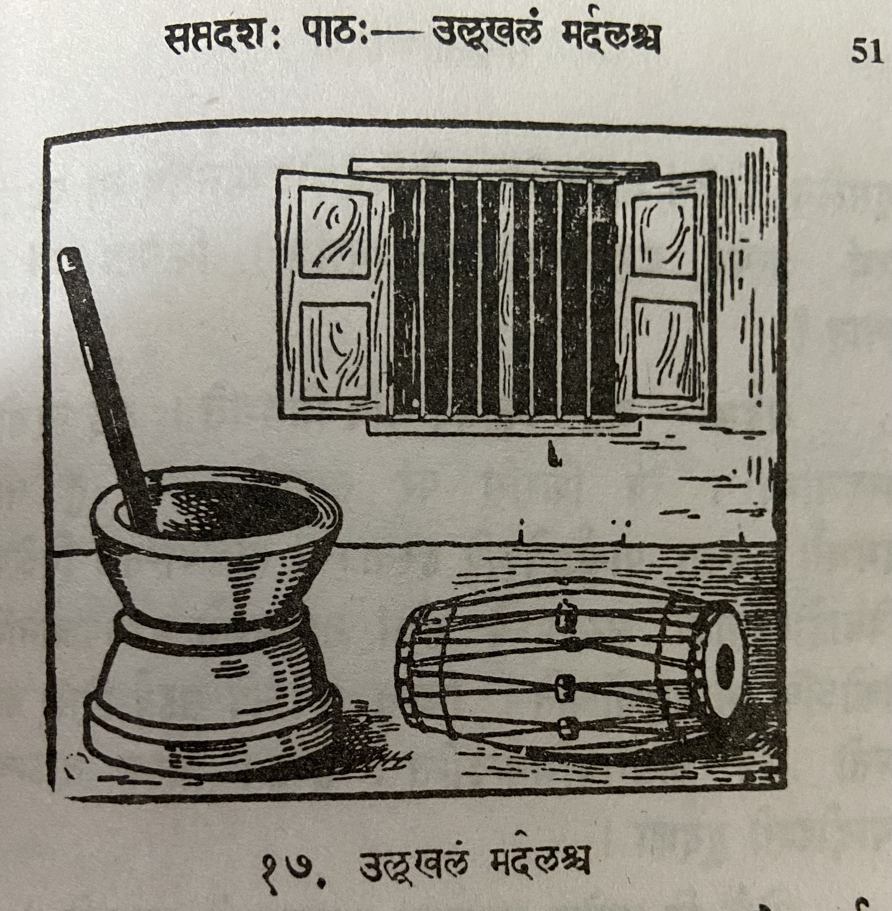

# Lesson 17: उल्लूखलं मर्दलश्च

कस्मिश्चित् गृहे भजनोत्सवानन्तरं रात्रौ मर्दलः कश्चिदुलूखलस्य समीपे स्थापितः।  मित्रमन्तिके दृष्टवा मर्दलः कुशलं पृच्छंस्तेन सह सम्भाषते।

मर्दलः - सखे! अपि कुशलं भवतः? अस्मिन् देशे का वार्ता?

उलूखलम् - मित्र? अस्मिन् देशे मां विहाय सर्वेऽपि कुशलिन एव। अहं परं मन्दभाग्यम्।

मर्दलः - कुतस्त्वं मन्दभाग्यम्? कस्ते दुःखहेतुः?

उलूखलम् - सखे! किं ब्रवीमि। तथापि श्रूयताम् - दुर्भगस्य मे शिरसि धान्यानि निधाय स्त्रियः पुरुषाश्च मां मुसलेन निर्दयं ताडयन्ति। केचिदयोदण्डेनापि मां प्रहरन्ति इत्थं प्रत्यहं महती पीडामनुभवामि। किमतः परं कष्टं स्यात्?

मर्दलः - भद्र! किमिदं मयि निवेद्यते। अहं त्वक्तोऽपि मनदभाग्यः। त्वं शिरसि परं ताड्यसे। मां तु ताडने समर्थाः जनाः पार्श्वद्वयेऽपि हस्ताभ्यां ताडयन्ति। विशेषतश्च विवाहोत्सवादौ सभामध्ये तीव्रं ताडयन्तो मामवजानन्ति। नैकोऽपि मामनुशोचति। किन्तु सर्वेऽपि सहर्षं शिरः कम्पयन्तो मम ताडनमभिनन्दन्ति। हन्त! कस्य वाऽन्यस्य स्यादीदृशी दुर्दशा।

लोके हि प्रायेण नान्यस्य दुःखमन्यो जानाति॥

---

## Translation

**Title:** The mortar (उलूखलम्) and (च) the drum (मर्दलः) (i.e. percussion instrument) 

In some (कस्मिश्चित्) house (गृहे) after (अनन्तरं) a devotional music (भजन) festival (उत्सव) in the night (रात्रौ) a drum (मर्दलः) was placed (स्थापितः) close to (समीपे) some (कश्चिद्) mortar (उलूखलस्य).

Drum (मर्दलः) - Oh friend (सखे)! Are (अपि1) you (भवतः) well/fine (कुशलं)?

Mortar (उलूखलम्) - Friend (मित्र)! In this (अस्मिन्) country (देशे) other than (विहाय) me (माम्) all (सर्वेऽपि) are happy (कुशलिन) only (एव). But (परं) I am (अहम्) unfortunate (मन्दभाग्यम्).

Drum (मर्दलः) - Why (कुतः) you (त्वम्) are unfortunate (मन्दभाग्यम्) ? What (कः) is the reason (हेतुः) for your (ते) misery (दुःख)?

Mortar (उलूखलम्) - Friend (सखे)! What (किम्) can I say (ब्रवीमि). But still (तथापि) listen (श्रूयताम्) -  On my (मे) misfortunate (दुर्भस्य) head (शिरसि), women (स्त्रियः) and (च) men (पुरुषाशः) after placing (निधाय) grains (धान्यानि) mercilessly (निर्दयम्) beat/pound (ताडयन्ति) me (माम्) with a pestle (मुसलेन). Some (केचिद्) also (अपि) attack/beat (प्रहरन्ति) me (माम्) with iron sticks (अयोदण्डेन) - about (प्रति) this (इत्थं) (due to this) I (अहम्) experience (अनुभवामि) great (महती) suffering/pain (पीडाम्). What (किम्) further (अतः परम्) troubles (कष्टम्) maybe/may happen (स्यात्)?

Drum (मर्दलः) - Friend (भद्र)! What should I say about me / my situation (किमिदं मयि निवेद्यते2).  I'm more unlucky than you (अहं त्वक्तोऽपि मनदभाग्यः3)

On your (त्वं)  head (शिरसि) alone/merely (परं) you are beaten (ताड्यसे). But me (माम् तु) people (जनाः) capable of/expert in (समर्थाः) beating (ताडने) beat (ताडयन्ति) (my) two sides (पार्श्वद्वयेऽपि) with (two) hands (हस्ताभ्यां). And (च) especially (विशेषतः) in wedding celebrations (विवाहोत्सवादौ) in the middle of the gathering (सभामध्ये) (they) intensively (तीव्रम्) beat (ताडयन्तः4) me (माम्) treat me with contempt (अवजानन्ति). Not (न) a single one (एकोऽपि) is sorry for (अनुशोचति) me (माम्). But (किन्तु) everyone (सर्वेऽपि) happily (सहर्षं) shaking (कम्पयन्तो) (their) head (शिरः) applaud/apprecite (अभिनन्दति) my (मम) beating (ताडनम्‌). Alas (हन्त)! how (कस्य वा) other's (अन्यस्य) दुर्दशा (misfortune) स्यात् (could be) ईदृशी (like this) 

Surely (हि) in the world (लोके) generally (प्रायेण) other people (अन्यः) do not (न) know (जानाति) other's (अन्यस्य) sorrow (दुःखम्).

1अपि usually means "also". But it is used in sentences that are questions similar to usage of वा. अपि कुशलम् is the same as कुशलं वा

2Word by word meaning won't work here. Over all meaning is: what should I say about me / my situation.

3
अहं त्वत्तोsपि (त्वत्तः - त्वत् + तः (तसिल् प्रत्यय). त्वत् - you. त्वत्तः - than you

4It is कृदन्त form. Like गच्छन् गच्छन्तौ गच्छन्तः It is continuous tense.

---

## Vocabulary

| Word | Meaning | Word | Meaning |
| --- | --- | --- | --- |
| उलूखल *n.* | wooden mortar used for cleansing rice (removing husk) | मुसल *m. n.* | pestle| 
| कुशल *n.* | welfare | अयोदण्ड *m.* | an iron-bar |
| दुर्भग *a. m.* | unfortunate | प्रवृत्ति *f.* | news|
| वृत्तान्त *m* | news | | |

The word भवति means "to be". Its root is भू. When a prefix (उपसर्ग) is added to भवति its meaning changes.

| Word | Meaning | Word | Meaning |
| --- | --- | --- | --- |
| अनुभवति | enjoys, experiences | परिभवति | disregards |
| पराभवति | overcomes | प्रभवति | Is able to, happen, prevail |
| सम्भवति | happens | अभिभवति | defeats |