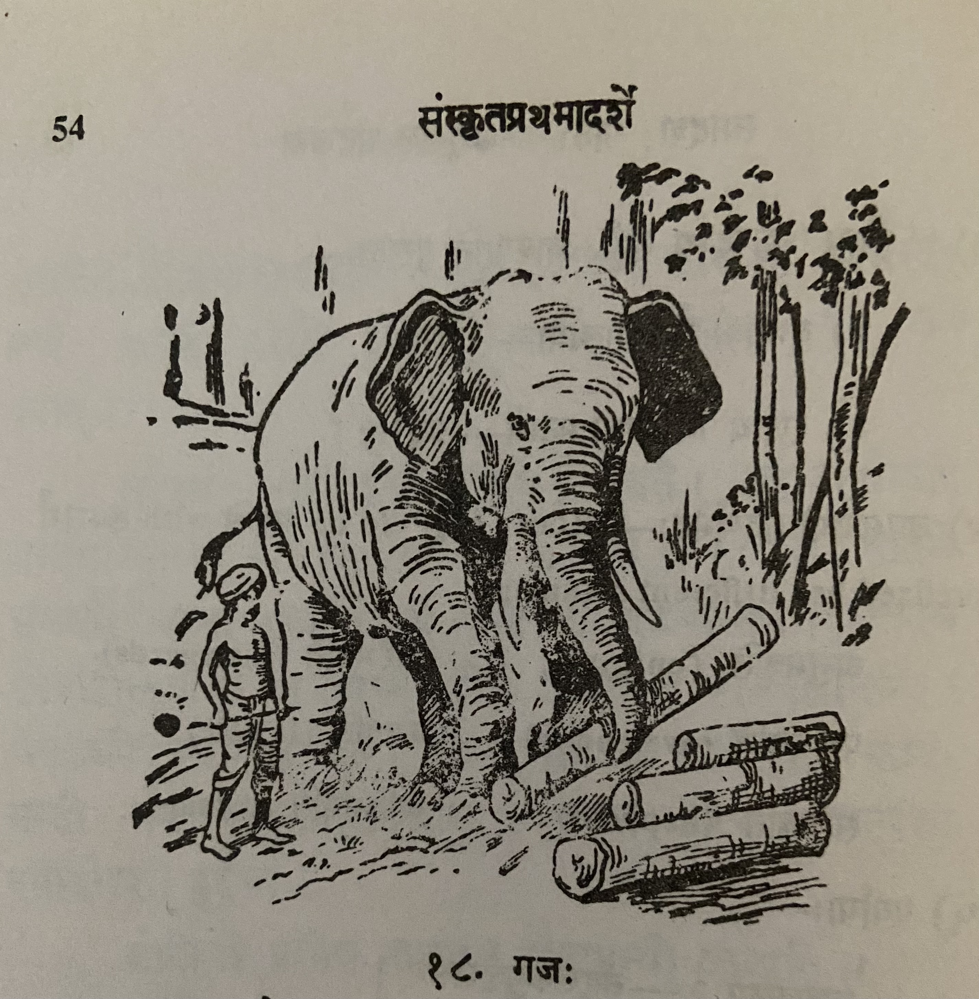

# Lesson 18: गजः

मृगजातौ गजः गरिष्ठः। तस्य पादाः स्तम्भा इव स्थूलाः। तस्य कर्णौ शूर्पाविव1 विशालौ। तस्य नेत्रे तावदत्यल्पे। अथापि सोल्पान्यपपि सोल्पान्यपि वस्तूनि द्रष्टुं शक्नोति। भूमौ स्थितां सूचिकामपि स पश्यति गृह्णाति च॥

गजस्य मुखेऽजगरवल्लम्बमानोऽवयवः2 शुण्डा। वयं हस्तेन यत कर्म कुर्मः तत् गजः शुण्डया करोति। अत एव गजस्य शुण्डा ’हस्तः’ इति ’करः’ इति  च व्यपदिश्यते। तेन गजस्य ’हस्ती’ ’करी’ इति संज्ञे भवतः। शुण्डैव गजस्य नासिका। तयैव श्वसिति गजः। शुण्डाया अग्रे रन्ध्रमस्ति॥

गजः प्रथमं शुण्डया जलमादाय पश्चात् तन्मुखे निषिञ्चति। एवं द्वाभ्यामवयवाभ्यां जलं पिबन् गजः ’द्विपः’ इत्याख्यां भजते॥

गजानां दृढौ तीक्षणौ च द्वौ दन्तौ स्तः। तस्मात् ते ’दन्तिनः’, ’दन्तावलाः’ ’द्विरदाः’ इति कथ्यन्ते। शिल्पिनः करिणां दन्तैः रम्याणि महार्घाणि वस्तुनि निर्मान्ति। करेणूनां दन्तौ न स्तः॥

यद्यपि गजा वन्या जन्तवः, तथापि ते जनैः कौशलेन गृह्यन्ते, शिक्षयन्ते च। साधु शिक्ष्यमाणास्ते जनैः कर्तुमशक्यानि कर्माणि  कुर्वन्ति। गुरुतराणि दारूणि कर्षन्ति। शिक्षिता अपि गजास्तदा तदा मदेनोन्माद्यन्ति। तदा तान् आधोरणाः निशितेनाङ्कुशेन नियन्त्रयन्ति॥

 

1शूर्प (*m*) - शूर्पौ + इव = शूर्प् + आव् + इव = शूर्पाविव This is यान्तवान्तादेशसन्धिः (एचोऽयवायावः)

2मुखेऽजगरवल्लम्बमानोऽवयवः = मुखे अजगरवत् लम्बमानः अवयवः

---

**Translation**

In the family of animals (मृगजातौ) the Elephant (गजः) is the biggest (गरिष्ठः). His (तस्य) legs (पादाः) are thick (स्थूलाः) like (इव) pillars (स्तम्भाः). His (तस्य) two ears (कर्णौ) are big (विशालौ) like winnowing basket (शूर्पा). His (तस्य) two eyes (नेत्रे) are so very small (तावद् अति अल्पे). So much the more (अथापि) (he) is able (शक्नोति) to see (द्रष्टुं) even (अपि) small (सोल्पानि) objects (वस्तूनि). He (सः) sees (पश्यति) and (च) takes (गृह्णाति) even (अपि) a needle (सूचिकाम्) lying (स्थितां) on the floor/ground (भूमौ).

In the elephant's (गजस्य) face (मुखे) is a python-like (अजगरवत्) limb (अवयवः) hanging down (लम्बमानः) trunk (शुण्डा). That which (यत्) work (कर्म) we (वयम्) do (कुर्मः) with hand (हस्तेन) that (तत्) the elephant (गजः) does with trunk (शुण्डया). Thus (अतः) only (एव) is referred to (व्यापदिश्यते) like (इति) hand (हस्त:) like (इति) hand (करः). Due to that the elephant is also designated/called *hasti* and *kari*3. The trunk (शुण्डा) is only (एव) the elephant's (गजस्य) nose (नासिका). With that only (तया एव) the elephant (गजः) breathes (श्वसिति). The trunk's (शुण्डाया) beginning (अग्रे) is (अ्स्ति) a hole (रन्ध्रम्).

The elephant (गजः) first (प्रथमम्) having taken (आदाय) water (जलम्) with the trunk (शुण्डया) then (पश्चात्) pours into (निषिञ्चति) its mouth (तन्मुखे). The elephant (गजः) drinking (पिबन्) like this (एवम्) with two (द्वाभ्याम्) limbs (अवयवाभ्याम्) is named (आख्याम्) as *Dvipaha* (द्विपः इति) (and) adore/revere (भजते).

Elephants (गजानां) have  (स्तः) two (द्वौ) strong (दृढौ) and sharp (तीक्षणौ) teeth (दन्तौ)4. Therefore (तस्मात्) they (ते) are thus (इति) called (कथ्यन्ते) *Dantinah* (दन्तिनः), *Dantavlah* (दन्तावलाः), *Dviradaha* (द्विरदाः). Sculptors (शिल्पिनः) make (निर्मान्ति) pleasing (रम्याणि) expensive (महार्घाणि) objects (वस्तुनि) with elephant's (करिणां) teeth (दन्तैः). Female elephants (करेणूनां) do not (न) have (स्तः) teeth (दन्तौ)5.

Even though (यद्यपि) elephants (गजाः) are forest (वन्याः) animals (जन्तवः), even then (तथापि) they (ते) are skillfully (कौशलेन) obtained/taken (गृह्यन्ते) and (च) trained/instructed (शिक्षयन्ते) by people (जनैः). Well (साधु) trained/taught (शिक्ष्यमाणास्ते) (elephants) do (कुर्वन्ति) works/jobs (कर्माणि) that can be done (कर्तुमशक्यानि) by people (जनैः). (They) cut (कर्षन्ति) heavy (गुरु) trees (तराणि) and logs (दारूणि). Trained (शिक्षिताः) elephants (गजाः) also (अपि) now and then/sometimes (तदा तदा) become mad (उन्माद्यन्ति) with intoxication (मदेन). Then (तदा) elephant drivers (आधोरणाः) restrain (नियन्त्रयन्ति) them (तान्) with a sharpened (निशितेन) hook (अङ्कुशेन).
  

 

3The literal translation of - तेन गजस्य ’हस्ती’ ’करी’ इति संज्ञे भवतः - is as follows - Due to that (तेन)  the elephant's (गजस्य) designations (संज्ञे) are (भवतः) *hasti* (हस्ति) *kari* (करी) thus (इति). The translation is as shown above. 

4The literal translation of - गजानां दृढौ तीक्षणौ च द्वौ दन्तौ स्तः - Elephant's two strong and sharp teeth are there.

5The literal translation is  - Female elephant's (करेणूनां) teeth (दन्तौ) was not (न) there (स्तः).

---

**Vocabulary**

**लत्व सन्धिः** - तकास्य दकारस्य वा ’ल’ कारः भवति

अजगरवत् + लम्बते = अजगरवल्लम्बते

भगवत् + लीला = भगवल्लीला

सुहृद् + लाभः = सुहृल्लाभः

 

**उपसर्गयोगादर्थभेदः** - दिश् दिशति (to give)। उपदिशति (instructs), व्यपदिशति (calls), आदिशति (commands), निर्दिशति (directs), उद्दिशति (points), सन्दिशति (sends message)

 

**अतिशयनार्थकाः शब्दाः (Degrees of comparison):**

| Positive | Comparative | Superlative |
| --- | --- | --- |
| गुरुः | गरीयान् | गरिष्ठः |

 

| Word | Meaning | Word | Meaning |
| --- | --- | --- | --- |
| गरिष्ठ (*a. m.*) | biggest | नासिका *f* | nose |
| शूर्प *m. a.* | winnowing basket | रन्ध्र *n. a* | a hole |
| सूचिका *f* | needle | शिल्पिन् (*m*) | artisan |
| अजगर *m* | a huge serpent which swallows goats, python | करेणु *f* | a female elephant |
| दारु *n* | timber | निशित *a. m.*| sharpened |
| [आधोरण](https://www.learnsanskrit.cc/translate?search=%E0%A4%86%E0%A4%A7%E0%A5%8B%E0%A4%B0%E0%A4%A3&dir=au) *m* | rider or driver of an elephant | [उन्माद्यति](https://www.learnsanskrit.cc/translate?search=%E0%A4%89%E0%A4%A8%E0%A5%8D%E0%A4%AE%E0%A4%BE%E0%A4%A6%E0%A5%8D%E0%A4%AF%E0%A4%A4%E0%A4%BF&dir=au) | be or become mad or furious |
| [निशित](https://www.learnsanskrit.cc/translate?search=nishita&dir=se) | sharpened | [नियन्त्रयति](https://www.learnsanskrit.cc/translate?search=niyantrayati&dir=se) | restrain |
