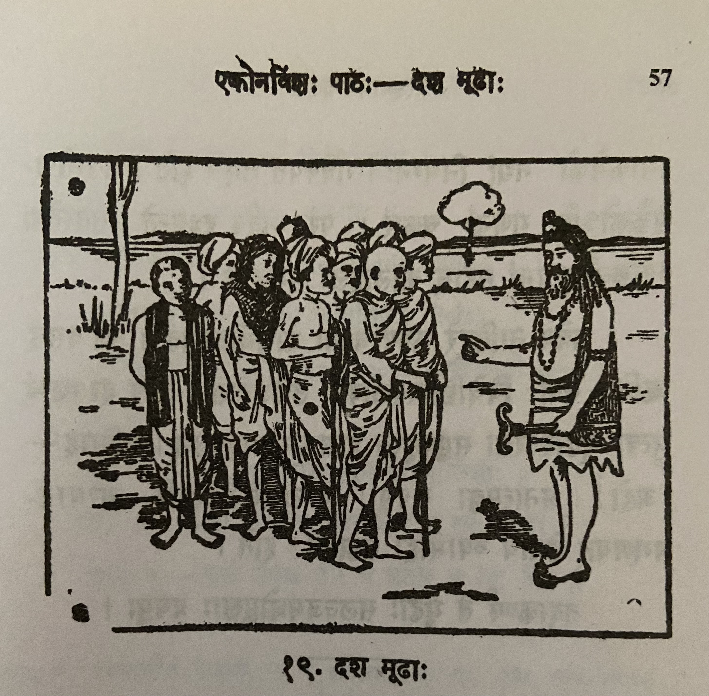

# Lesson 19: दश मूढाः

मूढानां चेष्टितानि प्रायेण विनोदावहानि। यथा हि - एकदा दश मूढाः देशाटनाय प्रस्थिताः। किञ्चिद्दूरं गतानां तेषामुपस्थिता काचिदगाधा1 नदी। बाहुभ्यां तरन्तस्ते कथमपि नदीं तीर्त्वा पारं गताः॥

आसीत् तेषां मध्ये कश्चन वृद्धः। ’स किं सर्वे तीरमनुप्राप्ताः?’ इति जिज्ञासमानस्तान् एकैकशो गणयामास। परं नवैव  परिगणितास्तेन। तता स आक्रोशत् - ’अहि! वयं दश प्रस्थिताः। इदानीं नवैव स्मः। नूनमस्माकमेको नद्यां निमग्नः। गवेषयत तम्’ इति। ततस्तेषामेकैकोऽपि गणनां चकार2। परं नवैव दृश्यन्ते। ततस्तेषां व्याकुलीभूतानां महान् कोलाहलः समजनि।

तत्रैव नातिदूरे कस्यचिदृषेः आश्रमोऽवर्तत। तत्र वसन् ॠषिः तेषां विचेष्टितमवलोक्य उच्चैर्जहास। तस्य हासशब्दं श्रुत्वा मूढास्तरसा समुपसृत्य हासकारणमपृच्छन्। ऋषिराह - ’अहो! अनात्मज्ञा यूयम्। युष्माकमेकैकोऽपि नात्मानमगणयत् तेनायं व्यामोहः सञ्जातः’ इति।

तदाकर्ण्य ते मूढाः सलज्जमधोमुखाः प्रययुः।

1कदाचित् अगाधा

2चकार - did. Past tense (लिट् लकार of करोति)

---

**Translation**
 
The antics (चेष्टितानि) of fools (मूढानां) is generally (प्रायेण) humorous (विनोदावहानि). For example (यथा हि) - once (एकदा) ten (दश) fools (मूढाः) started out (प्रस्थिताः) to travel the country (देशाटनाय). After going (गतानां) some distance (किञ्चिद्दूरं) they arrived (तेषामुपस्थिता) (near) some deep river (काचिदगाधा) river (नदी). They (ते) who swum (तरन्तः) with their hands (बाहुभ्यां) somehow (कथमपि) went (गताः) across (पारम्) the river (नदीं) bank (तीर्त्वा)

In their (तेषाम्) midst (मध्ये) there was (आसीत्) some (कश्चन) old man (वृद्धः). He (सः) - "Have (किम्) all (सर्वे) reached (अनुप्राप्ताः) the bank (तीरम्)" - to find that (जिज्ञासमानस्तान् इति) counted (गणयामास) each one (एकैकशः). But (परम्) only (एव) nine (नव) were enumerated (परिगणिताः) by him (तेन). Then (तता) he (सः) cried out (आक्रोशत्) thus (इति) - 'Oh! Ten (दश) of us (वयं) left (प्रस्थिताः). We are (स्मः) nine (नव) only (एव) now (इदानीम्). Indeed (नूनम्) one (एकः) of us (अस्माकम्) has drowned (निमग्नः) in the river (नद्यां). Search for (गवेष्यत्) him (तम्)'. After that (ततः) each of (एकैकः) their (तेषाम्) counted (गणनां चकार) also (अपि). But (परम्) only (एव) nine (नव) were seen (दृश्यन्ते). Then (ततः) among them all (तेषाम्) who were perplexed (व्याकुलीभूतानां) there was (समजनि) a big (महान्) noise (कोलाहलः).

There (तत्र) only (एव), not (न) too (अति) far (दूरे) some (कश्चित्) sage’s (ऋषेः) hermitage (अश्रमः) was there (अवर्तत्). The sage (ऋषिः) living (वसन्) there (तत्र) seeing (अवलोक्य) their (तेषाम्) action/struggle/behaviour (विचेष्टितम्) loudly (उच्चैः) laughed (जहास). Hearing (श्रुत्वा) the sound of his (तस्य) laughter (हासशब्दं3) the fools (मूढाः) speedily/quickly (तरसा) gathering (समुपसृत्य) (near him) asked (अपृच्छन्) the reason for laughter (हास्यकारणम्). The sage (ऋषिः) said (आह) this (इति) - 'Oh! You all (यूयम्) ignorant of the selves (अनात्मज्ञ). Not (न) even (अपि) one (एक एकः) among you (युष्माकम्) counted (अगणयत्) yourself (आत्मानम्) due to that (तेन) this (अयम्) mental confusion (व्यामोहः) has arisen (सञ्जातः)'.

Hearing (आकर्णय) that (तत्) those (ते) fools (मूढाः) facing downwards (अधोमुखाः) with shame (सलज्जम्) went away (प्रययुः)

3sound of laughter

---

**Notes and Vocabulary**

**अश्त्व सन्धिः - (जशू = , ज, व, ग, ड, द वर्णाः वकारश्व भवति)**

वाक् + रसः = वाग्रसः

सम्राट् + भरति = सम्राड्भरति।

किञ्चित् + दूरम् = किञ्चिद्दूरम्।

अप् + धारा = अब्धारा

**उपसर्गयोगादर्थभेदः**

स्था (to stand) तिष्ठति ; अनुतिष्ठति (performs); अधितिष्ठति (sets); उपतिष्ठति (उपतिष्ठते) (approaches); सन्तिष्ठते (ends)

| Word | Meaning | Word | Meaning |
| --- | --- | --- | --- |
| पारम् *n* | opposite bank of a river | अनात्मज्ञ *a. m.* | one who does not know himself |
| एकैकशः *in* | one by one | व्यामोह *m* | perplexity |
| एकैक *m* | everyone | स्रजू *f* | a garland |
| व्याकुलीभूत *m* | perplexed | सम्राजू *m* | a paramount sovereign |
| कोलाहल *m* | a loud and confused noise | | |