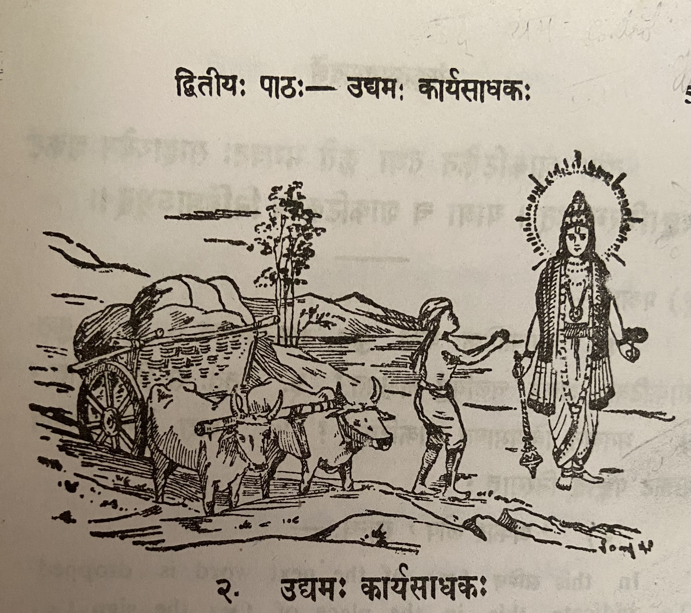

# Lesson 2: उद्यमः कार्यसाधकः

वर्षासु शकटिकः कश्चित् स्वशकटे भाण्डान्यारोप्य तं नगरान्तरमनयत्। द्वौ वृषौ तं शकटम् अवहताम्। रथ्यायां पङ्के शकटस्य चक्रं रुद्धमभूत्। रथ्यायां पङ्के शकटस्य चक्रं रुद्धमभूत्। वृषभौ बलवत् प्रहरन्नपि स शकटं चलयितुं नाक्षमत॥

ततः स भगवन्तं नारायाणं प्रति चिक्रोश। तस्याक्रोशं श्रुत्वा दयालुर्भगवांस्तस्य पुरस्तादाविरभूत्। अभाषत च शाकटिकम् - 'भो मूढ! किमिति जोषमास्से? मम साहाय्यं वाञ्छसि चेत् उत्तिष्ठ! धुर्यौ चोदय, चक्रं स्कन्धेन प्रचालय। एवं कृतेऽहं ते सहाय्यं करिष्यामि' - इति। एवमुक्त्वा भगवान् अन्तर्धानमकरोत्॥

---

**Story title:** The hard worker (उद्यमः) is the accomplisher of any object/work (कार्यसाधकः)

During rains/rainy season (वर्षासु) some (कश्चित्) cart man (शकटिकः) having loaded (आरोप्य) wares (भाण्डानि) on his (स्व) cart (शकटे) and took (अनयत्) it (तम् -refers to the cart)  to another town (नगरान्तरम्). Two (द्वौ) bulls (वृषौ) drove/transported (अवहताम) that (तम्) cart (शकटम्). The cart's (शकटस्य) wheel (चक्रं) became ([अभूत्](https://learnsanskrit.wordpress.com/2018/09/29/%E0%A4%85%E0%A4%AD%E0%A5%82%E0%A4%A4%E0%A5%8D-he-happened/)) stuck/obstructed (रूद्धम्) in the mud (पङ्के) on the road ([रथ्यायां](https://sanskritabhyas.in/%E0%A4%B0%E0%A4%A5%E0%A5%8D%E0%A4%AF%E0%A4%BE-%E0%A4%B6%E0%A4%AC%E0%A5%8D%E0%A4%A6-%E0%A4%B0%E0%A5%82%E0%A4%AA)).
Inspite of beating (प्रहरन् अपि) both bulls (वृषभौ) forcefully/severely (बलवत्)
he (स) was unable (न अक्षमत) to move (चलयितुम्) the cart (शकटं).

Therefore (ततः) he (स) cried (चिक्रोश) to/towards (प्रति) lord/god (भगवनतम्) Narayana (नारायाणम्). Having heard (श्रुत्वा) his (तस्य) cry (अक्रोशं) the kind god (दयालुः भगवान्) became manifest (अविरभूत्)) in front of him (तस्य पुरस्तात्). And (च) said (अभाषत) to the cart man (शाकटिकम्) - "Hey idiot (भो मूढ)! Why (किम) you are silent (जोषमास्से) like this (इति)? If (चेत्) you want (वाञ्छसि) my (मम) help (साहाय्यं) stand up (उत्तिषठ)! Drive (चोदय) the two bulls (धुर्यौ), push (प्रचालय) the wheel (चक्रं) with your shoulder (स्कन्धेन). If you do like that (एवं कृते) I (अहम्) will help (सहाय्यं करिष्यामि) you (ते)" - thus (इति)। Saying like this (एवम् उक्त्वा) the lord (भगवान्) disappeared (अन्तर्धानमकरोत्).

---

**Notes:**

प्रहरन् + अपि - प्रहरन्नपि। Here न् became double because of सन्धि rule. प्रहरन् is a present continuous कृदन्त like गच्छन्।

नाक्षमत - न + अक्षमत। आत्मनेपदी verb, past tense. लट् is: क्षमते  क्षमेते  क्षमन्ते

आस्से - root is "आस् - to sit". आत्मनेपदी लट् मध्यमपुरुष एकवचनम्

जोषम् + आस्से। जोषम् - is from the root "जुष् - to remain quit / silent"

नगरान्तरम् Is it a compound word?

---

**Sandhis:**

भाण्डान्यारोप्य = भाण्डानि आरोप्य  इ when followed by any vowel becomes य्

नगरान्तरमनयत् = नगरान्तरम् अनयत्

रुद्धमभूत् = रूध्दम् अभूत्

प्रहरन्नपि = प्रहरन् + अपि

तस्याक्रोशं = तस्य अक्रोशं

दयालुर्भगवांस्तस्य = दयालुः भगवान् तस्य

पुरस्तादाविरभूत् = तस्य पुरस्तात् अविरभूत्

---

**Vocabulary**

| Word | Meaning | Word | Meaning |
| --- | --- | --- | --- |
| भाणडानि (n) | wares, goods | अभाषत | spoke |
| नगरान्तर (n) | another town | जोर्ष (in) | are keeping idle |
| रथ्या (f) | road | आस्ते | are keeping idle |
| पङ्क (n) | mud, slush | साहाय्यम् (n) | assistance |
| रूद्ध (n) | obstructed | वाञ्छसि | wish, crave |
| बलवत् (in) | severely | धुर्य (m) | bullock, horse |
| अक्षमत | was able | चोदय (p) | drive |
| चुक्रोश (p) | cried | स्कन्ध (m) | shoulder |
| दयालु | kind  | प्रचालय (p) | push |
| अन्तर्धान | disappear | अकरोत् | did (past tense of करोति)|

भाषते is the लट् लकारः form of the word meaning "to speak". अभाषत is the
लङ् लकारः (past tense) of the word.
