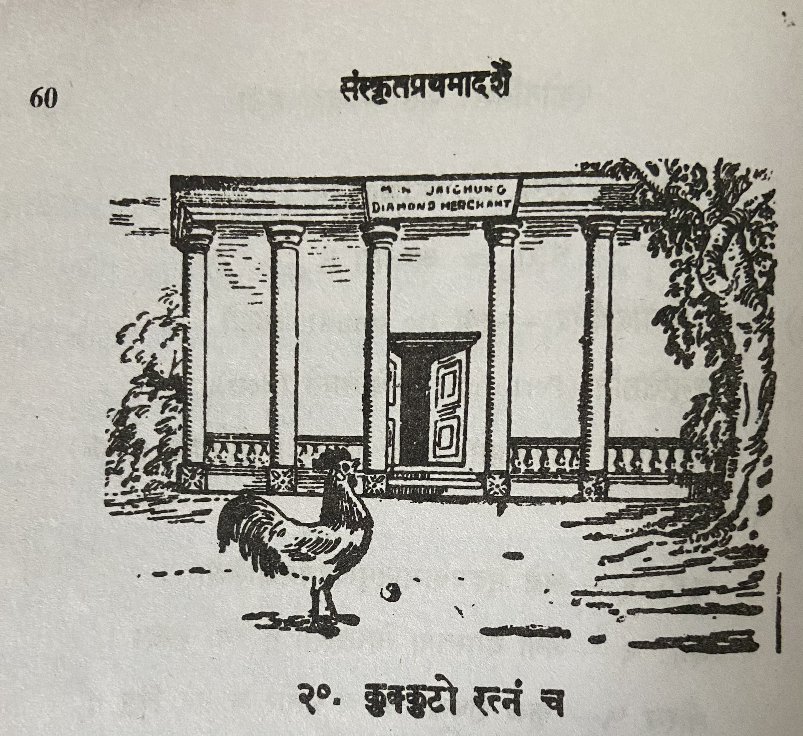

# Lesson 20: कुक्कुटो रत्नं च

एकदा कुक्कुटः कश्चित् पादेनावकरं किरन्।

ददर्श भासुरं किञ्चिद्रत्नं श्रेष्ठिगृहाङ्गणे॥

कुक्कुटस्यानभिज्ञस्य रत्नलाभेन किं फलम्?

रत्नमूल्यं कियद्वेति किं स जानाति मन्दधीः॥ 

अतः स पक्षौ विस्तृत्य विधूय वदनं मुहुः।

तारं रटन् वक्रवत्रस्तद्रत्नं समगर्हयत्॥

रे रत्नं! शिरसा धृत्वा लोक्स्त्वामभिनन्दतु।

किन्तु धान्यकणेन त्वं नैव सादृश्यमर्हसि॥

इत्युक्तवा स च तद्रत्नं पादेनाक्षिप्य दूरतः॥

अन्यत्र गतवान् शीघ्रं धान्यान्वेषणतत्परः॥

---

**Translation**

---

**Notes and Vocabulary**

| Word | Meaning | Word | Meaning |
| --- | --- | --- | --- |
| किरन् *a. m.* | scattering | धान्यकण *m* | a grain of corn |
| अङ्गण *n. a.* | a courtyard | सादृश्य *n.* | equality |
| कियत् *n, n.* | how much | आक्षिप्य *in* | throwing off |
| विधूय *in.* | having shaken | | |