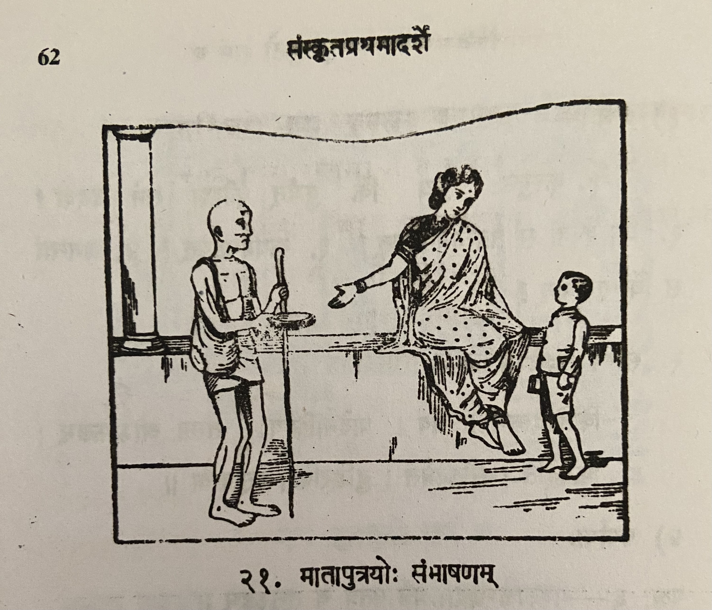

# Lesson 21: मातापुत्रयोः संभाषणम्

कस्मिश्चित् दिने सुगुणो नाम बालकः मात्रा सह गृहस्य बहिर्वेदिकायामास्त1। तदा कश्चन याचकः समेत्य ’मातः! भिक्षां देहि’ इत्ययाचत’॥

तदा पुत्रो मातरं पृच्छति -

पुत्रः - अम्ब! कोऽयम्?

माता - वत्स! अयं याचकः।

पुत्रः - याचकः किं करोति?

माता - स भिक्षां याचते। याचनेन यल्लभ्यते2 तेनोदरं पूरयति।

पुत्रः  - किमित्ययं याचनेनोदरं पूरयति? कस्मान्न3 कर्म करोति?

माता - वत्स! अयमलसः! आलस्येन बाल्ये पाठालयमगत्वा विद्याम् अनभ्यस्य कालमनयत्। न किञ्चिदपि कर्म परिशीलितं तेन।

पुत्र - विद्यया कथं जीविका निर्वर्त्यते?

माता - विद्यया किं न सिध्यति! विद्यया बुद्धिर्विकसति। बुद्धिमन्तो जनाः स्वाभिष्टं कर्म कर्तुं प्रभवन्ति। तेन सुखेन जीविकां निर्वर्तयन्ति। विद्वान् सर्वत्र पूज्यते।

पुत्रः - अस्तु, अयं याचते खलु। किमनेन प्रतिदिनं भिक्षा लभ्येत?

माता - कथं लभ्बेत? कदाचिल्लभ्यते, कदाचिन्न लभ्यते। यदा जनाः भिक्षां न वितरन्ति तदाऽयमञ्जलिं बद्ध्वा पादयोः पतित्वा तान् याचति। यदि तदाऽपि न किञ्चिल्लभते तर्हि बुभुक्षया पिडितः कुत्रापि गत्वा चोरयति।

पुत्रः - किं न चोरं राजपुरुषा बध्नन्ति?

माता - यदि राजपुरुषाः पश्यन्ति तर्हि तं बध्नन्ति, ताडयन्ति, कारां च प्रवेशयन्ति।

पुत्रः - अम्ब! अहमपि यदि न बाल्ये विद्यामभ्यस्ये तर्हि मयाऽपि याचितव्यं स्यात। किं न?

माता - जात! कः सन्देहः? याचितव्यमेव भवेत्।

पुत्रः - एवं चेत अहं श्वः प्रभृति पाठालयं गमिष्यामि, विद्यां चाभ्यसिष्यामि॥

माता - वत्स!। आलस्यं विहाय विद्याभ्यासे यतस्व। उद्योगी भव। विद्यावन्तमुद्योगिनं च नरं लक्ष्मीः स्वयमेवोपैष्यति। तथा च सुभाषितरत्नाकरः - "अद्योगिनं पुरुषसिंहमुपैति लक्ष्मीः" इति॥

 

---

Notes:

1बहिर्वेदिकायामास्त = बहिः + वेदिकायाम् + आस्त । वेदिका  - *thinnai* in Tamizh.  वेदिकायाम् - सप्तमीविभक्ति

2यल्लभ्यते

3कस्मान्न = कस्मात् न

अनेन - in this way/manner

याचितव्यम् - beggary, to be asked for

--- 

**Translation**

Title: Conversation of Mother and Son

On some (कस्मिश्चित्) day (दिने) a boy (बालकः) named (नाम) *Sugunaha* (सुगुणः) with (सह) (his) mother (मात्रा) was at (आस्त) the platform (वेदिकायाम् - *thinnai* in tamizh) outside (बहिः) of the house (गृहस्य). Then (तदा) some (कश्चन) beggar (याचकः) joined them (समेत्य) thus (इति) asked (अयाचत) ’Mother (मातः)! Give me (देहि) alms (भिक्षां)’.

Then (तदा) the son (पुत्रः) asks (पृच्छति) the mother (मातरं) -

Son (पुत्रः) - Mother (अम्ब)! who (कः) is this (अयम्) ?

Mother (माता) - Son (वत्स)! This (अयं) is a begger (याचकः)

Son (पुत्रः) - What (किम्) (does) a beggar (याचकः) do (करोति)?

Mother (माता) - He (सः) asks (याचते) (for) alms (भिक्षाम्). What (किम्) he gets (लभते) from begging (याचनेन) with that (तेन) he fills (पूरयति) his stomach (ओदरम्)

Son (पुत्रः) - Why (किम्) he fills (पूरयति) the stomach (ओदरम्) by begging (याचनेन) like this (इति अयम्). Why (कस्मात) doesn't (न) he do (करोति) work (कर्म) ?

Mother (माता) - Son (वत्स)! This (अयम्) is a lazy person (अलसः). Due to laziness (आलस्येन) in his youth (बाल्ये) he led (अनयत्) his time (कालम्) not going (अगत्वा) to the school (पाठालयम्) not learning (अनभ्यस्य) knowledge (विद्या). No (न) even (अपि) little (किञ्चिद्) work (कर्म) was studied (परिशीलितं) by him (तेन).

Son (पुत्रः) - How can (कथम्) employment (जीविका) be accomplished (निर्वर्त्यते) by knowledge (विद्यया) ?

Mother (माता) - What (किम्) is not (न) accomplished (सिध्यति) by knowledge (विद्यया)! Due to knowledge (विद्यया) the intelligence (बुद्धि) increases (विकसति). Intelligent (बिद्धिमन्तः) people (जनाः) are able to (प्रभवन्ति) do (कर्तुम्) work (कर्म) of their choice (स्वाभिष्टं). By that (तेन) (i.e. knowledge) employment (जीविकां) is accomplished (निर्वर्तयन्ति) by ease/ comfortably (सुखेन). A knowledgeable person (विद्वान्) is respected (पूज्यते) everywhere (सर्वत्र).

Son (पुत्रः) - All right (अस्तु), he (अयम्) begs (याचते) isn't it (खलु). What (किम्) alms (भिक्षा) like this (अनेन) अिलल be gotten (लभ्येत) everyday (प्रतिदिनं)?

Mother (माता) - How (कथम्) will he get (लभ्येत)? Sometimes (कदाचित्) he will get (लभ्येत) sometimes (कदाचित्) not (न) get (लभ्येत). When (यदा) people (जनाः) don't (न) give (वितरन्ति) then (तदा) he (अयम्) folding (बद्ध्वा) his hands (अञ्जलिम्) falling (पतित्वा) at their feet (पादयोः) begs (याचति) them (तान्). If (यदि) then (तदा) also (अपि) nothing (किन्चित् न) is gotten (लभते) then (तर्हि), tormented (पिडितः) due to hunger (बुभुक्षया), going (गत्वा) some where (कुत्रापि) he  steals (चोरयति).

Son (पुत्रः) - Won't (किम् न) the king's guards (राजपुरुषाः) catch (बध्नन्ति) the thief (चोरं)

Mother (माता) - If (यदि) the guards (राजपुरुषाः) see (पश्यन्ति) then (तर्हि) they will capture (बध्नन्ति) him (तम्) beat him (ताडयन्ति) and (च) put him (प्रवेशयन्ति) in jail (काराम्)

Son (पुत्रः) - mother (अम्ब)! If (यदि) I also (अहमपि) don't (न) study (विद्यामभ्यस्ये) in my youth (बाल्ये) then (तर्हि) begging (याचितव्यं) by me (मया) also (अपि) will happen (स्यात्). Why (किम्) not (न)?

Mother (माता) - Child (वत्स) why (कः) doubt (सन्देहः)? Begging (याचितव्यं) only (एव) will happen (भवेत्).

Son (पुत्रः) - In that case (एवं चेत) starting (प्रभृति) tomorrow (श्वः) I (अहम्) will go (गमिष्यामि) to school (पाठालयम्) and (च) will study (विद्याम् अभ्यसिष्यामि) 

Mother (माता) - Child (वत्स)! Leave (विहाय) laziness (आलस्यम्) try to (यतस्व) study (विद्याभ्यासे). Be (भव) industrious (उद्योगी). Fortune (लक्ष्मीः) herself (स्वयम् एव) approaches/comes to (उपैष्यति) the knowledgeable (विद्यावन्तम्) and (च) industrious (उद्योगिनम्) man (नरं). And (च) such is (तथा) *Subashita Ratnakarah* (a compendium of good sayings) - "Fortune (लक्ष्मीः) goes to/approaches (उपैति) the industrious (अद्योगिनं) lion among men (पुरुषसिंहम्)" - thus (इति).

यतस्व आत्मनेपदी लोट् मध्यमपुरुष एकवचनम्। meaning "you try

---

**Notes and Vocabulary**

| Word | Meaning | Word | Meaning |
| --- | --- | --- | --- |
| बहिर्वेदिहा *f.* | an outer altar | अञ्जलि *m.* | hands folded together |
| याचक *m.* | a beggar | कारा *f* | jail |
| उदर *n* | belly | बुभुक्षा *f.* | hunger |
| आलस्म् *n.* | idleness | याचितव्य *a. n.* | has to be begged |
| जीविका *f* | livelihood | उद्योकिन् *a. m.* | industrious |
| स्वाभीष्ट *a. n.* | liked by oneself | लक्षमीः *f* | fortune |

 

**विरूद्धपदानि -** कृत्वा x अकृत्वा, अभ्यस्य x अनभ्यस्य, गत्वा x अगत्वा, विहाय x अविहाय

**उपसर्गयोगादर्थभेदः** - तृ (to cross) तरति । अवतरति (descends), वितरति (gives), निस्तरति (overcomes)

**तव्यप्रत्ययान्तः - Potential participles** :
याचितव्यम्, गन्तव्यम्, कर्तव्यम्, द्रष्टव्यम् इत्यादयः॥