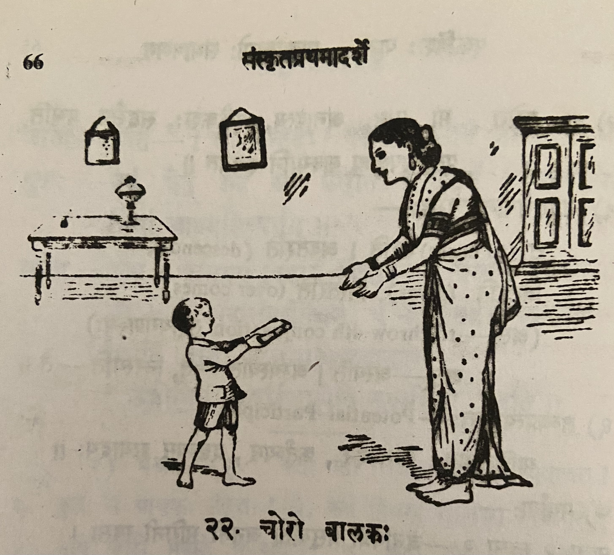
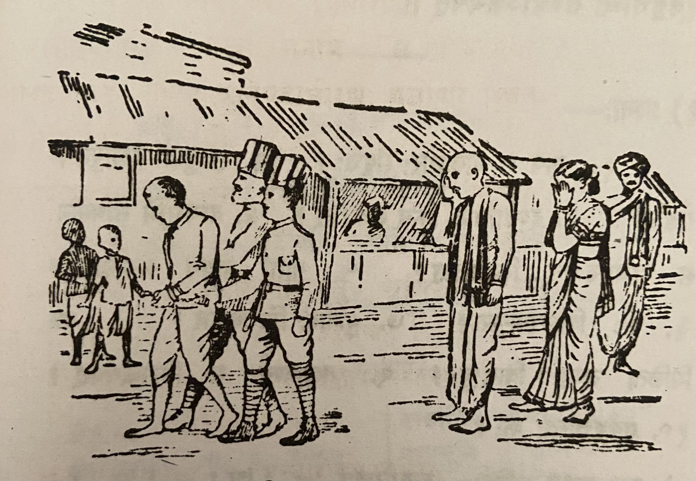

# Lesson 22: चोरो बालकः

 

कश्चित् बालकः पाठशालायां कस्यापि सहाध्यायिनः पुस्तकमचोरयत्। तत् स गृहमानीय मतुर्हस्तेऽर्पितवान्। तया स तदा तीव्रं दण्डनीय आसीत्। तदकृत्वा सा तस्य कृत्यमभिनन्द्य तस्मा आम्रफलमेकं भक्षणार्थमयच्छत्॥

गच्छति काले यथा यथा सोऽवर्धत् तथा तस्य स्तेयबुद्धिरपि वृद्धिं गता। किं बहुना! कालेन स महांश्चोरः संवृत्तः।

एकदा स रात्रौ सन्धिच्छेदेन कस्यचिद्धनिकस्य गृहं प्राविशत्। गाढं निद्रिता अपि तद्गृहस्था जनाः सन्धिच्छेदशब्देन प्रबोधं गताः। तान् सर्वान् स व्यापाद्य महार्घाणि रत्नान्यादाय प्रतस्थे। पति गच्छन् स रक्षापुरुषैर्गृहीतस्ताडितो दण्डाधिपस्य समीपं नीतश्च॥ 

 

दण्डाधिपः चोरस्य वृत्तान्तम् अवगत्य तस्य वधदण्डं व्यधात्। तदनु वध्यभूमिं नियमानः स राजपुरुषानब्रवित् - "भो भोः! सकृन्मे मात्रा सह भाषणमनुमन्यध्वम्" - इति। ततस्तैः साक्रन्दं पृष्ठत आगच्छन्त्या मात्रा सह तस्य भाषणमन्वमन्यत॥

कुमारस्तस्या कर्णे रहस्यं कथयन्निव तामुपसृत्य तस्याः कर्णं ददंश। ’अहो! मृत्युना गृहीतोऽपि पापोऽयं मात्रे  द्रुह्यति’ इत्युच्चैरुचुस्तत्र मिलिता जनाः। तदाकर्ण्य कुमारः - ’भो जनाः! नाहं पापः। किन्त्वेषैव पुत्रघातिनी राक्षसी। आम्रफलदानेनैषा मम स्तेयासक्तिमवर्धयत्’ इत्युक्त्वा स पूर्ववृत्तान्तं तेभ्योऽकथयत्॥

---

**Translation**

Some (कश्चित्) boy (बालकः) stole (अचोरयत्) some other (कस्यापि) fellow student's (सहाध्यायिनः) book (पुस्तकम्). Bringing (आनीय) that (तत्) home (गृहम्) he gave (अर्पितवान्) it in his mother's hand (मातुर्हस्ते). He (सः) was (आसीत्) to be severely (तीव्रम्) punished (दण्डनीय) by her (तया). Not having done (अकृत्वा) that (तत्) she (सा) appreciated (अभिनन्द्य) his (तस्य) act (कृतम्), gave (अयच्छत्) him (तस्मा) one (एकम्) mango (आम्रफलम्) to eat (भक्षणार्थम्).

In the coming (गच्छति) years (काले) as (यथा यथा) he (सः) grew (अवर्धत्) so also (तथा अपि) his (तस्य) stealing intelligence (स्तेयबुद्धिः) became (गता) bigger (वृद्धिम्). Oh how (किम्) big (बहुना)! With time (कालेन) he (सः) became (संवृत्तः) a great (महान्) thief (चोरः).

One time (एकदा), in the night (रात्रौ), he (सः) entered (प्राविशत्) some (कस्यचित्) rich man's (धनिकस्य) house (गृहम्) by breaking the wall (सन्धिच्छेदेन). Though (अपि) sleeping (निद्रिता) deeply (गाढं) the people (जनाः) in that (तत्) house (गृहस्था) woke up  (प्रबोधं गताः) the sound (शब्देन) made by the wall breaking (सन्धिच्छेदेन). Killed (व्यापद्य) them (तान्) all (सर्वान्) he (सः), having taken (आदाय)  with valuable (महार्घाणि) gems (रत्नानि), set out (प्रतस्थे). He (सः) who was going (गच्छन्) in the road (पथि) was caught (गृहीतः) beaten (तादितः) and (च) taken (नीतः) by the police (रक्षापुरुषैः).

The magistrate (दण्डाधिपः), learning (अवगत्य) the thief's (चोरस्य) story (वृत्तान्तम्), sentenced (व्यधात्) him (तस्य) to death penalty (वधदण्डं). After that (तदनु) he (सः) who was consigned to (नियमानः) the place of death (वध्यभूमिम्) said (अब्रवीत्) to the guards (राजपुरुषान्) - "Hey hey (भो भोः - in this context *Deei deei* in Tamizh feels more apt)! Allow me (अनुमन्यध्वम्) one (सकृन्मे) conversation (भाषणम्) with (सह) my mother (मात्रा)." - thus (इति). Then (ततः)  conversation (भाषणम्) was allowed (अन्वमन्यत) by them (तैः) with (सह) the crying (साक्रन्दम्) mother (मात्रा) coming (आगच्छन्त्या) behind (पृष्ठत).

The boy (कुमारः) as though (इव) speaking (कथयन्) a secret (रहस्यम्) in her (तस्याः) ear (कर्णे) having approached (उपसृत्य) her (ताम्) bit (ददंश) her ear (कर्णम्)। ’Oh (अहो)! Though (अपि) caught (गृहीतः) by death (मृत्युना) this (अयम्) sinner (पापः) seeks to harm (द्रुहयति) his mother (मात्रे).’ - The people (जनाः) assembled (मिलिता) there (तत्र) said (उचुः) loudly (उच्चैः) like this (इति)। Hearing (आकर्ण्य) that (तत्) the boy (कुमारः) - "Oh (भो) people (जनाः)!  I (अहम्) am not (न) a sinner (पापः). But (किन्तु) this (एषा) (she) only (एव) is a son (पुत्र) killer (घातिनी) daemon (राक्षसी). By giving (me) the mango fruit (आम्रफलदानेन) she (एषा) grew/encouraged (अवर्धयत्) my (मम) stealing capability (स्तेयासक्तिम्)" - Saying (उक्त्वा) like this (इति) he (सः) narrated (अकथ्यत्) to them (तेभ्यः) what happened earlier (पूर्ववृत्तान्तम्).

---

**Notes and Vocabulary**

| Word | Meaning | Word | Meaning | 
| --- | --- | --- | --- |
| चोर *m.* | thief | दण्डाधिप *m.* | chief magistrate |
| सहाभ्यायिन् *m.* | fellow student | वध्यभूमि *f* | place of execution |
| आम्रफल *n.* | mango fruit | सकृत् *in* | once |
| सन्धिच्छेद *m.* | making breaches in a wall | मिलित *a. m.* | assembled |
| प्रबोध *m.* | wakefulness | पुत्रघातिनी *a. f.* | one who has killed her own son |
| महार्घ *a. n.* | highly valuable | स्तेयासक्ति *f.* | habit of stealing |
| रक्षापुरुष | policeman | | |
