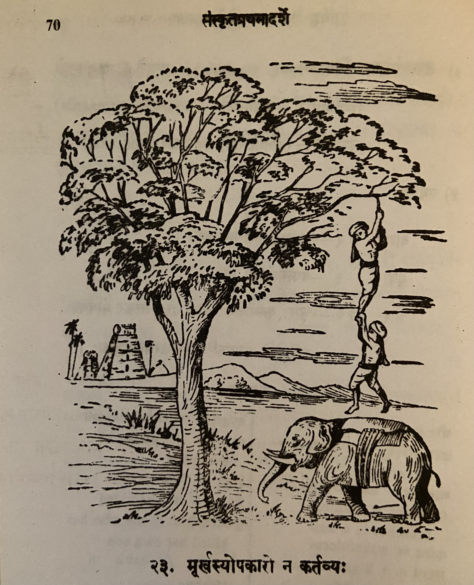

# Lesson 23: मूर्खस्योपकारो न कर्तव्यः

कश्चन मूर्खः कदाचित् ग्रामान्तरात् प्रतिनिवर्तमानो निजग्रामगामिनं पन्थानं व्यस्मरत्। अथ पन्थानं पृच्छन्तं तं मूर्खं जनाः ’नदीतटे दृश्यमानस्य तरोरुपरि वर्त्मना गच्छ’ - इत्यवोचन्॥

ततः स तरुमुपगम्य एतस्योपरि खलु मे पन्थाः जनैरुपदिष्टः इति मत्वा तस्य तरोः पृष्ठमारोहत्। तस्य पृष्ठे सर्पतस्तस्य भारात् तरोः शाखा ननाम। स तां यत्नेनावलम्ब्य यावदतिष्ठत् तावत् कश्विदाधोरणः गजोपरि स्थितः नद्या आरुह्य तेन पथा समाययौ॥ 

तरुशाखावलम्बी मूर्खस्तं हस्त्यारोहं दृष्ट्वा सदैन्यमवोचत् - ’महाभािग! मां गृहाण’ - इति। तदाकर्णय हस्त्यारोहः करुणया तं तरोरवतरयितुं पाणिभ्यां तस्य पादावग्रहीत्2। मूर्खस्तु तरुशाखां नामुञ्चत्। अत्रान्तरे गजो निर्गतः। हस्त्यारोहः शाखाग्रलम्बिनस्तस्य पादयोलर्लम्बे॥

ततः स मूर्खः सम्भ्रान्तो हस्त्यारोहमभ्यधात् - ’यदि जानासि तर्हि शीघ्रं किमपि गीतं पठ। गानं श्रुत्वा कोऽप्यागत्य आवामितोऽवतारयेत्’ - इति॥

एवं तेनोक्तः स हस्त्यारोहस्तथा मधुरमगायत् यथा स मूर्खः प्रहृष्टः रसेन करतालिकां दातुं प्रवर्तत। अथ तत्क्षणं सहस्त्यारोहः मूर्खो नद्यां निपत्य विपेदे। पश्यत! उपकर्तुं प्रवृत्तस्य हस्त्यारोहस्य गतिम्।

---

**Translation**

Some (कश्चन) fool (मूर्खः) on his way to his own village (निजग्रामगामिनं 1) once (कदाचित्) returning (प्रतिनिवर्तमानः) from another village (ग्रामान्तरात्) forgot (व्यस्मरत्) the way (पन्थानं). Therefore (अथः) people (जनाः) said (अवोचन्) like this (इति) to him (तम्) who was asking (पृच्छन्तं) the way (पन्थानं) - "Go (गच्छ) on the road (वर्त्मना) which is visible (दृश्यमानस्य) from top (उपरि) of the tree (तरोः) on the river bank (नदीतटे)".

Therefore (ततः) that (सः) fool (मूर्खः) having approached (उपगम्य) the tree (तरुम्) Believing (मत्वा) this (इति) 'Isn't (खलु) this's (एतस्य) (i.e. tree's) top (उपरि) is my (मे) path (पन्थाः) as advised (उपदिष्टः) by people (जनैः)' (he) climbed (अरोहत्) the that (तस्य) tree's (तरोः) back (पृष्ठम्). 

From the weight (भारात्) of his (तस्य) crawling (सर्पतः) onto its (तस्य) back (पृष्ठे) the tree's (तरोः) branches (शाखाः) bent (ननाम).

As (यावत्) he (सः) after holding (अवलम्ब्य) that (ताम् i.e. the tree branch)  with effort (यत्नेन) stayed there (अतिष्ठत्) then (तावत्) some (कश्चित्) mahout  (आधोरणः) seated (स्थितः) on top of the elephant (गजोपरि) came out (आरुह्य) from the river (नद्याः) (and) came (समाययौ) by that way  (तेन पथा)

The fool (मूर्खः) who was holding (अवलम्बी) on the tree (तरु) branch (शाखा) seeing (दृष्ट्वा) the elephant rider (हस्त्यारोहम्) said (अवोचत्) in a miserable state (सदैन्यम् = स + दैन्यम्) thus (इति) - 'Noble sir (महाभाग)! Catch (गृहाण) me (माम्)'. Hearing (आकर्ण्य) that (तत्) the *mahout* (हस्त्यारोहः),  for him (तम्) to descend (अवतरितुम्) from the tree (तरोः), with pity (करुणया) grasped (अग्रहीत) his two legs (पादौ). But (तु) the fool (मूर्खः) did not (न) release (अमुञ्चत्) the tree branch (तरुशाखां). In the mean time (अत्रान्तरे) the elephant (गजः) went away (निर्गतः). The *mahout* (हस्त्यारोहः) was left catching (ललम्बे) the two legs (पादयोः) of (तस्य) the man who was catching the branch (शाखाग्रलम्बिनः).

Therefore (ततः) that (सः) confused (सम्भ्रान्तः) fool (मूर्खः) said (अभ्यधात्) to the *mahout* (हस्त्यारोहः) thus (इति) - 'If (यदि) you know (जानासि) then (तर्हि) quickly (शीघ्रम्) sing (पठ) some (किमपि) song (गानम्). Hearing (श्रुत्वा) the song (गानम्) someone (कः अपि = कोऽपि) will having come (आगत्य) may let us two (आवाम्) descend (अवतारयेत्)'.

Accordingly (तथा) that (सः) *mahout* (हस्त्यारोहः) who was addressed so (तेनोक्तः) sang (अगायत्) melodiously (मधुरम्) just as (यथा) the (सः) thrilled (प्रहृष्टः) fool (मूर्खः)  started (प्रवर्तत) giving (दातुम्) applause (करतालिकाम्) with enjoyment (रसेन). Then (अथ) in that second ( तत्क्षणं) the (सः) *mahout* (हस्तयारोहः) (and) fool (मूर्खः) fell (निपत्य) in to the river (नद्याम्) and died (विपेदे). See (पश्यत) the fate (गतिम्) of the *mahout* (हस्त्यारोहस्य) who set out (प्रवृत्तस्य) to help (उपकर्तुं).

**Notes:**

1निजग्रामम् - his/her own village गामिनम् - one who is on the way (masculine, 2nd vibhakti singular)

2पादावग्रहीत् = पादौ + अग्रहीत्

---

**Notes and Vocabulary**

| Word | Meaning | Word | Meaning | 
| --- | --- | --- | --- |
 | वर्त्मन् *n.* | a way road | हस्त्यारोह *m.* | Elephant rider |
 | पृष्टम् *n* | upper side | करतालिका *f.* | clapping the hands |
 | ननाम *P.* | bent | सदैन्यम् *in* | pitiable one |
 | महाभागः *a. m.* | illustrious | | | 

 अवतारयति - make or let one descent