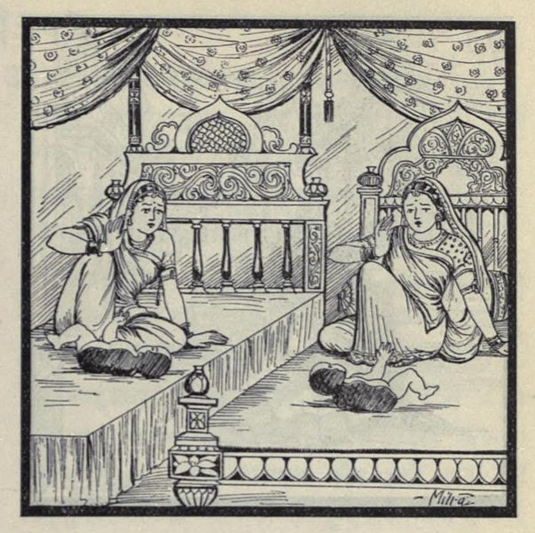

# Lesson 24: जरासन्धः

पुरा किल<b>1</b> वृहद्रथो नाम मगधानां राजा बभूव। स काशिराजस्य द्वे अपि सुते पर्यणयत्। महताऽपि कालेन तस्य वंशकरः सुतो नाजायत। अतः स राट् भृशं दुःखितो राज्यं परित्यज्य भार्याभ्यां सः तपोवनमगच्छत्॥

तत्र चण्डकौशिको नाम मुनिः सभार्य तम् तपसि निरतमपश्यत्। अपृच्छच्च तं तपसः कारणम्। पार्थिवश्चात्मनः सन्ततेरभावं कारणं व्यज्ञापयत्॥

तन्निशम्य सत्यवाक् स महर्षिः आम्रफलमेकं तस्मै दत्त्वा जगाद - ’इदं फलं सन्ततिं दास्यति। निवर्तस्व। अलं क्लेशकारिणा तपसा<b>2</b>’ - इति।

तदादाय प्रहृष्टो नृपः पत्नीभ्यां सहितः स्वपुरम् आजगाम। आगत्य च ताभ्यां तत्फलं प्रायच्छत्। ते उमे अपि तत् फलं द्विधा विभज्य तमभक्षयताम्। कालेनैका सजीवं शरीरार्धं प्रासूत, अपरा चापरमर्धम्। भीता धात्री ते अर्धे वनं नीत्वा क्वचिदुत्ससर्ज॥

अथ जरा नाम राक्षसी पर्यटन्ती तं देशमाजगाम। अवलोक्य च ते शरीरार्धे कौतुकेन संयोजयामास। तदैकमूर्तिधरो वरः कुमारः समपद्यत। धार्मिकस्य महीक्षितः वंशे वसन्ती सा राक्षसी न तं कुमारं हन्तुमैच्छत्॥

ततः सा कुमारमादाय राजानामुपगम्याब्रवीत् - ’राजन्! अयं ते सुतः पत्नीद्वये जातः, गृह्यताम्’ - इति। भूयः सहर्ष तमादाय जरया सनदीतस्य तस्य ’जरासन्धः’ इति नाम चकार॥

1किल does not have a direct English translation. In Tamizh it is அல்லவோ.

2तपसा is from तपस् which is declined like मनस्. Also, when अलम् is used then the noun should always be in तृतीया विभक्ति.

---

**Translation**

In ancient times (पुरा) a king (राजा) named (नाम) Vrihadratha (वृहद्रथः) was there (बभूव). He (सः) also (अपि) married (पर्णयत्) the king of Kashi's (काशिराजस्य) two (द्वे) daughters (children) (सुते). Even (अपि) after a long (महता) time (कालेन) a son (वंशकरः सुतः) was not (न) born (अजायत). Therefore (अतः) the (सः) king (राट्) was very (भृशम्) unhappy (दुःखितः), giving up (परित्यज्य) (his) kingdom (राज्यम्) he (सः) went to (अगच्छत्) a sacred grove (तपोवनम्).

There (तत्र) a sage (मुनिः) named (नाम) *Chandakoushika* (चण्डकौशिकः) saw  (अपश्यत्) him (तम्) with his wife (सभार्यम्) engaged (निरतम्) in penance (तपसि). And (च) Asked (अपृच्छच्त्) him (तम्) the reason (कारणम्) for the penance (तपसः). The king (पार्थिवः) informed (व्यज्ञापयत्) (the sage) about his (आत्मनः) lack of (अभावम्) a son (सन्ततेः)

Having heard (निशम्य) that (तत्) the sage (सः महर्षिः) whose words are true (सत्यवाक्), giving (दत्त्वा) for him (तस्मै) one (एकम्)  mango  (आम्रफलम्) said (जगाद) - "This (इदम्) fruit (फलम्) gives (दास्यति) child (सन्ततिम्). Stop (निवर्तस्व). Enough (अलम्) burdensome () penance (तपसा)" - thus (इति).

Having taken (आदाय) that (तत्) the delighted (प्रहृष्टः) king (नृपः) along with (सहितः) (his) two wives (पत्निभ्याम्) came (आजगाम) to his city (स्वपुरम्). They two (ते उमे) also (अपि) having split (विभज्य) that (तत्) fruit (फलम्) in half (द्विधा) (and) ate (अभक्षताम्) it (तम्). After some time (कालेन्) one (एका) gave birth (प्रासूता) (to a) live (सजीवम्) half-body (शरीरार्धम्) and (च) the other (अपरा) the other (अपारम्) half (अर्घम्). A scared (भीता) nurse (धात्री) having taken (नीत्वा) those (ते) two haves (अर्धे) to the forest (वनं) abandoned them (उत्ससर्ज) somewhere (क्वचित्).

Now (अथ) a  *rakhshasi* named (नाम) *Jara* (जरा) who was wandering (पर्यटन्ती) came (आजगाम) to that (तम्) place (देशम्). And (च) seeing (अवलोक्य) with curiosity (कौतुकेन ) (she) joined (संयोजयामास) those two (ते) half-bodies (शरीरार्धे). Then (तदा) a one (एक) body (मूर्तिधरः) good/best (वरः) boy (कुमारः)  (समपद्यत). That (सा) *rakshasi* (राक्षसी) who was living (वसन्ती) in the dynasty (वंशे) of virtuous's (धार्मिकस्य) king (महीक्षितः) did not (न) want (ऐच्छत्) to kill (हन्तुम्) that (तम्) boy (कुमारम्).

Therefore (ततः) she (सा), taking the boy (कुमारादाय), having gone (उपगम्य) to the king (राजानम्) said (अब्रवीत्) - 'King (राजन्)! this (अयम्) your (ते) child (सुतः) is born (जातः) by two (द्वौ) wives (पत्न्यौ). Take him (गृह्यताम्)'. The pleased (सहर्ष) king (भूयः)  having taken (आदाय) him (तम्) said (चकार) thus (इति) he who is joined (सन्धितस्य) by *Jara* (जरया) his (तस्य) name (नाम)  is *Jarasandha* (जरासन्धः).

---

**Notes and Vocabulary**

तपोवनम् - sacred grove, a place frequented by ascetics 

| Word | Meaning | Word | Meaning | 
| --- | --- | --- | --- |
 | वंशकर *a. m.* | founding a family | उत्ससर्ज *P.* | throw away |
 | निरत *a. m.* | engaged in | कौतुक *n.* | curiosity |
 | सत्यवाक् *a. m.* | one whose words are true | व्यज्ञापयत् *P.* | informed |
 | धात्री *f.* | a nurse | जगाद *P.* | told |
 | सन्धित *a. m.* | joined together | 

 वर *m.* best, boon

 मूर्तिधर *adj* incarnate, corporeal, having a body

 महीक्षित् - earth-ruler, price, king

 वंश - family, dynasty

 धार्मिक - righteous, virtuous 