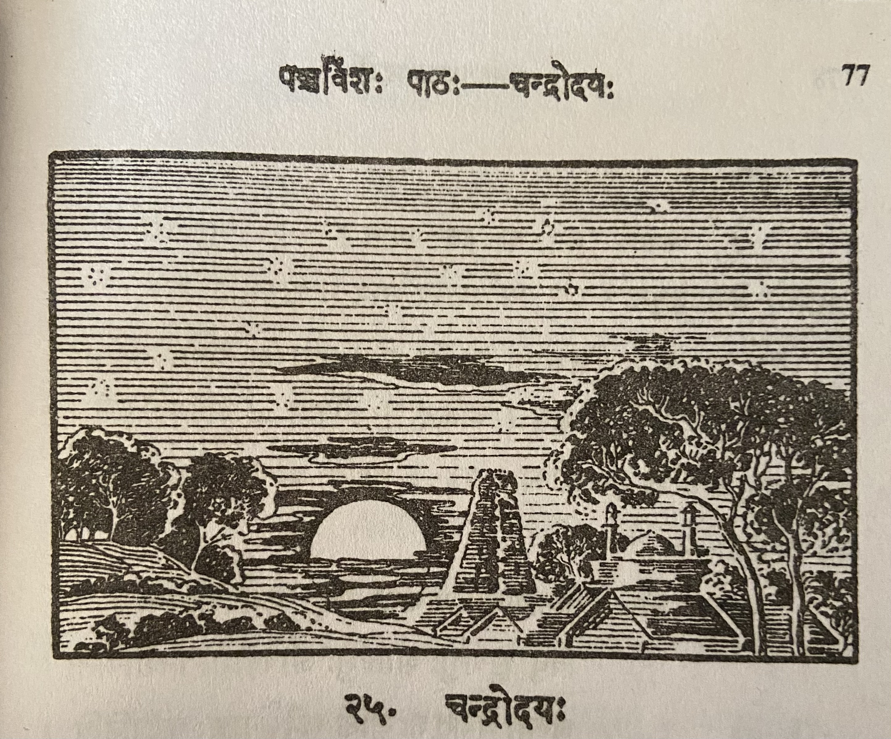

# Lesson 25: चन्द्रोदयः

पश्य! पूर्वाद्रिशिखरे चन्द्रमाश्चारुमण्डलः।

भाति क्रीडाङ्गणे न्यस्तः सौवर्ण इव कन्दुकः॥ १

अथवा तमसा व्याप्तं जगद्दीपयितुं क्षमः।

सर्वानन्दकरो विद्युत्प्रदीप इव भात्ययम्॥ २

अथवा व्योमकासारे नक्षत्रकुमुदान्विते।

पयोदशैवलाकीर्णे भात्ययं राजहमसवत्॥ ३

भासुरैस्तस्य किरणैः अभिव्यप्ता वसुन्धरा ।

हैमद्रवविलिप्तेव भाति सर्वमनोहरा॥  ४

भासयन् जगतीं सर्वां घनध्वन्तं व्यपोहयन्।

चन्द्रश्वन्द्र इवाभाति न तस्य सदृशः कचित्॥   ५

---

**Translation**

---

**Notes and Vocabulary**

न्यस्तः - placed, deposited, painted, illustrated

| Word | Meaning | Word | Meaning | 
| --- | --- | --- | --- |
| पूर्वाद्रि *m.* | the eastern mountain behind which the Sun and Moon are supposed to rise | भासुर *a. m.* | shining |
| चन्द्रमस् *m.* | moon | कासार *m. n.* | a lake |
| विधुत्प्रदीप *m.* | electric light | कुमुद *n*  | a night lotus |
| तमस् *n.* | darkness | पयोद *m.* | a cloud |
| अभिव्यप्त *a. m.* | covered with | शौवक *n.* | moss |
| क्षम *m.* | capable | वसुन्धरा *f.* | earth |
| हैमद्रव *m.* | gold fluid | घन *a. m.* | thick |
| ध्वान्त *n.* | darkness | | |