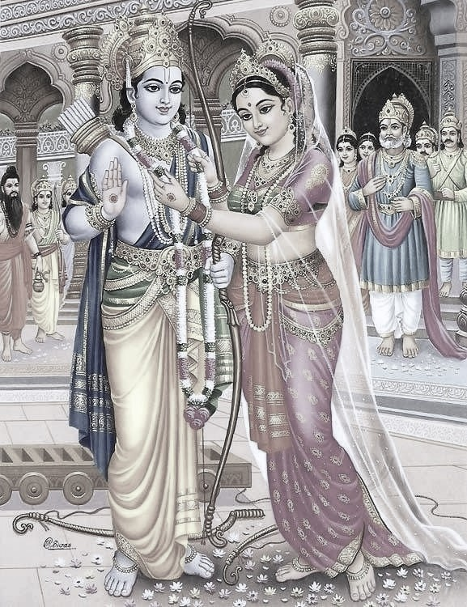

# Lesson 28: सीताविवाहः

पुरा मिथिलायां जनको नाम राजा बभूव। तस्य सुता सीता नाम। सा रूपे शीले चानुपमा
बभूव। तां परिणेतुमिच्छन्तोऽनेके राजकुमाराः जनकाय दूतान् प्रेषयामासुः॥

जनकस्तु तां विर्यसम्पन्नाय क्षत्रियकुमाराय दातुमैच्छत्। अतः स तां वीर्येण
क्रेतव्यामकल्पयत्। तथा हि - तस्य सकाशे गुरुतरं किमपि धनुरासीत्। 'य इदं
धनुरुद्धृत्य अस्मिन् शरं सन्धत्ते स मम सुतां परिणेष्यति' इति जनकः प्रतिजज्ञे॥

तां तस्य प्रतिज्ञां श्रुत्वा शतशो राजकुमाराः समाजग्मुः परं नैकोऽपि तेषां
तद्‍धनुश्चलयितुमपि शशाक। 'लङ्काधिपती रावणोऽपि साटोपं समेत्य सलज्जं
प्रतिनिवृत्तः' इति ज्ञायते॥

सर्वान राजकुमारान् प्रतिनिवृत्तान् विलोक्य - 'को मे दुहितुर्भर्ता भविष्यति!' इति
चिन्तापरोऽभूज्जनकः। अत्रान्तरेऽयोध्याधिपतेः दशरथस्य पुत्रः श्रीरामः सलक्षमणो
विश्वामित्रेण तत्रानीयत। श्रीरामो महर्षेः विश्वामित्रस्य वचनेन लीलयैव
तद्धनुरुद्धृत्य यावत् तस्मिन् बाणमारोपयति तावत् तद्धनुर्द्वेधा भग्नमभूत्॥

साधु साध्विति ब्रुवाणाः श्रीरामस्य वीर्यं प्रशशंसुर्जनाः ॥ जनकस्य राज्ञो हृदयं
प्रहृष्टमभूत्। ततः स दशरथादीन् आनाय्य महता विभवेन सीतारामयोः विवाहोत्सवं
निरवर्तयत्॥

तथा च श्रीमद्वाल्मीकिरामायणे बालकाण्डे त्रिसप्ततितयः सर्गः -

'अब्रवीज्जनको राजा कौसल्यानन्दवर्धनम्। इयं सीता मम सुता सहधर्मचरी तव॥ प्रतीच्छ
चैनां भद्रं ते पाणिं गृह्णीष्व पाणिना। पतिव्रता महाभागा छायेवानुगता तव॥'

---

**Translation**

In olden days (पुरा) in Mithila (मिथिलायां) there was (iबभूव) a king (राजा)
named (नाम) Janaka (जनकः). His (तस्य) daughter (सुता) was named (नाम) Sita
(सीता). She (सा) was (बभूव) unmatched (अनुपमा) in looks (रूपे) and (च) character
(शीले). Many (अनेके) princes (राजकुमाराः) wanting (इच्छन्तः) to marry (परिणेतुम्) her
(ताम्) sent (प्रेषयामासुः) messengers (दूतान्) to Janaka (जनकाय).

That (तथा) is (हि) he had (आसीत्) in his (तस्य) possession (सकाशे) some (किमपि)
heavy (गुरुतरम्) bow (धनुः).
'He who (यः) having taken (उद्धृत्य) this (इदम्) bow (धनुर) fixes (सन्धत्ते) an
arrow (शरम्) in it (अस्मिन्) he (सः) will marry (परिणेष्यति) my (मम) daughter
(सुता)' so (इति) Janaka (जनकः) promised (प्रतिज्ञे).

Having listened (श्रुत्वा) to his (तस्य) this (तस्य) promise (प्रतिज्ञाम्)
hundreds (शतशः) of princes (राजकुमाराः) came to the assemby (समाजग्मुः) but
(परम्) not (न) even (अपि) one (ऐकः) among them (तेषाम्) was able to (शशाक) use
(चलयितुम्) that (तत्) bow (धनुः).

'लङ्काधिपती रावणः अपि साटोपम् समेत्य सलज्जम् प्रतिनिवृत्तः' इति ज्ञायते॥
'Ravana (रावणः) the king of Lanka (लङ्काधिपती) also (अपि) having come (समेत्य)
in a stately manner (साटोपम्) returned (प्रतिनिवृत्तः) with shame (सलज्जम्)'
thus (इति) it is known (ज्ञायते).

Seeing (विलोक्य) all (सर्वान्) princes (राजकुमारान्) returning (प्रतिनिवृत्तान्)
Janaka (जनकः) was (अभूत्) lost in thought (चिन्तापरः) as to (इति) 'Who (कः) will
be (भविष्यति) my (मे) daughter's (दुहितुः) husband (भर्ता)'.

Meanwhile (अत्रान्तरे) the king of Ayodhya (अयोध्याधिपतेः) Dasharatha's
(दशरथस्य) son (पुत्रः) Sri Rama (श्रीरामः) with Lakshmana (सलक्षमणः) were
brought (आनीयत) there (तत्र) by Vishwamitra (विश्वामित्रेण).
Sri Rama (श्रीरामः) due to Maharishi (मर्षेः) Vishwamitra's (विश्वामित्रस्य)
words (वचनेन) plafully (लीलया एव) took (उद्धृत्य) that (तत्) bow (धनुः) and as
(यावत्) he affixed (आरोपयति) an arrow (बाणम्) in it (तस्मिन्) then (तावत्) that
(तत्) bow (धनुः) broke (भग्नम् अभूत्) into two (द्वेधा). 

The people (जनाः) who were saying (ब्रुवाणाः) great great (साधु साधु इति)
praised (प्रशशंसुः) Sri Rama’s valor (वीर्यं). King (राज्ञः)  Janaka's (जनकस्य)
heart (हृदयं) was (अभूत्) exceedingly pleased (प्रहृष्टम्). Therefore (ततः) he
(सः) brought (आनाय्य) Dasharatha and others (दशरथादीन्) and with great (महता)
pomp (विभवेन) conducted (निरवर्तयत्) Sita and Rama's (सीतारामयोः) marriage
(विवाहोत्सवं).

And so (तथा च) in the Bala kanda (बालकाण्डे) in the venerable (श्रीमत्) Valmiki
Ramayana (वाल्मीकिरामायणे) in the seventy third (त्रिसप्ततितयः) section (सर्गः) -

King (राजा) Janaka (जनकः) said (अब्रवीत्) to Sri Rama (i.e. the one who cause Kausalya's happiness to increase) (कौसल्यानन्दवर्धनम्). This (इयं) Sita (सीता) my (मम) daughter (सुता) is your (तव) wife who will help you fulfill all your *Dharmas* (सहधर्मचरी). Accept (प्रतीच्छ) her (एनां) and (च) take (गृह्णीष्व) her hand (पाणिं) with your (ते) hands (पाणिना), may you have auspiciousness (भद्रं ते). She with good qualities (महाभागा) and a devoted wife (पतिव्रता) follows (अनुगता) like (इव) your (तव) shadow (छाया)

पतिव्रता महाभागा छाया इव अनुगता तव

---

**Notes and Vocabulary**

| Word | Meaning | Word | Meaning | Word | Meaning |
| --- | --- | --- | --- | --- | --- |
| अनुपमा *f.* | matchless | दूत *m.* | messenger | वीर्य *n.* | valour |
| क्रेतव्या *a. f.* | fit to be bought i.e. won | सन्धत्ते *A.* | fixes | गुरुतर *n.* | heavier |
| परिणेष्यति *P.*  | will marry | उद्धृत्य *ind* | having  taken | सकाशे *m.* | in one's possession |
| शतशः *in* | in hundreds | साटोपम् *in* | in a stately manner | कीलया *f* | with ease |
| निरवर्तदत् A. | performed | निवृत्त | having renounced or given up, ceased, gone, vanished, disappeared | प्रतिनिवृत्त | return, turned back, come back |
| चिन्तापर | lost in shought, sunk in sorrow | शील | character | सहधर्मचरी | wife who helps in the fulfilment of duties |
| प्रतीच्छति | accept from | भद्रम् | happily | पतिव्रता | devoted and virtuous wife | 