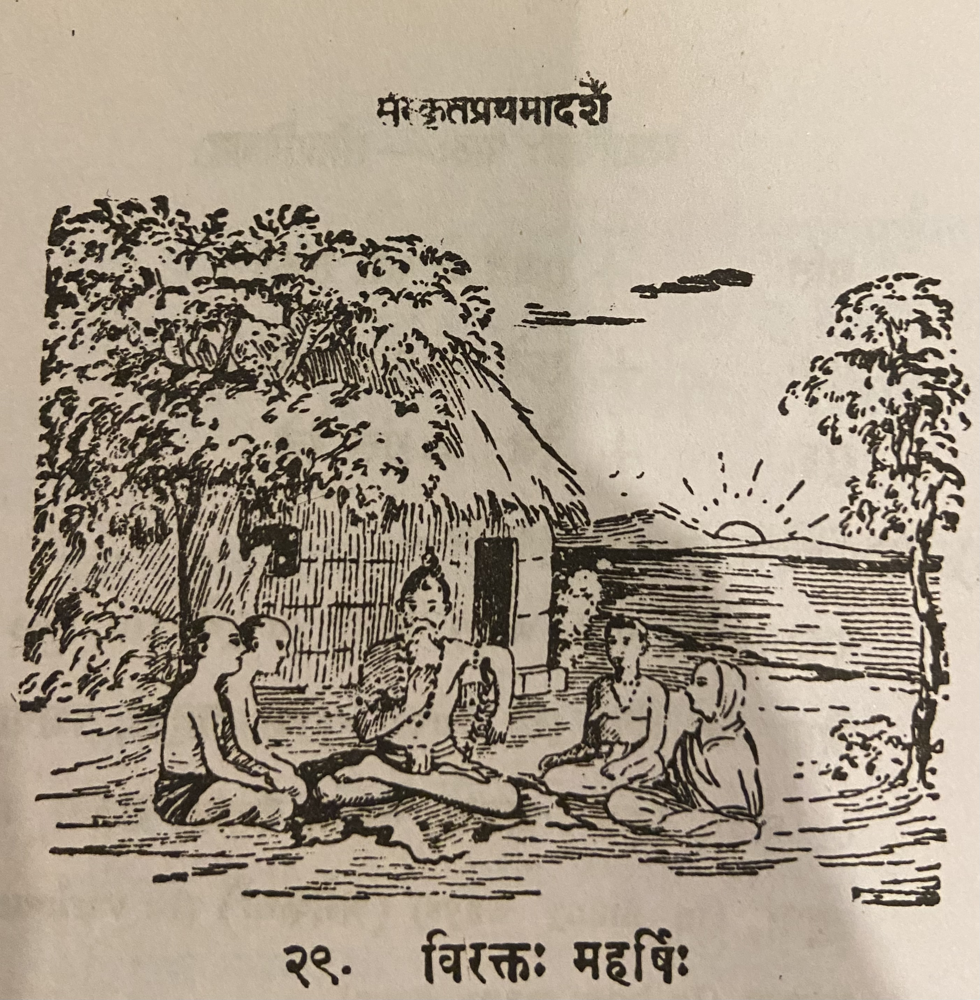

# Lesson 29: विरक्तः महर्षिः

अहो! रम्यः शान्तश्च अयमाश्रमः। आश्रमस्य पार्श्वे प्रसन्ना नदी प्रवहति। आश्रमं परितस्तरवो लताश्च पुष्पितास्तिष्ठन्ति। अयं महर्षिः इदानीमीश्वरं ध्यायति॥

अस्य निकटे विद्यामभ्यस्यन्ति बहबः छात्राः अयमतीव विरक्तो महर्षिः। नास्य धने स्पृहा वर्तते। महार्घाणि रत्नान्यप्ययं लोष्टवत् पश्यति। अतः शिष्यैः स्वयं भक्त्या दीयमानामपि गुरुदक्षिणां नायं प्रतीच्छति॥

एकदा कश्चित् राजकुमारोऽस्मात् विद्यामध्यैत। समाप्तविद्यः स गुरुं गुरुदक्षिणया तोषयितुमिच्छन् महता धनव्ययेन रत्नालङ्कृतं हैमं कङ्कणद्वयं कारयित्वा ॠषेः समिपमाजगाम॥

ऋषिः सायं नद्यास्तीरे शिलायामासीनः प्रकृतेश्चारुतां पश्यन्नवर्तत। राजकुमारस्तमुपसृत्य कङ्कणद्यं तस्मै समर्प्य प्राञ्जलिस्तस्थौ। ऋषिस्तयोः कङ्कणयोश्चारुतामवेक्षमाण इव ते निरूपयामास। अथ तयोरेकं स्वयमेव हस्तात् परिभ्रष्टमिति व्याजेन नद्यां पातयामास। अत्रान्तरे याजकुमारः प्रकृतेश्चारुतां पश्यन्नासीत्। विदितवृत्तान्तस्य राजकुमारस्य प्राणाः उत्क्रान्ता इवाभवन्॥

अथ राजकुमारः 'स्वयमेव नद्यां निपत्य तत् ग्रहीष्यामि' इति मत्वा ऋषिमपृच्छत् - 'भगवन्! कुत्र तत् पतितम्1?' इति। ऋषिरपि व्याकुल इव भूत्वा 'अत्र तत् पतितम्' इति दर्शयन् द्वितीयमपि कङ्कणं नद्यां प्राक्षिपत्। राजकुमारः परिदूनो लज्जितश्च प्रत्यगात्2॥

1पतितम् is a कृदन्त usage. पतितः masculine, पतिता - feminine, पतितम् - neuter

2प्रति + अगात् - अगात् - "went" prefixed with प्रति gives the meaning "returned"

---

**Translation**

Oh how wonderful (अहो) beautiful (रम्यः) and (च) peaceful (शान्तः) is that
(अयम्) hermitage (आश्रमः). The river (नदी) Prasanna (प्रसन्ना) flows (प्रवहति)
near (पार्श्वे) the hermitage (आश्रमस्य). Trees (तरवः) and (च) creepers (लताः)
in bloom (पुष्पिताः) stand (तिष्ठन्ति) on all sides (परितः) of the hermitage
(आश्रमं). This (अयं) great saint (महर्षिः) is now (इदानीम्) meditating (इश्वरं) upon Ishwara (ध्यायति).

Many (बहबः) students (छात्राः) are studying (अभ्यस्यन्ति) lessons (विद्याम्) near (निकटे) him (अस्य), this (अयम्) extremely (अतीव) detached (विरक्तः) great saint (महर्षिः). He (अस्य) does (वर्तते) not (न) long (स्पृहा) for wealth (धने).
He (अयं) sees (पश्यति) expensive (महार्घाणि) gems (रत्नानि) also (अपि) as a lump of clay (लोष्टवत्).

Once (एकदा) some (कश्चित्) prince (राजकुमारः) learnt (अध्यैत) these (अस्मात्) lessons (विद्याम्).

Having finished his study (समाप्तविद्यः) he (सः), who wanted (इच्छन्) to please
(तोषयितुम्) his teacher (गुरुं) with a fee (गुरुदक्षिणया), came (आजगाम) close
(समिपम्) to the sage (ॠषेः) carrying in his hands (कारयित्वा) two very (महता)
extravagant (धनव्ययेन) gem-encrusted (रत्नालङ्कृतं) gold (हैमं) bracelets
(कङ्कणद्वयं).

The sage (ऋषिः) was (अवर्तत) sitting (आसीनः) on a rock (शिलायाम्) on the river
(नद्याः) bank (तीरे) seeing (पश्यन्) the beauty (चारुतां) of nature (प्रकृतेः).
The prince (राजकुमारः) having approached (उपसृत्य) him (तम्) having given
(समर्प्य) it to him (तस्मै) stood (तस्थौ) with hands folded together
(प्राञ्जलिः). The sage (ऋषिः), as though (इव) looking at (अवेक्षमाण) the beauty of (चारुताम्) two (तयोः) bracelets (कङ्कणयोः),  examined (निरूपयामास) them (ते).
Then (अथ) pretending (व्याजेन) as though (इव) one (एकम्) of the two (तयोः)
slipped out (परिभ्रष्टम्) of his hands (हस्तात्) he dropped it (पातयामास) into
the river (नद्यां). Meanwhile (अत्रान्तरे) the prince (याजकुमारः) was (आसीत्)
gazing (पश्यन्) at nature's (प्रकृतेः) beauty (चारुतां). It was (अभवन्॥) as
though (इव) the life (प्राणाः) of the prince (राजकुमारस्य) of the story
(विदितवृत्तान्तस्य) left him (उत्क्रान्ता).

Then (अथ) the prince (राजकुमारः), thinking (मत्वा) that (इति) 'I will myself
(स्वयम् एव) get (ग्रहीष्यामि) it (तत्) by jumping (निपत्य) into the river
(नद्यां)', asked (अपृच्छत्) the Sage (ऋषिम्) this (इति) - 'Sir (भगवन्) where
(कुत्र) did it (तत्) fall (पतितम्).' The sage (ऋषिः) also (अपि), as though (इव)
he was concerned (व्याकुल भूत्वा), gesturing (दर्शयन्) like this (इति) - 'It
(तत्) fell (पतितम्) here (अत्र)' - threw (प्राक्षिपत्) the second (द्वितीयम्)
bracelet (कङ्कणं) also (अपि) into the river (नद्यां).
The ashamed (लज्जितः) prince (राजकुमारः) who was consumed by grief (परिदूनः) returned (प्रति अगात). 

---

**Notes and Vocabulary**

| Word | Meaning | Word | Meaning | Word | Meaning |
| --- | --- | --- | --- | --- | --- |
| अहो *in* | how great or wonderful | आश्रम *m. n.* | hermitage | विरक्त *a. m.* | free from passion | 
| कोष्टवत् *in* | like a lump of earth | अध्यैत *A.* | learnt | कङ्कणद्वयम् *n. a.* | a pair of bangles |
| चारुता *f.* | beauty | प्राञ्जलि *m.* | with hands folded together | उत्क्रान्त *a. m.* | departed |
| परिदून *a. m.* | very much pained | महार्घ | expensive, precious, high value, costly | लोष्ट | lump of earth or clay |
| धनव्यय | extravagence | चारुता *f.* | beauty | उपसृत्य | having approached | 
| निरूपयति |  examine | व्याज | pretence, guile | परिदूयते | consumed by pain or grief |

तस्थौ past tense of तिष्ठति। he stood