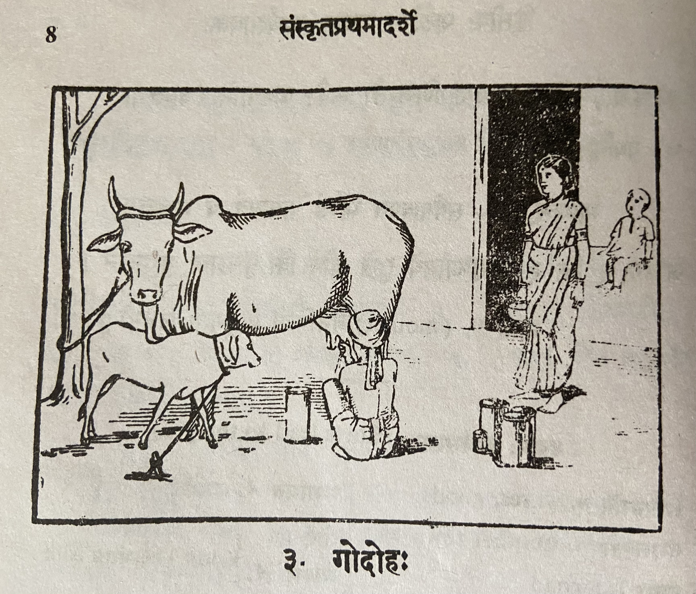

# Lesson 3: गोदोहः

इह गोपालः गां पयो दोग्धि। इयं पीवरा गौः। अस्य गोपालस्य तनयः प्रत्यहं प्रभाते दोहात् परमिमां गां प्रचारभूमिं नयति सायं च प्रत्यानयति। यद्यपि, गावः पलालं धान्यमन्नं पिण्याकं च भक्षयन्ति तथापि बालतृणे तासां महती प्रीतिः॥

गोः समीपे तिष्टति वत्सः। स प्रथमं गोः पयः किञ्चित् पिबति। अनन्तरं गोपो दोहनं करोति। स गोः पार्श्वे भूमावुपविश्य वामहस्तेन पात्रं गृहीत्वा दक्षिणहस्तेन दुग्धं दोग्धि। धेनोः क्षीरं, मधुरं पथ्यं पुष्टिकरं च॥

तत्रैका नारी बालकेन सह तिष्टति। सा क्षीराय समागता। तं बालं पयसा पोषयति। तेन स बुद्धिमान् अरोगश्च वर्तते॥

क्षीरं तक्रेण मिश्रितं दधि भवति। दधि मथित्वा नवनीतं गृह्यते। तप्तं नवनीतं घृतं सम्पद्यते। क्षीरं दधि तक्रं नवनीतं घृतं च मनुष्याणामत्यन्तमुपयुक्तानि वस्तूनि। तानि भोजनाय उपयुज्यन्ते। तानि विना भोजनं न रसकरं भवति। अत एवाहुः - ’विना गोरसं को रसो भोजनानाम्।’ - इति॥

गां मातरमिव पूजयन्ति भारतीया जनाः। उक्तं च श्रीमन्महाभारते - ’मातरः सर्वभूतानां गावः सर्वसुखप्रदाः’ - इति॥

---

**Translation**

Here (इह) a cowherd (गोपालः) milks (दोग्धि) cow (गां) milk (पयः - note it becomes पयो due to *sandhi*). She (इयं) is a milk yeilding (पिवरा) cow (गौः). This (अस्य) cowherd's (गोपालस्य) son/child/offspring (तनयः) every day (प्रत्यहं) in the morning (प्रभाते) after (परम्) milking (दोहात् ) leads (नयति) this (इमाम्) cow (गां) to the grazing field (प्रचारभूमिं) and (च) in the evening (सायं) brings it back (प्रत्यानयति). Even though (यद्यपि) cows (गावः) eat (भक्षयन्ति) straw (पलालं), grain (धान्यम्), rice (अन्नम्), *punnakku* (पिण्याकं) still (तथापि) tender grass (बालतृणे) is their (तासां) great (महती) desire (प्रीतिः).

The calf (वत्सः) stands (तिष्टति ) near (समीपे) the cow (गोः). He (स) first (प्रथमं) drinks (पिबति) some (किञ्चित्) cow's (गोः) milk (पयः). Afterward (अनन्तरं) the cowherd (गोपो - without *sandhi* गोपः ) does (करोति) the milking (दोहनं). He (स) sitting (उपविश्य) on the ground (भूमौ) near (पार्श्वे) the cow (गोः) holding (गृहीत्वा) a vessel (पात्रं) with his left hand (वामहस्तेन) with his right hand (दक्षिणहस्तेन) is milking (दोग्धि) the milk (दुग्धं). Cow's (धेनोः) milk (क्षीरं) is sweet (मधुरं) agreeable (पथ्यं) and (च) nourishing (पुष्टिकरं).

There (तत्र) a (एका) woman (नारी) stands (तिष्टति) with a boy (बालकेन सह). She (सा) has come (समागता) for the milk (क्षीराय). She nourishes (पोषयति) that (तं) boy (बालं) using milk (पयसा). Due to that (तेन) he (स) is (वर्तते) intelligent (बुद्धिमान्) and (च) without disease (अरोगः)।

Milk (क्षीरं) mixed (मिश्रितं) with buttermilk (तक्रेण) becomes (भवति) curd (दधि). After churning (मथित्वा) milk (दधि) we get (गृह्यते) butter (नवनीतं). Heated (तप्तं) butter (नवनीतं) turns into (सम्पद्यते) *ghee* (घृतं). Milk (क्षीरं), curd (दधि), buttermilk (तक्रं), butter (नवनीतं), and (च) ghee (घृतं) are people's (मनुष्याणाम्) absolutely (अत्यन्तम्) useful (उपयुक्तानि) items (वस्तूनि). They (तानि) are used (उपयुज्यन्ते) for meals (भोजनाय). Without (विना) them (तानि) meal (भोजनं) is (भवति) not (न) tasty (रसकरं). So (अतः) only (एव) they say (आहुः) thus (इति) - "Without (विना) cow's milk (गोरसं) (i.e. dairy products) what (को) is in a meal's (भोजनानाम्) taste (रसो)?"

*Bharatiya* (भारतीयाः) people (जनाः) (i.e. Indian) worship (पूजयन्ति) the cow (गां) like mother (मातरमिव = मातरम् इव).  And (च) in the sacred Mahabaratha (श्रीमन्महाभारते) it is said (उक्तं) thus (इति) - "Cows are the mothers of all living things and the givers of all happiness."

---

**Sandhis** in this lesson. Intended to be in the order of occurance.

पयः दोग्धि = पयो दोग्धि

परम् + इमाम् = परमिमां

प्रति + आनयति =  प्रत्यानयति

धान्यम् + अन्नम् = धान्यमन्नं

गोपः दोहनं = गोपो दोहनं

स गोः पार्श्वे भूमावुपविश्य वामहस्तेन पात्रं गृहीत्वा दक्षिणहस्तेन दुग्धं दोग्धि। This sentence without *sandhi* is: सः गोः पार्श्वे भूमौ उवुपविश्य वामहस्तेन पात्रं गृहीत्वा दक्षिणहस्तेन दुग्धं दोग्धि।

भूमौ + उपविश् = भूमावुपविश्य - the general rule is that if औ is followed by any vowel that becomes आव्. So in this case भूमौ + उपविश् => भूम् + आव् + उपविश् => भूमाव् + उपविश् => भूमावुपविश्य

अत एवाहुः -> अतः एव आहुः

---

**Notes**

पयो without sandhi is पयः which comes from पयस् meaning milk (also means water, but in this context milk). Here is a link to
[पयस्](https://www.mycoaching.in/2019/05/payaske-roop.html)
शब्द रूप

[गो/गौ शब्द रूप](https://www.mycoaching.in/2019/04/go-gau-shabd-ke-roop.html)

पिण्याकं - In Tamizh this is புண்ணாக்கு. This is a cake made from the material remaining after oil seeds are pressed/ground for oil. Popularly used as cattle feed. Oil seed cake.

बालतृणे तासां महती प्रीतिः The literal translation of this phrase is - "in tender grass is their great desire". The expression sounds awkward in English but it is common usage in Sanskrit. This translates better in Tamizh -
இளம்புல் மீது அவற்றுக்கு அதிக ஆசை.

---

**Vocabulary**

| Word | Meaning | Word | Meaning |
| --- | --- | --- | --- |
| दोह m. | milking | पुष्टिकर a. n. | nourishing  |
| गोपालक m. | milkman | तक्र n. | buttermilk |
| दोग्धि P | milks | दधि n | curd |
| पलाल n | hay |  मथित्वा in | having churned |
| बालतृण n | tender crass | नवनीत n | fresh butter |
| पार्श्व n | side | भारतीय m | Indian |
| दुग्ध n | milk | सर्वभूत in | all living beings |
| पथ्य a n | agreeing with (diet) | वत्स m | calf |

---

**Clarifications from Sanskrit teacher**

गृह्यते I guess it must be from the root ग्रह् - to take. This form is like passive usage (adding य् between the root and the पुरुषप्रत्यय). Meaning is: butter has been taken by churning the curd

रसकरम् - रसं करोति इति रसकरः - that makes (the food) tastier

आहुः is the present tense 3rd person plural form. आह  आहतुः  आहुः। Root is ब्रूञ् - व्यक्तायां वाचि। to say it clear / to speak it clear
