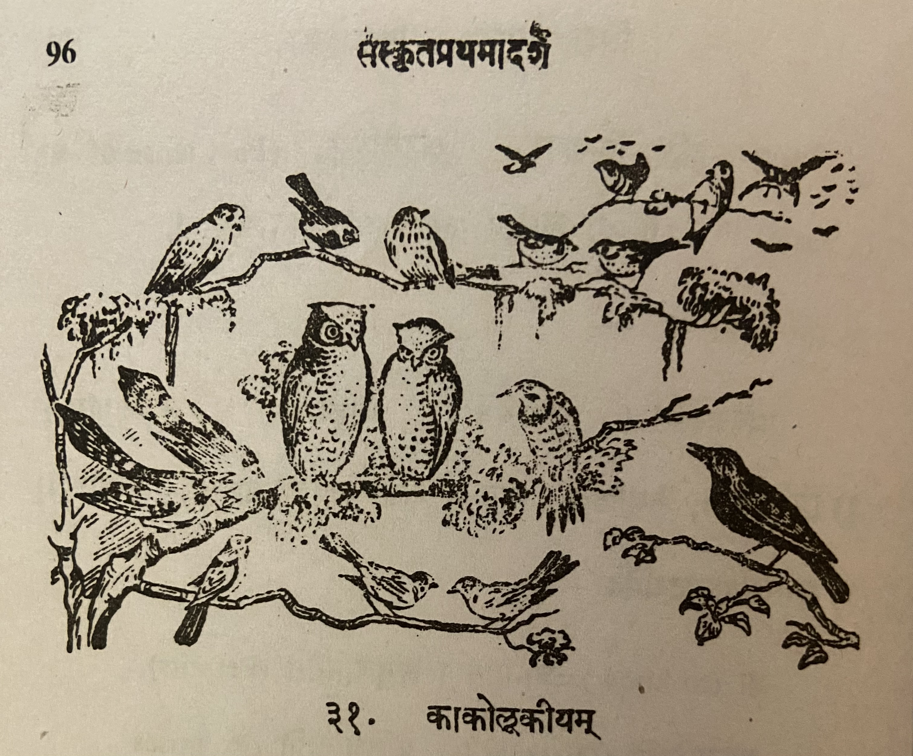

# Lesson 31: काकोलूकीयम्

एकदा पक्षिणः सम्भूय मन्त्रयामासुः - 'अस्माकं राजा वैनतेयः। स च वासुदेवस्य सेवायां तत्परो नास्माकं कामषि चिन्तां करोति। किं तेन राज्ञा नः1 प्रयोजनम्? अतोऽन्यं कमपि राज्येऽभिषिञ्चामः' - इति। एवं निश्चित्य तैः भद्राकारम् उलूकम् अवलोक्याभिहितम् - 'एष उलूकः अस्माकं राजा भविष्यति। सम्पाद्यन्तां पट्टाभिषेकसम्बन्धिनः सम्भाराः' - इति॥

अथ समानीतानि विविधतीर्थोदकानि। प्रदत्तं सिंहासनम्। प्रसारितं व्याघ्रचर्म। प्रज्वलिता दीपाः। आरब्धानि वाद्यानि। युवतयो गानम् आसभन्ता! आनीता पट्टमहिषी कृकालिका। उलूकोऽभिषेकार्थं सिंहासनमारोपितः। जरद्गवोऽभिषेकार्थं हैमकुम्भं हस्तेन धृतवान्॥ 

अत्रान्तरे वायसः कश्चित् तत्र समायातः। अपृच्छच्च - 'अहो! किमेष सकलानां पक्षिणां समागमो महोत्सवश्च?' - इति यथास्थितं निवेदयामासुः पक्षिणः॥ 

अथ काको विहस्याह - 'अहो! न युक्तम् एतत्! 
किमिति हंसादिषु पक्षिषु विद्यमानेषु दिवान्धस्य क्रियतेऽभिषेकः?' श्रोतव्यं सर्वैः -

<q>वक्रनासं सुजिह्नाक्षं क्रूरमप्रियदर्शनम्। उलूकं नृपतिं कृत्वा का नः सिद्धिर्भविष्यति॥</q>

तस्योपदेशं श्रुत्वा - 'साध्वनेनाभिहितम्। पार्थिवार्थमधिकृत्य भूयः समेत्य मन्त्रयिष्यामहे' इति ब्रुवाणाः सर्वे पक्षिणः यथाभिमतं गताः। दिवान्धः केवलं सिंहासनोपविष्टः2 कृकालिकया सहास्ते। आह च - 'कः कोऽत्र भोः? किमद्यापि न क्रियतेऽभिषेकः' इति॥

ततः कृकालिकयाऽभिहितम् - 'तवाभिषेके कृतोऽयं विघ्नो वायसेन। गताः सर्वे पक्षिणः। तत् त्वमुत्तिष्ट। स्वाश्रय त्चां प्रापयामि' - इति। ततः स दिवान्धः कृकालिकया दर्श्यमानमार्गः सविषादं स्वाश्रयं जगाम। ततः प्रभृति काकानाम् उलूकालां च शाश्वतिकः विरोधः अभवत्॥

 (पञ्चतन्त्रात् उद्धृतम्)

1अस्मद् शब्द रूप चतुर्थी विभक्ति - मह्यम्/मे आवाभ्याम्/नौ अस्मभ्यम्/नः

2सिंहासनोपविष्टः is a समस्तपद। सिंहासने उपविष्टः become सिंहासन उपविष्टः and then सन्धि happens.

---

**Translation**

Once (एकदा) birds (पक्षिणः) gathered (सम्भूय) in consultation (मन्त्रयामासुः) - 'Our (अस्माकं king (राजा) is *Garuda* (वैनतेयः). And (च) he (सः) is totally devoted (तत्परः) to the service (सेवायां) of *Vasudeva* (वासुदेवस्य) and does (करोति) not (न) worry (चिन्ताम्) about our (अस्माकं) welfare (कामषि).'
What (किं) use (प्रयोजनम्) from his (तेन) kingship (राज्ञा) for us (नः)?
Therefore (अतः) we will coronate (राज्येऽभिषिञ्चामः) some one (कमपि) else (अन्यं) in the kingdom (राज्ये)' -  thus (इति).

Therefore (अथ) they brought (समानीतानि) various (वविध) sacred waters (तीर्थोदकानि). Gave (प्रदत्तं) the throne (सिंहासनम्). Spread (प्रसारितं) the tiger skin (व्याघ्रचर्म). Lit (प्रज्वलिता) the lamps (दीपाः). Started playing (आरब्धानि) the music instruments (वाद्यानि). Young ladies (युवतयः) started (आसभन्ता) a song (गानम्)! Brought (आनीता) the principal queen (पट्टमहिषी) she-owl (कृकालिका). For the ritual bath (अभिषेकार्थं) the owl (उलूकः) climbed (आरोपितः) the throne (सिंहासनम्). An old vulture (जरद्गवः3) held (धृतवान्) with his hands (हस्तेन) a gold pot (हैमकुम्भं) for the ritual bath (अभिषेकार्थं).

3The literal translation of this word is "old cow" but in the book, given the context, the meaning is given as old vulture.

In the meanwhile (अत्रान्तरे) some (कश्चित्) crow (वायसः) arrived (समायातः) there (तत्र). And (च) asked (अपृच्छत्) this (इति) - 'Hey (अहो)! What (किम) is this (एष) gathering (समागमः) and (च) festival (महोत्सवः) of all (सकलानाम्) birds (पक्षिणाम्)'. 
The birds (पक्षिणः) informed him (निवेदयामासुः) of the situation (यथास्थितम्)

Then (अथ) the crow (काकः) said (आह) after laughing (विहस्य) - 'Hey (अहो)! This (एतत्) is not (न) suitable (युक्तम्)! Why (किम्) thus (इति) in the
presence (विद्यमानेषु) of swans (हंस) and other (आदिषु)  birds (पक्षिषु) you are doing (क्रियते) the coronation (अभिषेकः) of the owl (दिवान्धस्य).' 
Everybody (सर्वैः) listen (श्रोतव्यं) - 'Crooked nose (वक्रनासं) well marked eyes (सुजिह्नाक्षं) and cruel (क्रूरम्) unpleasant appearance (अप्रियदर्शनम्।). What (का) fulfillment (सिद्धिः) will making (कृत्वा) the owl (उलूकं) king (नृपतिं) get us (नः भविष्यति)?'

Having heard (श्रुत्वा) his (तस्य) advice (उपदेशं) - 'Well (साधु) said (अभिहितम्) by this person (अनेन). Regarding (अधिकृत्य) the kingship (पार्थिवार्थम्), let us assemble (समेत्य) again (भूयः) and discuss (मन्त्रयिष्यामहे).' Saying (ब्रुवाणाः) this (इति) all (सर्वे) the birds (पक्षिणः) went (गताः) where they wished (यथा अभिमत).
Only (केवलं) the owl (दिवान्धः) who was seated on the throne (सिंहासनोपविष्टः) was sitting (आस्ते) with (सह) the she-owl (कृकालिकया). And (च) he said (आह) like this (इति) - 'Oh (भोः) who are all (कः कः) here (अत्र)? Why are they not going to do the ritual bath now?'

Therefore (ततः) this was said (अभिहितम्) by the she-owl (कृकालिकया) - 'An obstacle (विघ्नः) has been created (कृतः) in your coronation (अभिषेके) by this (अयं) crow (वायसेन)'. All (सर्वे) the birds (पक्षिणः।) have left (गताः). So (तत्) you (त्वम्) get up (उत्तिष्ठ). I will reach (प्रापयामि) you (त्चां) to your home (स्वाश्रय).
Therefore (ततः) the (सः) owl (दिवान्धः) despondently (सविषादं) went 
(जगाम) to his home (स्वाश्रयं) by the path (मार्गः) shown (दर्श्यमान) by the she-owl (कृकालिकया). After that (ततः प्रभृति) the perpetual (शाश्वतिकः) enimity (विरोधः) of crows (काकानाम्) and (च) owls (उलूकालां) happened (अभवत).

Selected (उद्धृतम्) from the (पञ्चतन्त्रात्)

-----

**Notes and Vocabulary**

| Word | Meaning | Word | Meaning | Word | Meaning |
| --- | --- | --- | --- | --- | --- |
| वैनतेय *m.* | गरुड | पार्थिवार्थ *m.* |  the question of coronation of a King | सम्भार | Preparation |
| जरद्गव *m.* | old vulture | भुय *in.* | again | हेमकुम्भ *m.* | golden jar |
| वायस *m.* | a crow | कृकालिका *f.* | she-owl | दिवान्ध *m* | an owl |
| स्वाश्रय *a. m.* | one's abode | शाश्वतिकः | permanent | सविषाद | having despondency |

सविषादम् = disconsolately

विषाद = dejection