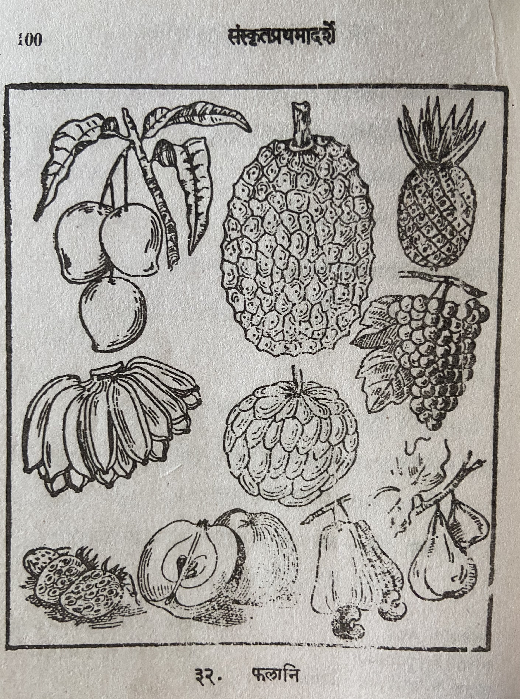

# Lesson 32: फलानि

चित्रेऽस्मिन् आम्रं पलसं कदलीफलं सीताफल द्राक्षा मातुलुङ्गम् इत्यादीनि विविधानि फलानि सन्ति। उपरिष्‌टात् प्रथमायां पङ्क्तौ वामत्रीण्याम्रफलानि विद्यन्ते। तान्येकस्मिन् वृन्ते श्लिष्टानि वर्तन्ते। अपक्कानि च तानि। पक्कान्याम्रफलानि रुचिराणि भवन्ति, वर्णश्च तेषां रम्यः॥

आम्राणां दक्षिणतो विद्यमानं पनसफलम्। बहिः कण्टकैरावृतं वर्तते पनसफलम्। तस्य गन्धस्तु मनोहरः। परम् अधिकतया भक्षयमाणं तदुदरपीडां जनयति॥

द्वितीयस्यां पङ्क्तौ वामतः कदलीफलानि विद्यन्ते। पक्कानां कदलीफलानां वर्णः पीतः अपक्कानां तु हरितः। कानिचित् कदलीफलानि रुचिराणि हितावाहनि च भवन्ति। कादलानां दक्षिणतः सीताफलं वर्तते, तस्यापि दक्षिणतो द्राक्षागुच्छः॥

तृतीयस्या श्रेणौ वामभागे विद्यामानानि मातुलुङ्गफलानि। इतरेषां केषाञ्चित् फलानां नामान्यप्रसिद्धानि। तेषु कानिचित् विदेशीयानि फलानि॥

फलानामाहारः सात्त्विकः पथ्यश्च। अत एव मुनयः प्रायेण फलैरेव जीविकां वर्तयन्ति। तेन ते नीरोगाश्चिरायुषश्च भवन्ति॥

---

**Translation**

In this (अस्मिन्) picture (चित्रे) there are (सन्ति) different (विविधानि) fruits (फलानि) such as (इत्यादीनि) mango (आम्रं), jack fruit (पलसं), banana (कदलीफलं), custard apple (सीताफल), grape (द्राक्षा), and sweet lime (मातुलुङ्गम्). In the first (प्रथमायां) line (पङ्क्तौ) from the top (उपरिष्‌टात्) on the left (वाम) there are (विद्यन्ते) three (त्रीणि) mangoes (आम्रफलानि). They (तानि) are (वर्तन्ते) attached (श्लिष्टानि) to one (एकस्मिन्) fruit-stalk (वृन्ते). And (च) they (तानि) are unripe (अपक्कानि). Ripe (पक्कानि) mangoes (आम्रफलानि) are (भवन्ति) tasty (रुचिराणि) and (च) their (तेषां) color (वर्णः) is pleasing (रम्यः).

The Jack fruit (पनसफलम्) is present (विद्यमानं) to the right (दक्षिणतः) of the mangoes (आम्राणां). The jack fruit (पनसफलम्) is (वर्तते) covered with (आवृतं) many (बहिः) thorns (कण्टकैः). It's (तस्य) smell (गन्धस्तु) is appealing (मनोहरः). Eaten (भक्षयमाणं) in large quantity (परम् अधिकतया) it (तत्) causes (जनयति) stomachache (उदरपीडां).

In the second (द्वितीयस्यां) row (पङ्क्तौ) bananas (कदलीफलानि) are present (विद्यन्ते) on the left (वामतः). Ripe (पक्कानां) banana's (कदलीफलानां) color (वर्णः) is yellow (पीतः) and (तु) unripened's (अपक्कानां) is green (हरितः).
Some (कानिचित्) bananas (कदलीफलानि) are (भवन्ति) tasty (रुचिराणि) and (च) beneficial (हितावाहनि).
To the right (दक्षिणतः) of the bananas (कादलानां) is (वर्तते) the custard apple (सीताफलं) and to their (तस्यापि) right (दक्षिणतः) is a grape bunch (द्राक्षागुच्छः).

In the third (तृतीयस्या) row (श्रेणौ), on the left side (वामभागे), the citron fruits (मातुलुङ्गफलानि) are present (विद्यामानानि). The names (नामानि) of some (केषाञ्चित्) other (इतरेषां) fruits (फलानां) are not famous (अप्रसिद्धानि).
Among them (तेषु) some (कानिचित्) are foreign (विदेशीयानि) fruits (फलानि).

A fruit meal (फलानामाहारः) is good (सात्त्विकः) and (च) salubrious (पथ्यः). So (अतः) only (एव) sages (मुनयः) generally (प्रायेण) live (वर्तयन्ति) their lives (जीविकां) with fruits (फलैः) only (एव).
Due to that (तेन) they (ते) are (भवन्ति) unafflicted by disease (नीरोगाः) and (च) long lived (चिरायुषः).

---

**Notes and Vocabulary**

| **Word** | **Meaning** | **Word** | **Meaning** |  
| --- | --- | --- | --- |
| आम्र *n.* | Mango | श्लिष्ट *a.* | sticking to |
| पनस *n* | jack fruit | कण्टक *m. n.* | thorn|
| कादल *n.* | plaintain fruit | उदरपीडा *f.* | stomach-ache |
| सीताफल *n.* | custard apple | विदेशीय *n. n.* | foreign |
| द्राक्षा *f.* | grape | सात्विक *a. m.* | harmless |
| वामतः *in.* | from left | निरोग *a. m.* | free from disease |
| वृन्त *a.* | foot-stalk of leaf of a fruit  | चिरायुष *a. m.* | long-lived |