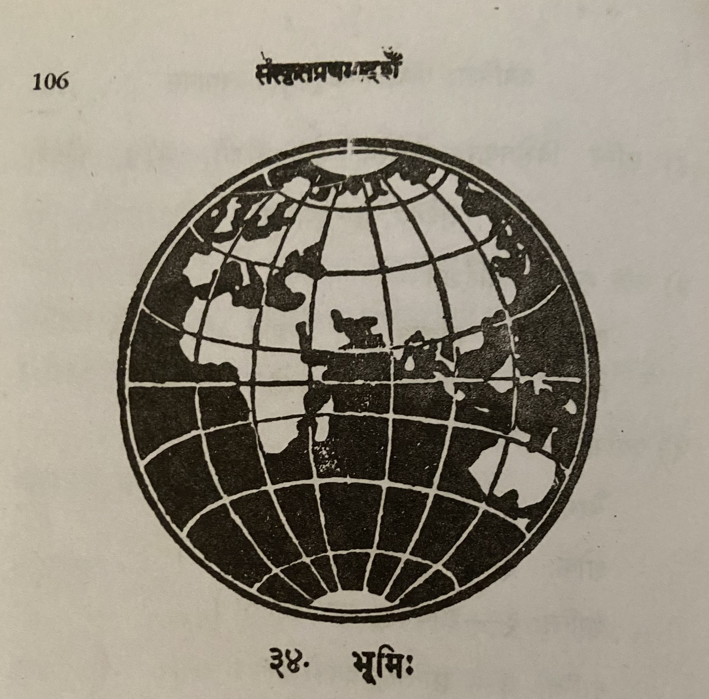

# Lesson 34: भूमिः

भूमिः कन्दुकवत् गोलाकृतिः। तस्यास्त्रिषु भागेषु द्वौ भागौ जलम्। त्रिष्वेको भागः स्थलम्। चित्रं पश्य, तत्र शुक्लो भागः स्थलम्। कृष्णो भागः जलम्।

स्थलभागः एष्या, यूरोप्, आफ्रिका, अमेरिका, आस्त्रेलिया चेति पञ्चखण्डत्वेन विभक्तः।

जलभागः - शान्तसागरः, अतलान्तिकसागरः, भारतसागरः, उत्तरध्रुवसागरः, दक्षिणध्रुवसागरश्चेति पञ्चसागरत्वेन विभक्तः। समुद्रेषु तत्र तत्र सिंहलादयो द्वीपाः सन्ति॥

एष्याखण्डः सर्वेषु खण्डेषु विशालतमः। खण्डेऽस्मिन् विद्यया परिष्कारेण च खण्डान्तराण्यतिशयानाऽस्माकं2 भारतभूमिर्विराजते। अस्यां परमपावनाः गङ्गा-सिन्धु-गोदावरी-नर्मदा-कावेरीप्रभृतयो नद्यः, परमोन्नता हिमालयप्रभृतयः पर्वताश्च विलसन्ति।

यूरोप्खण्डोऽनेकैः सार्वभौमैर्विभज्य भुज्यते। तस्मिन् निवसन्तो जनाः श्वेतगात्राः॥

अमेरिकाखण्डो दक्षिणामेरिका उत्तरामेरिका चेति द्वेधा विभक्तः। खण्डोऽयमतीव विशालः समृद्धश्च। गोधूमादीनि धान्यानि प्रभूततया तत्र प्ररोहन्ति॥

आफ्रिकाखण्डो विशाल एव। किन्तु अत्र भूयान् भागो मरुभूमिः। नद्योऽत्र विरलाः। सहाराख्योऽतिविशालः कश्चिन्मरुप्रदेशोऽत्र सुप्रसिद्धः॥

आस्त्रेलियाखण्डः सर्वेषु खण्डेष्वल्पिष्ठः। खनिजानि द्रव्याण्यत्रबाहुल्येन समासाद्यन्ते। ऊर्णाव्यवसायोऽस्मिन् खण्डे प्रसिद्धः॥

शान्तसागरोऽन्वर्थनामा विराजते। अतीव विशालोऽप्ययमत्यन्तं शान्तः। अस्मिन्नावर्ताः कल्लोलाश्च न सन्ति।

अतलान्तिकाब्धिरल्पीयानप्यतीव भयङ्करः। भारतसागरोऽस्माकं भारतवर्षस्य दक्षिणतो वर्तते॥

उत्तरध्रुवसागरस्य जलमतीव शीतलम्। तत्रत्येषु द्वीपेषु जनानां वासो दुष्करः। समुद्रेऽस्मिन् शैलतुल्या हिमखण्डाः प्लवन्ते। ते वात्यया नीयमानाः शश्वत् प्रवहणानि निहत्य जले मज्जयन्ति। दक्षिणध्रुवसागरस्य जलं शैत्येन घनीभूतं शिलाप्रायं वर्तते। न तस्मिन् द्वीपाः सन्ति, नापि तत्र प्रवहणानि सञ्चरन्ति॥

आकाशे परिभ्रमतां गोलानां मद्ये भूमिरन्यतमा। भूगोलापेक्षयाप्युत्तराणि गोलान्तराण्याकाशे विद्यन्ते। सूर्य-चन्द्रौ सर्वाणि नक्षत्राणि च भूगोलवत् गोलानि इति तत्रापि जीवराशयो विवसन्ति इति च भूगोलशास्त्राभिज्ञाः कथयन्ति॥

---

**Translation**

Removing *Sandhi* and translating...

**भूमिः कन्दुकवत् गोल आकृतिः। तस्याः त्रिषु भागेषु द्वौ भागौ जलम्। त्रिषु एकः भागः स्थलम्। चित्रं पश्य, तत्र शुक्लः भागः स्थलम्। कृष्णः भागः जलम्।**

The Earth (भूमिः) like a ball (कन्दुकवत्) is a round (गोल) shape (आकृतिः). In her's (तस्याः) three (त्रिषु) parts (भागेषु) two (द्वौ) parts (भागौ) are water (जलम्।). Third (त्रिषु एकः) part (भागः) is land (स्थलम्). See (पश्य) the picture (चित्रं), there (तत्र) the white (शुक्लः) part (भागः) is land (स्थलम्). Black (कृष्णः) part (भागः) is water (जलम्).

**स्थलभागः एष्या, यूरोप्, आफ्रिका, अमेरिका, आस्त्रेलिया च इति पञ्चखण्डत्वेन1 विभक्तः।**

The land portion (स्थलभागः) is divided (विभक्तः) thus (इति) into five pieces/continents (पञ्चखण्डत्वेन) Asia (एष्या), Europe (यूरोप्), Africa (आफ्रिका), America (अमेरिका), and (च) Australia (आस्त्रेलिया).

1तृतीया विभक्ति like रामेण

**जलभागः - शान्तसागरः, अतलान्तिक सागरः, भारत सागरः, उत्तरध्रुव सागरः, दक्षिणध्रुव सागरः च इति पञ्चसागरत्वेन विभक्तः। समुद्रेषु तत्र तत्र सिंहल आदयः द्वीपाः सन्ति॥**

The water portion (जलभागः) - peaceful ocean (शान्तसागरः) Atlantic ocean (अतलान्तिकसागरः), Indian Ocean (भारतसागरः), north pole (उत्तरध्रुव) ocean (सागरः), and (च) south pole ocean (दक्षिणध्रुवसागरः) thus (इति) split (विभक्तः) as five oceans (पञ्चसागरत्वेन). In the ocean (समुद्रेषु) in different places (तत्र तत्र) there are (सन्ति) islands (द्वीपाः) like (आदयः) Sri Lanka (सिंहल).

**एष्याखण्डः सर्वेषु खण्डेषु विशालतमः। खण्डे अस्मिन् विद्यया परिष्कारेण च खण्डान्तराणि अतिशयाना अस्माकम्2 भारत भूमिः विराजते। अस्यां परमपावनाः गङ्गा-सिन्धु-गोदावरी-नर्मदा-कावेरी प्रभृतयः नद्यः, परमोन्नता हिमालयप्रभृतयः पर्वताः च विलसन्ति।**

2खण्डान्तराण्यतिशयानाऽस्माकं  -> खण्डान्तराणि अतिशयाना अस्माकम्

Asia continent (एष्याखण्डः) is the largest (विशालतमः) of all (सर्वेषु) continents (खण्डेषु). In this (अस्मिन्) continent (खण्डे), (endowed) with knowledge (विद्यया) and (च) polish (परिष्कारेण),
very much/more than (अतिशयाना) other continents (खण्डान्तराणि)  our (अस्माकम्) land (भूमिः) Bharata (भारत) appears beautiful (or shines) (विराजते).
In this (अस्यां) (land) absolutely pure (परमपावनाः) rivers (नद्यः) Ganga (गङ्गा), Sindhu (सिन्धु), Godavari (गोदावरी), Narmada (नर्मदा)  Cauvery (कावेरी) etc (प्रभृतयः) the most tallest (परमोन्नता) Himalaya (हिमालय) etc (प्रभृतयः) glitters (विलसन्त).

**यूरोप्खण्डः अनेकैः सार्वभौमै: विभज्य भुज्यते। तस्मिन् निवसन्तः जनाः श्वेतगात्राः॥**

Europe continent  (यूरोप्खण्डः) is divided (विभज्य) and enjoyed/owned (भुज्यते) among many (अनेकैः) kings (सार्वभौमै:). People (जनाः) living (निवसन्तः) in that (तस्मिन्) are white bodied (श्वेतगात्राः)

**अमेरिकाखण्डः दक्षिणामेरिका उत्तरामेरिका च इति द्वेधा विभक्तः। खण्डः अयम् अतीव विशालः समृद्धः च। गोधूमा आदीनि धान्यानि प्रभूततया तत्र प्ररोहन्ति॥**

America continent (अमेरिकाखण्डः) is split (विभक्तः) into two (द्वेधा),  thus (इति) South America (दक्षिणामेरिका) and (च) North America (उत्तरामेरिका)। Wheat (गोधूमा) and other (आदीनि) grains (धान्यानि) grow (प्ररोहन्ति) with abundance (प्रभूततया) there (तत्र).

**आफ्रिकाखण्डः विशालः एव। किन्तु अत्र भूयान्3 भागः मरुभूमिः। नद्यः अत्र विरलाः। सहारा आख्यः अतिविशालः कश्चित् मरु प्रदेशः अत्र सुप्रसिद्धः॥**

Africa continent (आफ्रिकाखण्डः) is certainly (एव) large (विशालः). But (किन्तु) here (अत्र) most (भूयान्) portion (भागः) is desert (मरुभूमिः). There (अत्र) rivers (नद्यः) are rare (विरलाः). Here (अत्र) some (कश्चित्) very big (अतिविशालः) desert (मरु प्रदेशः) named (आख्यः) Sahara (सहाराख्यः) is very famous (सुप्रसिद्धः).

3[भूयस् शब्द रुप](https://sanskritabhyas.in/%E0%A4%AD%E0%A5%82%E0%A4%AF%E0%A4%B8%E0%A5%8D-%E0%A4%B6%E0%A4%AC%E0%A5%8D%E0%A4%A6-%E0%A4%B0%E0%A5%82%E0%A4%AA)

**आस्त्रेलिया खण्डः सर्वेषु खण्डेषु अल्पिष्ठः। खनिजानि द्रव्याणि अत्र बाहुल्येन समासाद्यन्ते। ऊर्णा व्यवसायः अस्मिन् खण्डे प्रसिद्धः॥**

Australia (आस्त्रेलिया) continent (खण्डः) is the smallest (अल्पिष्ठः) among all (सर्वेषु) portions (खण्डेषु). Mine (खनिजानि) substances (द्रव्याणि) (minerals) are attainable (समासाद्यन्ते) here (अत्र) with plenty (बाहुल्येन)4. In this (अस्मिन्) continent (खण्डे) wool (ऊर्णा) business (व्यवसायः) is famous (प्रसिद्धः).

4That is the closest "exact" translation. The meaning is - "The kind of substances that are in mines are obtainable in plenty here."

**शान्तसागरः अन्वर्थनामा विराजते। अतीव विशालः अपि अयम् अत्यन्तं शान्तः। अस्मिन् आवर्ताः कल्लोलाः च न सन्ति।**

The calm ocean (Pacific), agreeing with its name (अन्वर्थनामा), is beautiful (विराजते)5. This (अयम्) is exceedingly (अतीव) big (विशालः) but (अपि) very (अत्यन्तं) calm (शान्तः). In this (अस्मिन्) whirlpools (आवर्ताः) and (च) large waves (कल्लोलाः) are not (न) there (सन्ति).

5This is the literal translation. The semantic translation would be "The Pacific is beautiful and true to its name."

**अतलान्तिक अब्धिः अल्पीयान् अपि अतीव6 भयङ्करः। भारतसागरः अस्माकम् भारतवर्षस्य दक्षिणतः वर्तते॥**

Atlantic (अतलान्तिक) ocean (अब्धिः) is small (अल्पीयान्) but (अपि) exceedingly (अतीव) terrible (भयङ्करः). Indian ocean (भारतसागरः) is (वर्तते) to our (अस्माकम्) Bharatha's (भारतवर्षस्य) south (दक्षिणतः).

---

6 अतलान्तिकाब्धिरल्पीयानप्यतीव -> अतलान्तिक अब्धिः अल्पीयान् अपि अतीव।

The sandhi's one by one.

1. अतलान्तिक अब्धिः (अ + अ = आ) -> अतलान्तिकाब्धिः
1. अतलान्तिकाब्धिः अल्पीयान्  (*visarga* preceeded by a vowel other than अ/आ and followed by vowel or voiced consonant changes to र्) -> अतलान्तिकाब्धिर् + अल्पीयान् -> अतलान्तिकाब्धिरल्पीयान्
1. अतलान्तिकाब्धिरल्पीयान् + अपि = अतलान्तिकाब्धिरल्पीयानपि
1. अतलान्तिकाब्धिरल्पीयानपि + अतीव  (इ followed by any vowel becomes य्)-> अतलान्तिकाब्धिरल्पीयानप्य् +  अतीव = **अतलान्तिकाब्धिरल्पीयानप्यतीव**

---

**उत्तरध्रुवसागरस्य जलम् अतीव शीतलम्। तत्रत्येषु द्वीपेषु जनानां वासः दुष्करः। समुद्रे अस्मिन् शैलतुल्या हिमखण्डाः प्लवन्ते। ते वात्यया नीयमानाः शश्वत् प्रवहणानि निहत्य जले मञ्जयन्ति। दक्षिणध्रुवसागरस्य जलं शैत्येन घनीभूतं शिलाप्रायं वर्तते। न तस्मिन् द्वीपाः सन्ति, न अपि तत्र प्रवहणानि सञ्चरन्ति॥**

The north pole ocean's (उत्तरध्रुवसागरस्य i.e. Arctic) water (जलम्) is exceedingly (अतीव) cool (शीतलम्). In the islands (द्वीपेषु) of that place (तत्रत्येषु) the living (वासः) of people (जनानां) is difficult (दुष्करः). In this (अस्मिन्) ocean (समुद्रे) snow pieces (हिमखण्डाः) comparable to mountains (शैलतुल्या) float (प्लवन्ते). They (ते), continuous (शश्वत्) led by  (नीयमानाः) strong winds (वात्यया), having broken/killed (निहत्य) ships (प्रवहणानि) drown (मज्जयन्ति) them in water (जले). The south pole ocean's (दक्षिणध्रुवसागरस्य) water (जलं) thick (घनीभूतं) due to cold (शैत्येन) is (वर्तते) like rock (शिलाप्रायं). Nor (न) islands (द्वीपाः) in there (तस्मिन्), and (अपि) nor do (न) ships (प्रवहणानि) sail (सञ्चरन्ति) there (तत्र).

भूगोलापेक्षयाप्युत्तराणि गोलान्तराण्याकाशे विद्यन्ते

**आकाशे परिभ्रमतां गोलानां मद्ये भूमिः अन्यतमा। भूगोल अपेक्षया अपि उत्तराणि गोलान्तराणि आकाशे विद्यन्ते। सूर्य-चन्द्रौ सर्वाणि नक्षत्राणि च भूगोलवत् गोलानि इति तत्र अपि जीवराशयः विवसन्ति इति च भूगोलशास्त्राभिज्ञाः कथयन्ति॥**

Earth (भूमिः) is one among many (अन्यतमा) in the midst (मद्ये) of the spheres (गोलानां) wandering (परिभ्रमतां) in the sky (आकाशे). Larger (उत्तराणि)  other spheres (गोलान्तराणि) than (अपेक्षया) the Earth (भूगोल) also (अपि) exist (विद्यन्ते) in the sky (आकाशे). Thus (इति) sun (सूर्य), moon (चन्द्र) and (च) all (सर्वाणि) stars (नक्षत्राणि) are Earth-like (भूगोलवत्) spheres (गोलानि) and (च) there (तत्र) also (अपि) lifeforms (जीवराशयः) live (विवसन्ति) thus (इति) say (कथयन्ति) (those) well versed in Geography (भूगोलशास्त्राभिज्ञाः).

**Vocabulary**

| Word | Meaning | Word | Meaning |
| --- | --- | --- | --- |
| परिष्कार | polish, finish, beautification | अतिशय | much, excessive|
| विराजते | appear beautiful | समृद्ध | prosperous |
| ऊर्णा | wool| भूयान् | most/mostly |
| तत्रत्य *adj.* | of that place | वात्या *f.* | strong wind, storm|
| शश्वत् *indec* | ever, always continually | शिलाप्राय *n* | like rock |
| घनीभूत *adj* | become thick | अन्यतम *adj* | one of several, any one of many |
| शास्त्राभिज्ञ | learned, verse in the shastras | अभिज्ञ | one who knows |
| कल्लोल *m.* | large wave | विरल *a.m.* | rare |
| खनिज *n.* | grown in mines | प्रभूतता *f.* | in plenty |  
| आवर्त *m.* | whirlpool |
