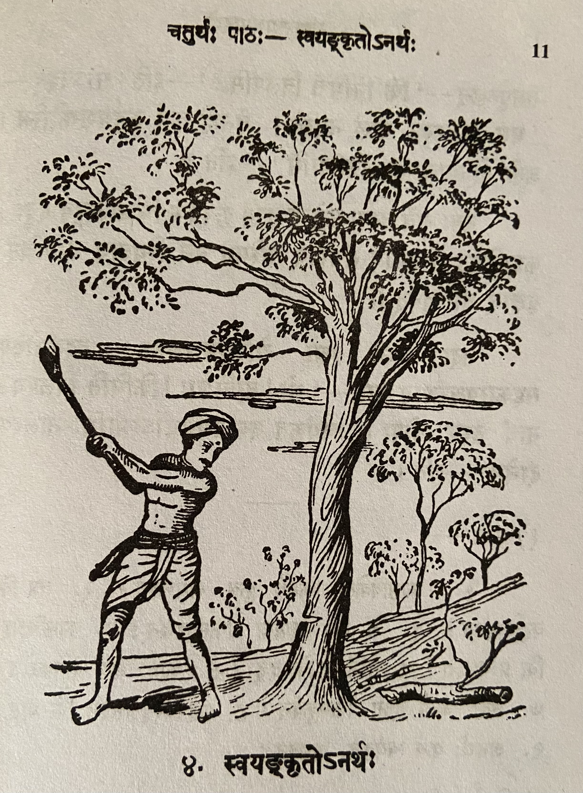

# Lesson 4: स्वयङ्कृतोऽनर्थः

जातु काष्टविक्रेता कश्चित् काष्ठार्थं वनमगच्छत्। तत्र स क्कचिदासीनः परितो विलोक्य विलपितुमारभत। तं विलपन्तं वीक्षय तस्मिन् वने स्थितास्तरवः करुणया तमपृच्छन् - ’किं निमित्तं विलपसि?’ - इति॥ सोऽवदत् - ’मम कुठारस्य नालं नास्ति। तेनाहं कर्म कर्तुमशक्तोस्मि। अतो भोज्यालाभात् विलपामि’ - इति॥

ततः सर्वे तरवः समेत्य तस्मै कृपयैकं चिञ्चालगुडं ददुः। काष्ठच्छित् तं कुठारे संयोज्य तस्मिन् वने स्थितान् कतिचित् वृक्षान् अच्छिनत्।

तदा अन्ये वृक्षा रोदितुमारभन्त। तदवलोक्य सहकारवृक्षस्तान् प्राह - ’भो! बालिशाः किमिति विलपथ? नायं तस्य दोषः। स्वयंकृत एवायमनर्थोऽस्माभिः नालस्य दानेन’ - इति।

---

**Translation**

जातु काष्टविक्रेता कश्चित् काष्ठार्थं वनम् अगच्छत्।

Once (जातु) a wood seller (काष्टविक्रेता) for some wood (कश्चित् काष्ठार्थं) went to the forest (वनमगच्छत्।)।

जातु - can also be understood as "once upon a time"

 

तत्र सः क्कचिद् आसीनः परितः विलोक्य विलपितुम् आरभत।

There (तत्र) he (सः) after sitting (आसीनः) somewhere (क्कचिद्) and after looking (विलोक्य) around (परितः) started (आरभत) crying (विलपितुम्),

 

तं विलपन्तं वीक्षय तस्मिन् वने स्थिताः तरवः करुणया तम् अपृच्छन् - ’किं निमित्तं विलपसि?’ - इति॥

Seeing (वीक्षय) him (तं) crying (विलपन्तं) the trees (तरवः) standing (स्थिताः) in that (तस्मिन्) forest (वने) asked (अपृच्छन्) him (तम्) with pity (करुणया) - ’What (किं) reason/cause (निमित्तं) are you crying (विलपसि) ?’ - thus (इति).

 

 सः अवदत् - ’मम कुठारस्य नालं न अस्ति। तेन अहं कर्म कर्तुम् अशक्तः अस्मि। अतः भोज्य अलाभात् विलपामि’ - इति॥

He (सः) said (अवदत्) - 'My (मम) axe's (कुठारस्य) handle (नालं) is not (न) there (अस्ति) (i.e. My axe does not have a handle). Due to that (तेन) I (अहं)
am (अस्मि) powerless (अशक्तः) to do (कर्तुम्) work (कर्म). So (अतः) due to not getting (अलाभात्) food (भोज्य) I cry (विलपामि)’ - thus (इति).

 

ततः सर्वे तरवः समेत्य तस्मै कृपय एकं चिञ्चालगुडं ददुः। काष्ठच्छित् तं कुठारे संयोज्य तस्मिन् वने स्थितान् कतिचित् वृक्षान् अच्छिनत्।

Therefore (ततः) all (सर्वे) the trees (तरवः) together (समेत्य) with grace (कृपय) gave (ददुः) a tamarind tree stick (चिञ्चालगुडं) for him (तस्मै). The woodcutter (काष्ठच्छित्) joined/fixed (संयोज्य) it ("it" is understood) in that (तं) axe (कुठारे) and cut down (अच्छिनत्।) a few (कतिचित्) trees (वृक्षान्) that stood (स्थितान्) in that (तस्मिन्) forest (वने).

 

तदा अन्ये वृक्षाः रोदितुम् आरभन्त। तद् अवलोक्य सहकारवृक्षः तान् प्राह - ’भो! बालिशाः किमिति विलपथ? न अयं तस्य दोषः। स्वयंकृत एव अयम् अनर्थः अस्माभिः नालस्य दानेन’ - इति।

Then (तदा) the other trees started to cry. Seeing that the mango tree said to them - "Hey fools why are you crying like this? This (अयं) is not (न) his (तस्य) fault (दोषः). This (अयम्) disaster (अनर्थः) is only (एव) self-created (स्वयंकृत) due to us giving (दानेन) the handle (नालस्य)." - thus (इति).

---

**Vocabulary**

| Word | Meaning | Word | Meaning |
| --- | --- | --- | --- |
| जातु *in.* | once | भोज्य *n.*| food |
| काष्टविक्रेतृ *m.* | a wood seller | चिञ्चालगुड *m.* | a stick of the tamarind tree |
| काष्टार्थम् *in.* | for wood | काष्ठच्छित् *m.* | wood cutter |
| आसीन *a , m* | sitting | अच्छिनत् P. | cut |
| परितः *in* | all around | सहकारवृक्षः *m.* | a mango tree |
| विलपितुम् *in* | to weep | पादप *m.* | tree |
| कुठार *m.* | an axe | बालिश *m.* | foolish |
| नाल *n.* | handle |
