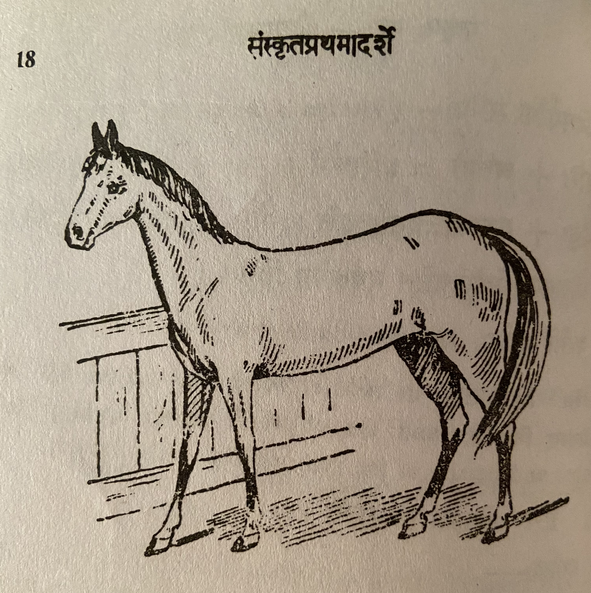

# Lesson 6: अश्वः

इह कश्चिदश्वस्तिष्ठति। गोरश्वस्य च को भेदः? अश्वो गवापेक्षया प्रांशुः। अश्वस्य पादाः दीर्घतराः। तस्य ग्रीवायां रोमराजिर्वर्तते। अश्वस्य श्रृङ्गे न स्तः। गोः शफो  द्वेधा दलितः, अश्वस्य तु न। अतोऽश्वः शीघ्रतरं धावति॥

अयमश्वो रथे बध्यते। कैश्चित् द्वावश्वौ रथे बध्येते। राजानो धनिकाश्चोत्सवदिवसेषु चतुरः ततोऽधिकान् वा तुरगान् रथे योजयन्ति। समवर्णैः बहुभिरश्वैः युक्तो रथः सुरम्यो भवति॥

अश्वाः सुशिक्षिताः सञ्चारायोपयुज्यन्ते। वनमार्गेषु जनाः प्रायेणाश्वैरेव सञ्चारं कुर्वन्ति। अश्वस्य पृष्ठे पर्याणमास्तीर्य तस्मिन्नुपविशत्यश्वारोहः। मुखबद्धं खलीनमाकर्षन् सोऽश्वं नयति॥

अश्वाः सङ्ग्रामेषु राज्ञां साह्यमाचरन्ति। ते रणाङ्गणे महत् कौशलं प्रदर्शयन्ति। कदाचित् ते योधानां प्राणानपि रक्षन्ति। अतः प्राधान्येन राजानोऽश्वसैन्यं सर्वदैव संरक्षन्ति॥

---

**Translation**

Here (इह) some (कश्चित्) horse (अश्वः) stands (तिष्ठति). What (को) is the difference (भेदः)  among the cow (गोः) and (च) the horse (अश्वस्य)? The horse (अश्वः) is strong (प्रांशुः) compared to (अपेक्षया) the cow (गव). The horse's (अश्वस्य) legs (पादाः) are longer (दीर्घतराः). There is (र्वर्तते) a line of hair (रोमराजि) on it's (तस्य)1 neck (ग्रीवायां).
Horse (अश्वस्य) does not (न) have (स्तः) two horns (श्रृङ्गे). The cow's (गोः ) hoof (शफः) is split (दलितः) in two (द्वेधा), but (तु) horse's (अश्वस्य) do not (न). Therefore (अतः) the horse (अश्वः) runs (धावति) more quickly (शीघ्रतरं).

This (अयम्) horse (अश्वः) is tied (बध्यते) to a chariot (रथे). In some (कैश्चित्) chariot (रथे) two horses (द्वावश्वौ) are tied (बध्येते). Kings (राजानः) and (च) wealthy persons (धनिकाः), on festival days (उत्सवदिवसेषु), tie/connect (योजयन्ति) four (चतुरः) or (वा) more (अधिकान्) horses (तुरगान्) to a chariot (रथे). A chariot (रथः) joined (युक्तः) with many (बहुभिः) horses (अश्वैः) of the same color (समवर्णैः) is very beautiful (सुरम्यः).

Well trained (सुशिक्षिताः) horses (अश्वाः) are used (उयुज्यन्ते) for movement (सञ्चाराय). People (जनाः) move (सञ्चारं कुर्वन्ति) in the forest (वनमार्गेषु) only (एव) with horses (अश्वैः) for travelling (प्रायेण). Spreading (आस्तीर्य) the saddle (पर्याणम्) on the horse's (अश्वस्य) back (पृष्ठे), sitting (उपविशत्य) on it (तस्मिन्) is the horse rider (अश्वारोहः). Holding (आकर्षन्) bridle (मुखबद्धं खलीनम्) he (सः) leads (नयति) the horse (अश्वं).

In wars (सङ्ग्रामेषु) horses (अश्वाः) do (आचरन्ति) help (साह्यम्) to the kings (राज्ञां)2.They (ते) display (प्रदर्शयन्ति) great (महत्) cleverness (कौशलं) in the battle field (रणाङ्गणे). Sometimes (कदाचित्) they (ते) protect (रक्षन्ति) the warriors' (योधानां) lives (प्राणान्) also (अपि). Therefore (अतः) kings (राजानः) always (सर्वदैव) mainly (प्राधान्येन) keep/take care of (संरक्षन्ति) horse army (अश्वसैन्यम् - cavalry).

1Note: तस्य means his but in English animals are referred to as it.

2 This sentence does not have a direct translation to English. The rough "correct" translation is - In wars horses perform king's help. राज्ञां is the षष्ठी विभक्ति बहुचवन of राजन् - i.e. possessive plural.

Useful links:

[गो/गौ शब्द रूप](https://www.mycoaching.in/2019/04/go-gau-shabd-ke-roop.html)

[राजन् शब्द रूप](https://sanskritabhyas.in/%E0%A4%B0%E0%A4%BE%E0%A4%9C%E0%A4%A8%E0%A5%8D-%E0%A4%B6%E0%A4%AC%E0%A5%8D%E0%A4%A6-%E0%A4%B0%E0%A5%82%E0%A4%AA)

---

## Notes

**Similar words**

| Different Words ||| Meaning |
| --- | --- | --- | --- |
| तुरगः | तुरङ्गः | तुरङ्गमः | Horse |
| विहगः | विहङ्गः | विहङ्गमः | Bird |
| पतगः | पतङ्गः | पतङ्गमः | Bird |
| भुजगः | भुजङ्गः | भुजङ्गमः | Snake |
| साह्यम | साहाय्यम् | साहायहम् | help/aid |

**Vocabulary**

| Word | Meaning | Word | Meaning |
| --- | --- | --- | --- |
| ग्रीवा *f* | neck | पर्याण *n* | saddle |
| रोमराजि *f* | a line of hair | अश्वारोह *m* | a horse man |
| श्रृङ्ग *n*| a horn | खलीन *n* | bit of a bridle |
| शफ *m* | a hoof | सङ्ग्राम  *m.* *a.* | battle |
| दलित *a.* *m.* | split | योधा *m* | warrior |
| समवर्ण *a.* *m.* | of uniform color | अश्वसैन्य *n* | cavalry |
