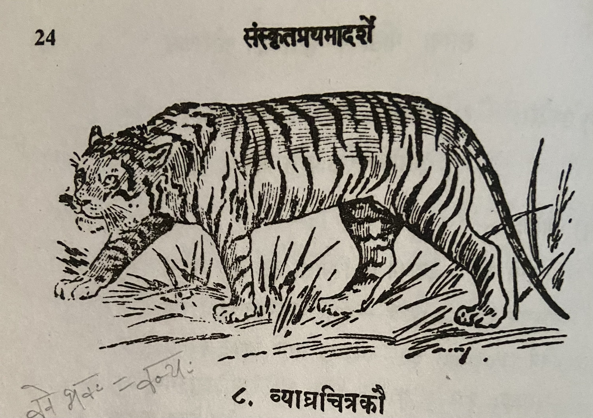

# Lesson 8: व्याघ्रचित्रकौ

व्याघ्रो वन्यः पशुः। सः हिंस्राणां मृगाणां मध्येऽतीव क्रूरः। इतरेभ्यः पशुभ्यो व्याघ्रः शीघ्रतरं धावति। व्याघ्रस्य देहे सर्वत्र कृष्णा विन्दवो रेखाश्च सन्ति। यदि तस्य स्वभावः शान्तोऽभविष्यत् तर्हि जनास्तं मृगान्तरापेक्षया अधिकतरम् आदरिष्यन्त॥

चित्रकस्तु व्याघ्रादपि सुन्दरः। चित्रकायः इत्यप्ययं व्यपदिश्यते। एकदा चित्रकः कश्चित् स्वस्य रूपेण गर्वितो भूत्वा मृगसभायामेवमब्रवीत् - "सिंहो न मम तुलां भजते। अतोऽहमेव मृगराज्येऽभिषेक्तव्यः" - इति॥

तेषां मध्यतः क्रोष्टोवाच - "आर्य! त्वमेकं गजं निहत्य मृगपरिवारं तर्पय; येन त्वां मृजराज्येऽभिषेक्ष्यामः" - इति। तद्वचनं श्रूत्वा लज्जितश्चित्रकः - "इदानीमेव आगमिष्यामि" - इत्युक्त्वा ततः प्रस्थितः तद्वनमेव परित्यज्य गतः॥

---

**Translation**

Title: Tiger and Cheetah

Tiger (व्याघ्रः) is a wild (वन्यः) animal (पशुः). Amidst (मध्ये) of the violent (हिंस्राणां) animals (मृगाणां) he (सः) is very (अतीव) cruel (क्रूरः). Tiger (व्याघ्रः) runs (धावति) faster (शीघ्रतरं) than other (इतरेभ्यः) animals (पशुभ्यः). Everywhere (सर्वत्र) on the tiger's (व्याघ्रस्य) body (देहे) black (कृष्णा) spots (विन्दवः) and (च) lines (रेखाः) are there (सन्ति). If (यदि) it's (तस्य) temperament (स्वभावः) had been (अभविष्यत्) calm (शान्तः) then (तर्हि) people (जनाः) would have respected (आदरिष्यन्त) it (तम्) more than other animals (मृगान्तरापेक्षया).

Cheetah (चित्रकः) is certainly (अस्तु) (more) beautiful (सुन्दरः) than Tiger (व्याघ्रादपि). Thus (इति) this (अयं) is  also (अपि) called (व्यपदिश्यते) mult-coloured body (चित्रकायः). i.e. another name for cheetah is चित्रकायः.

Once (एकदा) some (कश्चित्) cheetah (चित्रकः), having become (भूत्वा) proud (गर्वितः) due to it's own (स्वस्य) form (रूपेण), said (अब्रवीत्) like this (एवम्) in the assembly of animals (मृगसभायाम्) - "Lion (सिंहः) is not (न) revered/adored (भजते) as my (मम) equal (तुला). Therefore (अतः) I (अहम्) alone (एव) should be anointed (अभिषेक्तव्यः) as king of animals (मृगराज्ये)" - thus (इति).

In the midst of them (तेषां मध्यतः) the jackal (क्रोष्टः) spoke (उवाच) - "Noble one (आर्य)!  You (त्वम्) after having killed (निहत्य) one (एकम्) elephant (गजम्), please (तर्पय) the animal followers/family (मृगपरिवारं) in order that (येन) (we) anoint (अभिषेक्ष्यामः) you (त्वां) king of animals (मृगराजे)" - thus (इति). Listening (श्रुत्वा) to those (तत्) words (वचनम्) the embarrassed (लज्जितः) cheetah (चित्रकः) - "(I) will return (आगमिष्यामि) now (इदानीम्) only (एव)" - having said (उक्त्वा) thus (इति), after that (ततः) departed (प्रस्थितः) (and) having abandoned (परित्यज्य) that (तत्) forest (वनम्) itself (एव) went away (गतः).

---

**Vocabulary**

| Word | Meaning | Word | Meaning |
| --- | --- | --- | --- | 
| वन्य  a. m. | wild | मृगराज्य n. | kingdom of animals |
| पशु m. | a beast | क्रोष्टा m. | a jackal |
| हिंस्र a. m. | cruel | मृगपरिवार m. | animal follower |
| विन्दव m. | dots, spots | खग m. | a bird |
| चित्रक m. | a cheetah | तुला f. | equality |
| इतर | other |

[विन्दु](https://kosha.sanskrit.today/word/sa/vindu?q=%E0%A4%B5%E0%A4%BF%E0%A4%A8%E0%A5%8D%E0%A4%A6%E0%A4%B5%E0%A4%83) is a spot, a dot or mark. The form is like गुरु.

इतरेभ्यः -  पञ्चमी विभक्ति