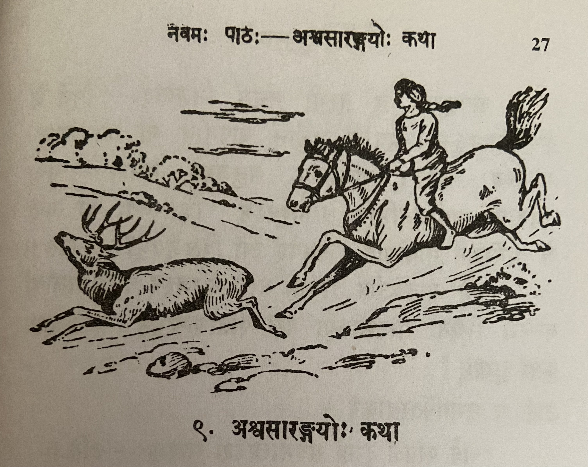

# Lesson 9: अश्वशारङ्गयोः कथा

कश्चिदश्वः सारङ्गश्चैकस्मिन् केदारे नित्यं चरतः, महता च स्नेहेन कालं नयतः। एवं स्थिते तौ जातु कलहपरौ जातौ। तयोः सारङ्गः श्रृङ्गबलेनाश्वं केदारान्निरवासयत्।।

ततः सारङ्गस्य प्रतीकारं कर्तुमिच्छन्नश्वः कञ्चिन्मनुजं प्राप्य तस्य साहाय्यं ययाचे। स मनुजः परं प्रहृष्टः तस्य पृष्टे पर्याणमारोप्य मुखे खलीनं दत्तवा तमारोहत्। तस्य गतिं परीक्षमाणः कशया तं तीव्रमताडयत्। स्वकार्यार्थी तत् सर्वमसहताश्वः। तस्य मनुजस्य साहाय्येन सोऽश्वः सारङ्गमजयत्।।

कृतकृत्यः स तुरगो मनुजं निजगाद - "सिद्धं मे समीहितमधुना। पर्याणं खलीनं चापनीय मां गमनायानुमन्यस्व" - इति। तन्निशम्य मनुजस्तं बभाषे - "मया तवैतावत् प्रयोजनमिति जानाम्यहम्। किन्त्वितः परं त्वया मे प्रयोजनं भविष्यति। कथमहं त्वां विसृजेयम्?" - इति।।

ततो यावज्जीवं सोश्वः तस्य मनुजस्य वाजिशालायां बन्धने स्थितः परतन्त्रतया परां पीडामन्वभूत्। परतन्त्रस्य कुतः सुखम्?

उक्तं च सुभाषितरत्नाकरे -
"सर्व परवशं दुःखं सर्वमात्मवशं सुखम्" - इति।।

**Translation**

Removing Sandhi and translating...

कश्वित् अश्वः सारङ्गः च एकस्मिन् केदारे नित्यं चरतः, महता च स्नेहेन कालं नयतः।

Some horse and deer are grazing/wandering in a field daily, and are living very harmoniously.

The literal meaning of महता च स्नेहेन कालं नयतः does not translate well. Literal meaning - spending  time with a lot of love.
 

एवं स्थिते तौ जातु कलहपरौ जातौ। तयोः सारङ्गः श्रृङ्गबलेन अश्वं केदारात् निरवासयत्।।

In this state (एवं स्थिते) some day (जातु) they become quarrellers (कलहपरौ जातौ). Among the two (तयोः), the deer (सारङ्गः) with the strength of (his) horns (श्रृङ्गबलेन) banished (निरवासयत्) the horse (अश्वं) from the field (केदारात्).
 

ततः सारङ्गस्य प्रतीकारं कर्तुम् इच्छन् अश्वः कञ्चिन् मनुजं प्राप्य तस्य साहाय्यं ययाचे।

Then, desiring to retaliate against the deer, the horse found some man and begged his help.
 

सारङ्गस्य प्रतीकारं - literal translation is "deer's retaliation". Clarify with teacher.

 
सः मनुजः परं प्रहृष्टः तस्य पृष्टे पर्याणमारोप्य मुखे खलीनं दत्तवा तम् आरोहत्।

Exceedingly pleased (परं प्रहृष्टः) that (सः) man (मनुजः) having placed a saddle (पर्याणमारोप्य) on his (horse's) back (पृष्टे) a bridle (खलीनं) on his (horse's) face (मुखे) and climbed upon him (horse) (आरोहत्)

 

तस्य गतिं परीक्षमाणः कशया तं तीव्रम् अताडयत्।

To evaluate/check (परीक्षमाणः) his (तस्य i.e. horse's) speed (गतिं) (the man) severely (तीव्रम्) beat (अताडयत्) him (तं - i.e. horse).

स्वकार्यार्थी तत् सर्वम् असहत् अश्वः।

For his work (goal) (स्वकार्यार्थी) the horse (अश्वः) bore (असहत्) all that (तत् सर्वम).

तस्य मनुजस्य साहाय्येन सः अश्वः सारङ्गम् अजयत्।

With the man's help that horse defeated the deer.
 

कृतकृत्यः सः तुरगः मनुजं निजगाद - "सिद्धं मे समीहितम् अधुना। पर्याणं खलीनं च अपनीय मां गमनाय अनुमन्यस्व" - इति।

That horse (सः तुरगः) which accomplished his objective (कृतकृत्यः) said (निजगाद) to the Man (मनुजं) - "Now (अधुना) my (मे) wish/desire (समीहितम्) is accomplished (सिद्धं). Remove (अपनीय) the saddle (पर्याणं) and (च) bridle (खलीनं) , permit (अनुमन्यस्व) me (मां) to go (गमनाय)."
 

तं निशम्य मनुजः तं बभाषे - "मया तव एतावत् प्रयोजनं इति जानामि अहम्। किन्तु इतः परं त्वया मे प्रयोजनं भविष्यति। कथम् अहं त्वां विसृजेयम्?" - इति।

Having heard (निशम्य) him (तं i.e. the horse) the man (मनुजः) said (बभाषे) to him (तं i.e. the horse) - "I know (जानामि अहम) by me/because of me (मया) that much (एतावत्) use (benefit) was yours (तव्). But (किन्तु) from now (इतः परं) you will be (भविष्यति) my (मे) for my use (प्रयोजनं). How (कथम्) can I (अहं) release (विसृजेयम्) you (त्वां) ?"

 

ततः यावत् जीवं सः अष्वः तस्य मनुजस्य वाजिशालायां बन्धने स्थितः परतन्त्रतया परां पीडाम् अवभूत्। परतन्त्रस्य कुतः सुखम्?

After that, the rest of his life (यावत् जीवं) that horse (सः अष्वः) stayed (स्थितः) bound (बन्धने) in the Man's (मनुजस्य) stable (वाजिशालायां)  

Check how to remove sandhi for परतन्त्रतया परां पीडामन्वभूत्। परतन्त्रस्य कुतः सुखम्? Also meaning.

 

उक्तं च सुभाषितरत्नाकरे - "सर्व परवशं दुःखं सर्वमात्मवशं सुखम्" - इति।।

A saying from the Subhashita Ratnakara (book) - Everything that is subject to  another's will (परवशं) brings sadness, everything that is in one's own will (control) gives happiness.

उपदेशः (moral) -

एकस्य जयार्थमन्यमाश्रयन् जनः स्वयमनर्थे पतति।।

एकस्य जयार्थम् अन्यम् आश्रयन् जनः स्वयम् अनर्थे पतति।

To win over one (someone) people who take the help of others will themselves fall into difficulty/disadvantage. 

---

**Vocabulary**

| Word | Meaning | Word | Meaning |
| --- | --- | --- | --- |
| सारङ्ग (m) | deer | कृतकृत्य (m) | he who has accomplished his object |
| केदार (m) | field | पर्याण (n) | saddle |
| कलहपर (m) | quarreller | समीहित (n) | wish, desire |
| निरवासयत् (P)| banished | एतावत् (n) | this much |
| प्रतीकार (m) | retaliation | वाजिशाला (f) | stable |
| ययाचे (U) | begged | बन्धन (n) | bondage |
| खलिन (n) | bridle |

जातु (in) - some day

अपनीयते - to be extracted

निशम्य - having heard

विसृजति - release
